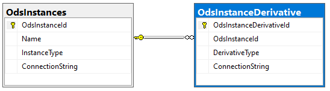

# Read-Replicas

In scenarios where the Ed-Fi ODS / API is experiencing both heavy read and write
loads, or where there is a need for a deployment that supports high
availability, the ODS databases can be deployed such that there is a primary
writable database, with one or more read replicas which are kept up to date in
real-time. The API can be configured to use this secondary database for all GET
requests to reduce the load on the primary database server.

:::info

For SQL Server, this functionality is provided through SQL Server Always On
Availability Groups (see [What is an Always On availability
group?](https://learn.microsoft.com/en-us/sql/database-engine/availability-groups/windows/overview-of-always-on-availability-groups-sql-server)).
For PostgreSQL, the options available will depend on your cloud host and/or
environment (see [High Availability, Load Balancing, and
Replication](https://www.postgresql.org/docs/current/high-availability.html) in
the PostgreSQL documentation).

:::

## API Configuration

The API identifies the presence of a read-replica ODS by the existence of a
record in the OdsInstanceDerivative table in the EdFi\_Admin database with a
DerivativeType value of "ReadReplica":



This connection string can also be overridden through configuration, as the
example below for SQL Server demonstrates (note the addition of
"ApplicationIntent" to the connection string):

```json
{
  "OdsInstances": {
    "2": {
      "ConnectionString": "Server=AGListener; Database=EdFi_Ods; Encrypt=False; Trusted_Connection=True; Application Name=EdFi.Ods.WebApi;",
      "ConnectionStringByDerivativeType": {
        "ReadReplica": "Server=AGListener; Database=EdFi_Ods; Encrypt=False; Trusted_Connection=True; Application Name=EdFi.Ods.WebApi; ApplicationIntent=ReadOnly"
      }
    }
  }
}
```

:::info

The API will always use the read/write connection to load data for cache
initialization purposes to ensure that the latest data is used, even if the
cache initialization is triggered during a GET request which is being served
using a read-replica.

:::
