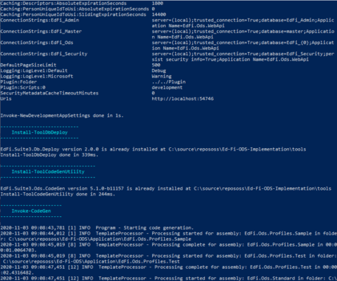
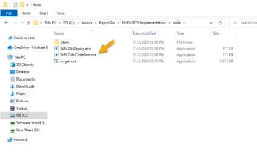
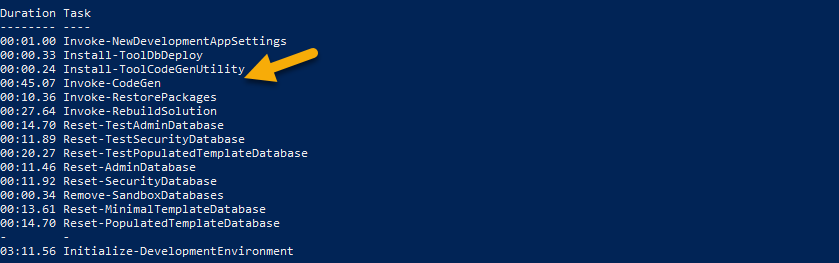
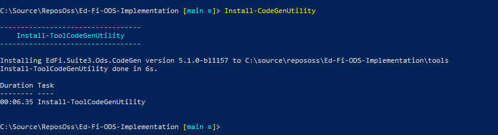
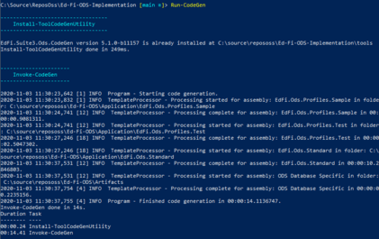

# Code Generation Utility

The Code Generation tool is an external tool used for generating required
classes and ORM mappings that are necessary to build the solution. Code
generation is required when working on the solution to create the core objects,
profiles, and extensions. This article describes how code generation is built
into the initdev command for local development and how it can be [executed from
a CICD
pipeline](https://edfi.atlassian.net/wiki/spaces/ODSAPIS3V72/pages/23299247/Code+Generation+Utility#CodeGenerationUtility-ManualExecution).

## Running initdev

The code generation utility is integrated into the initdev process. When you
run Initialize-PowershellForDevelopment.ps1 followed by initdev (as outlined in
the [Getting Started
Guide](../../getting-started/source-code-installation/readme.md)),
the codegen utility is downloaded from MyGet into the tools folder under
the Ed-Fi-ODS-Implementation repository and is executed after the
Invoke-NewDevelopmentAppSettings task.

A successful `initdev` execution will display the tasks executed and their
duration as shown, and you can see that code generation utility is downloaded
and installed during the process.

## Manual Execution

The code generation utility can be run from the command line.

### Installation

To Install the code generation tool
manually, run Initialize-PowershellForDevelopment.ps1 script from a PowerShell
prompt as outlined in the [Getting Started
Guide](../../getting-started/source-code-installation/readme.md),
followed by the Install-CodeGen-Utiltity command. This will pull the current
version of the tool, and install it into the tools folder under
the Ed-Fi-ODS-Implementation repository.

### Execution

To run code generation independently from the build process, the tool can be
executed by calling the PowerShell command Run-CodeGen. This will execute the
generation process for all required classes.

