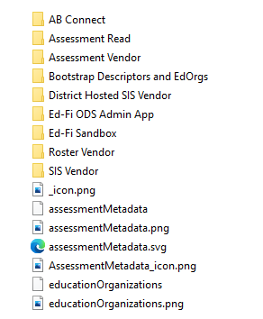
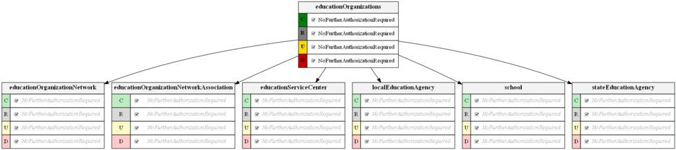
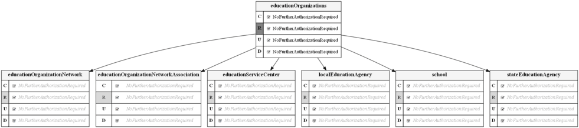
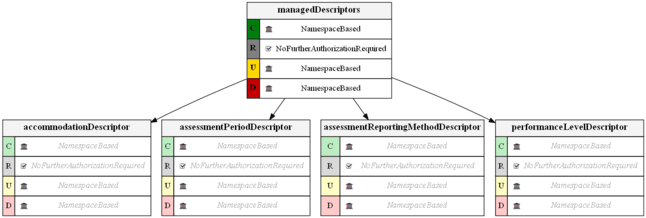
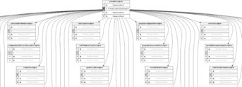

# Security Visualization Tool

Authorization schemes in an Ed-Fi ODS / API implementation are flexible and can
be customized to serve a variety of security needs. However, the configuration
metadata can be complex, which can make it difficult for administrators to
understand exactly what permissions apply for a resource. The Ed-Fi ODS / API
solution comes with a command-line Security Visualization Tool to help
implementers visualize authorization configurations.

This section outlines how to configure and use the Security Visualization Tool.
The high-level steps are:

* [Security Visualization Tool](#security-visualization-tool)
  * [Step 1. Install and Configure GraphViz (Optional)](#step-1-install-and-configure-graphvizoptional)
  * [Step 2. Build and Run the Security Visualization Tool](#step-2-build-and-run-the-security-visualization-tool)
  * [Step 3. Review Output](#step-3-review-output)
  * [Example Output](#example-output)
    * [Education Organizations](#education-organizations)
    * [Descriptors](#descriptors)

Each step is outlined in detail below.

## Step 1. Install and Configure GraphViz (Optional)

The security visualization tool uses [GraphViz](http://www.graphviz.org/) — open
source visualization software —. You can install the latest stable MSI release
for Windows [here](https://graphviz.org/download/#windows).

Use **\--graphviz** command-line argument to specify the installation path; if
this argument is not specified, the tool uses **C:\\Program
Files\\Graphviz\\** by default.

The tool will automatically download and use a portable version if GraphViz is
not detected in the default installation path.

## Step 2. Build and Run the Security Visualization Tool

* Start Visual Studio, open the Security Visualization Tool solution from
    \\Ed-Fi-ODS\\Utilities\\GenerateSecurityGraphs\\GenerateSecurityGraphs.sln,
    and build the solution.
* Open a Console window and navigate to
    \\Ed-Fi-ODS\\Utilities\\GenerateSecurityGraphs\\GenerateSecurityGraphs\\bin\\Debug\\net6.0.
* Run `GenerateSecurityGraphs.exe --help` to view the parameters that can be
    passed to the
    application.

* Execute the tool to generate the visualizations. The example below assumes
    that you have followed the Ed-Fi ODS / API [Getting
    Started](../../getting-started/readme.md)
    steps successfully.

```shell
GenerateSecurityGraphs.exe -o "C:\graphs" -f
```

## Step 3. Review Output

Once the tool has run, you will find a series of visualization files in the
output folder you specified. There are .png and .svg versions for each
schema. The root of the folder contains visualizations for the set of
authorizations that are possible, and there is a sub-folder for each
authorization claim set that has been configured. The as-shipped ODS / API
v6.1 contains nine claim sets, resulting in nine folders.



## Example Output

This section provides some examples of output from the Security Visualization
Tool, along with explanatory notes. An understanding of the concepts described
in [API Claim Sets &
Resources](../security/api-claim-sets-resources.md) is
useful to fully understand the visualizations.

Note that the shading of font has relevance:

|     |     |
| --- | --- |
| Black | Indicates permissions explicitly set for the resource claim. |
| _Italic gray_ | Indicates inherited permissions from the higher-level logical groupings in the claims taxonomy. |
| **Bold black** | Indicates ClaimSet level permission overrides explicitly set for the resource claim. |
| _**Bold italic gray**_ | Indicates ClaimSet level permission overrides inherited from the higher-level logical groupings in the claims taxonomy. |
| ~Red~ | Indicates a permission that has been overridden. |
| _**~Bold italic Red~**_ | Indicates a ClaimSet level permission from the higher-level logical groupings that has been overridden explicitly for the ClaimSet resource claim. |

### Education Organizations

The diagram below shows permissions for accessing education organization
entities for the "Ed-Fi Sandbox" claim set, where full Create, Read, Update, and
Delete (CRUD) operations are authorized. The diagram also indicates that the
authorization strategy associated with the claim
is **NoFurtherAuthorizationRequired**.



The diagram below shows permissions for accessing education organization
entities for the "SIS Vendor" claim set. In this case, it is assumed that the
education agency implementing the Ed-Fi ODS / API will load and manage education
organizations, so SIS vendor applications are only granted Read authorization.



### Descriptors

Permissions for accessing Ed-Fi Descriptors are separated into two types:
"Managed Descriptors" (managed by API clients), and "System Descriptors"
(managed by the system).

The diagram below shows permissions for accessing Managed Descriptors for the
"SIS Vendor" claim set. The **NamespaceBased** authorization strategy is applied
to Create, Update, and Delete operations, which ensures that only API clients
with the appropriate Namespace prefix can add or change a managed Descriptor,
while the **NoFurtherAuthorizationRequired** strategy is applied to Read
operations, meaning that other API clients read a managed Descriptor.



The diagram below shows permissions for accessing System Descriptors for the
"SIS Vendor" claim set, where only Read access is allowed.


