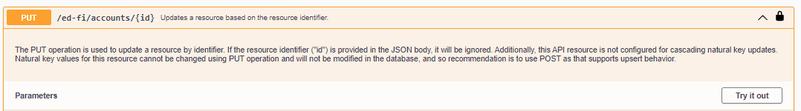
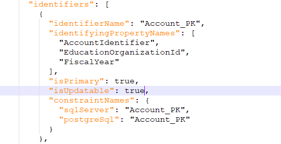
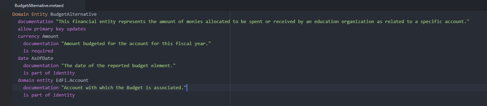

# Cascading Key Updates on ODS / API Resources

The Ed-Fi ODS SQL Server data store allows for the configuration of Cascading
Updates on entities. Cascading Update specifies that if an update is made to a
key value in a data row where the key value is referenced by foreign keys, then
all existing foreign key values are updated to the new key
value.[1](https://edfi.atlassian.net/wiki/spaces/ODSAPIS3V72/pages/23301674#CascadingKeyUpdatesonODS/APIResources-Footnote-1)

The following ODS / API resources are **already configured for Cascading
Updates** in the as-shipped solution:

* Class Period
* Grade
* GradebookEntry
* Location
* Section
* Session
* Student School Association
* Student Section Association

However, some implementers may find it useful to enable Cascading Updates on
additional resources including **core** resources and **extension** resources.

:::info

In order to make changes to Cascading Updates on a core resource, installation
from source code is required. When changes are made, be aware that the changes
could be lost when upgrading to a newer version of the API and care must be
taken to reapply the changes.

:::

## Configure Cascading Updates on an Ed-Fi Core resource

Cascading key updates are configured in MetaEd by '_allow primary key updates'_
language construct. However since the core model cannot be updated, we provide
steps to modify generated artifacts to enable cascading key updates on core
resources that are not preconfigured for cascading updates.  

1. Update the Api Model
    1. Locate the ApiModel.json file located in `<source code root
        directory>`Ed-Fi-ODS\\Application\\EdFi.Ods.Standard\\Artifacts\\Metadata
    2. Find the model you want to enable cascading updates on
    3. Within the identifiers array, find the primary key identifier (isPrimary
        flag will be true)
    4. Update the isUpdatable property to true
2. Run the code generation steps outlined in the [Getting Started
    Guide](https://edfi.atlassian.net/wiki/display/ODSAPIS3V60/Getting+Started+-+Source+Code+Installation) (i.e.,
    from a PowerShell prompt
    run `Initialize-PowershellForDevelopment.ps1` script, followed by
    the `initdev` command)
3. Update Foreign Key Constraints for all dependencies
    1. SQL Server - Locate the 0030-ForeignKeys.sql file located in `<source
        code root
        directory>`\\Ed-Fi-ODS\\Application\\EdFi.Ods.Standard\\Artifacts\\MsSql\\Structure\\Ods
    2. PostgreSQL- Locate the 0030-ForeignKeys.sql file located in `<source
        code root
        directory>`\\Ed-Fi-ODS\\Application\\EdFi.Ods.Standard\\Artifacts\\PgSql\\Structure\\Ods
    3. Identify all dependent resource foreign key constraints (Search for
        "REFERENCES \[edfi\].\[`<Resource_Name>`\]")
    4. Copy each of the the ALTER TABLE scripts to a separate text document
    5. Add a ALTER TABLE `<TableName>` DROP CONSTRAINT `<ConstraintName>` to the
        line before each of the copied ALTER TABLE Scripts
    6. Add ON UPDATE CASCADE1 to each of the copied ALTER TABLE scripts
    7. Execute all of these SQL Scripts on the target ODS

<details>
<summary>Step by Step Example</summary>

Here is an example scenario to demonstrate the steps needed to update a Core
resource. We will use the Account core resource as an example of a resource to
enable cascading updates on. Note that the default behavior of the Account
resource is not configured for cascading natural key updates via the PUT method.



We can modify this behavior by updating the **APIModel.json** file. Locate the
Account resource you want to update. Then, within the identifiers array, find
the primary key identifier and update the isUpdatable property to true.



Run the code generation steps outlined in the [Getting Started
Guide](https://edfi.atlassian.net/wiki/display/ODSAPIS3V60/Getting+Started+-+Source+Code+Installation) (i.e.,
from a PowerShell prompt run `Initialize-PowershellForDevelopment.ps1` script,
followed by the `initdev` command). At this point, the API would allow for
natural key cascading updates, but database is not set to support the cascading
updates yet. We need to update the foreign key constraints that dependencies of
Account have on the target ODS.

<details>
<summary>Click for scripts</summary>

```sql
ALTER TABLE [edfi].[AccountAccountCode] DROP CONSTRAINT [FK_AccountAccountCode_Account]
ALTER TABLE [edfi].[AccountAccountCode] WITH CHECK ADD CONSTRAINT [FK_AccountAccountCode_Account] FOREIGN KEY ([AccountIdentifier], [EducationOrganizationId], [FiscalYear])
REFERENCES [edfi].[Account] ([AccountIdentifier], [EducationOrganizationId], [FiscalYear])
ON UPDATE CASCADE
ON DELETE CASCADE

ALTER TABLE [edfi].[Actual] DROP [FK_Actual_Account]
ALTER TABLE [edfi].[Actual] WITH CHECK ADD CONSTRAINT [FK_Actual_Account] FOREIGN KEY ([AccountIdentifier], [EducationOrganizationId], [FiscalYear])
REFERENCES [edfi].[Account] ([AccountIdentifier], [EducationOrganizationId], [FiscalYear])
ON UPDATE CASCADE

ALTER TABLE [edfi].[Budget] DROP CONSTRAINT [FK_Budget_Account]
ALTER TABLE [edfi].[Budget] WITH CHECK ADD CONSTRAINT [FK_Budget_Account] FOREIGN KEY ([AccountIdentifier], [EducationOrganizationId], [FiscalYear])
REFERENCES [edfi].[Account] ([AccountIdentifier], [EducationOrganizationId], [FiscalYear])
ON UPDATE CASCADE

ALTER TABLE [edfi].[ContractedStaff] DROP CONSTRAINT [FK_ContractedStaff_Account]
ALTER TABLE [edfi].[ContractedStaff] WITH CHECK ADD CONSTRAINT [FK_ContractedStaff_Account] FOREIGN KEY ([AccountIdentifier], [EducationOrganizationId], [FiscalYear])
REFERENCES [edfi].[Account] ([AccountIdentifier], [EducationOrganizationId], [FiscalYear])
ON UPDATE CASCADE

ALTER TABLE [edfi].[Payroll] DROP CONSTRAINT [FK_Payroll_Account]
ALTER TABLE [edfi].[Payroll] WITH CHECK ADD CONSTRAINT [FK_Payroll_Account] FOREIGN KEY ([AccountIdentifier], [EducationOrganizationId], [FiscalYear])
REFERENCES [edfi].[Account] ([AccountIdentifier], [EducationOrganizationId], [FiscalYear])

ALTER TABLE [budgetextension].[BudgetAlternative] DROP CONSTRAINT [FK_BudgetAlternative_Account]
ALTER TABLE [budgetextension].[BudgetAlternative] WITH CHECK ADD CONSTRAINT [FK_BudgetAlternative_Account] FOREIGN KEY ([AccountIdentifier], [EducationOrganizationId], [FiscalYear])
REFERENCES [edfi].[Account] ([AccountIdentifier], [EducationOrganizationId], [FiscalYear])
ON UPDATE CASCADE
```

</details>

</details>

## Configure Cascading Updates on an Ed-Fi Extension resource

For configuring cascading key updates on the extension resource, simply add the
'_allow primary key updates'_ language construct to the .metaed file in your
extension project. For more details on creating Ed-Fi Extensions, see
[here](../how-to-guides/how-to-extend-the-ed-fi-ods-api-alternative-education-program-example.md).



For more details on Table Cascading Updates, see
[here](https://technet.microsoft.com/en-us/library/ms188066(v=sql.110).aspx).
