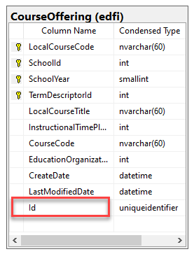
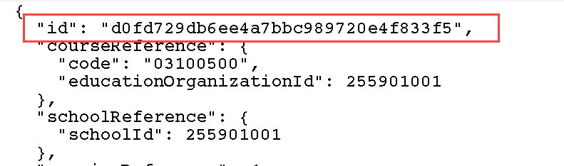
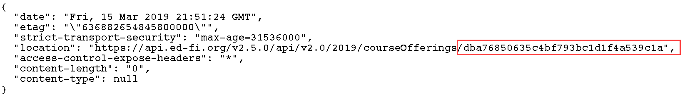
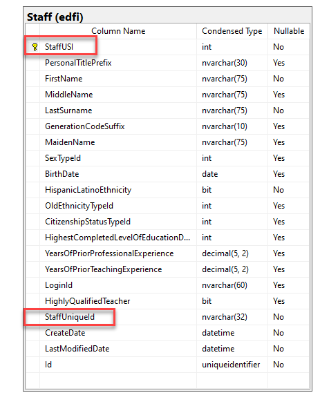
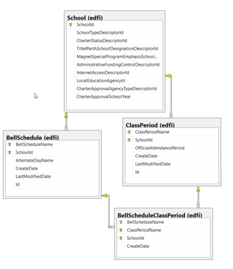

# Key Structure in the Ed-Fi ODS / API

This article provides technical details on the key structure in the Ed-Fi ODS /
API.

## Contents

* [Resource IDs](#resource-ids)
* [USIs (Unique Surrogate Identifiers)](#usis-unique-surrogate-identifiers)
* [Natural Keys](#natural-keys)

## Resource IDs

The ODS / API assigns and exposes resource IDs to align with REST conventions.
These IDs do not act as a surrogate key in the ODS data store, although
uniqueness is enforced.

The following diagram shows Id in CourseOffering table, which stores the
resource ID for an offering:



In the API surface, a CourseOffering can be looked up/queried by doing a HTTP
GET on a path like: `/courseOfferings/d0fd729db6ee4a7bbc989720e4f833f5`.

In the returned JSON, the resource ID appears as the `id` element:



When an element is POSTed (i.e., created in the ODS / API), the resource ID is
provided via a HTTP Header. It will look something like:



## USIs (Unique Surrogate Identifiers)

While most of the primary keys in ODS / API are natural keys (i.e., not
surrogate keys or identity columns), the Student, Parent, and Staff entities
have the integer-based surrogate key columns StudentUSI, PersonUSI, and
StaffUSI. These columns contain a primary key, while the text-based
StudentUniqueId, ParentUniqueId, and StaffUniqueId natural key columns
form unique indexes.

USI surrogates were introduced due to performance considerations with
primary indexes on non-numeric columns, and for the advantage they provide when
the natural key needs to be updated in these pivotal entities. With the USI
surrogate in place, the respective UniqueId field can be updated without having
to cascade updates through all related entities. See [When Key Values Change:
Cascading
Updates](https://edfi.atlassian.net/wiki/spaces/ODSAPIS3V72/pages/23301644#KeyStructureintheEd-FiODS/API-cascade) for
more details on cascading updates.

A key point with USIs is that integration with the ODS / API is done via the
text-based UniqueId. The integer-based USI is **not visible** to the API client
and is used only as internal identifier.

The following diagram shows the StaffUSI primary key field and the StaffUniqueId
field in the Staff table:



## Natural Keys

The Ed-Fi ODS / API uses natural keys as its primary means of enforcing
uniqueness in records and maintaining relationships between records.

The data in the Ed-Fi ODS / API represents a rich domain with deep
relationships. The ODS data store data model is organized into aggregates based
on the principles of [Domain-Driven
Design](https://en.wikipedia.org/wiki/Domain-driven_design), and those
aggregates are exposed as API resources. Since the ODS is not the system of
record (i.e., it is not the system that creates, manages, and is the
authoritative source for the data), primary keys are formed from the well-known,
natural keys in the domain.

### A Natural Key Example Using Bell Schedule Meeting Time

This section provides an example of how natural keys in the ODS / API work in
practice. Consider the following diagram, noting the composite key structure of
BellScheduleClassPeriod:



While SchoolId is present as a key in both BellSchedule and ClassPeriod, there
is only one SchoolId on the BellScheduleClassPeriod. This process of “merging”
the SchoolId column from the two keys is known as _key unification._ In turn,
key unification is fundamentally what gives the composite key design approach
its power to enforce referential integrity deeply throughout the entire data
store — even when data is supplied from many different client systems of record
that do not communicate with each other.

### When Key Values Change: Cascading Updates

Natural keys are a good solution for the ODS / API because they solve the
problem of maintaining referential integrity throughout a deep data structure
maintained by client systems that are disconnected from each other. However,
natural keys come with an inherent challenge in that a change in a primary key
value has the potential to cascade through the primary keys of many child
tables. Wherever possible, the ODS / API uses natural keys that are stable and
unlikely to change — but change does occur in the real world.

An approach to deal with this challenge is to turn on the CASCADE UPDATE option
on all tables and let the database server handle it. Currently, the
as-shipped Ed-Fi ODS enables this behavior on selected entities such as Class
Period, Grade, Section, and so forth.

The article [Cascading Key Updates on ODS / API
Resources](./cascading-key-updates-on-ods-api-resources.md)
has the full list of entities covered in the as-shipped configuration as well as
steps for enabling CASCADE UPDATE on additional entities.

### Key Unification Report

Developers and database administrators may find the query in this section of
interest.

The query below identifies all locations within the Ed-Fi ODS data store where
key unification is occurring. The FOREIGN\_TABLE\_NAME and FOREIGN\_COLUMN\_NAME
columns represent the tables and columns where key unification is occurring (and
consequently, the FOREIGN\_COLUMN\_NAME values will always appear as identical
values in adjacent pairs of records).

```sql
WITH ForeignKeys AS
(
-- Key column usage Primary/Foreign tables
SELECT KCU_FK.CONSTRAINT_NAME,
               KCU.TABLE_SCHEMA PRIMARY_TABLE_SCHEMA,
               KCU.TABLE_NAME PRIMARY_TABLE_NAME,
               KCU.ORDINAL_POSITION,
               KCU.COLUMN_NAME PRIMARY_COLUMN_NAME,
               KCU_FK.TABLE_SCHEMA FOREIGN_TABLE_SCHEMA,
               KCU_FK.TABLE_NAME FOREIGN_TABLE_NAME,
               KCU_FK.COLUMN_NAME FOREIGN_COLUMN_NAME
FROM INFORMATION_SCHEMA.KEY_COLUMN_USAGE KCU
        JOIN INFORMATION_SCHEMA.TABLE_CONSTRAINTS TC
               ON KCU.CONSTRAINT_CATALOG=TC.CONSTRAINT_CATALOG
                       AND KCU.CONSTRAINT_SCHEMA=TC.CONSTRAINT_SCHEMA
                       AND KCU.CONSTRAINT_NAME=TC.CONSTRAINT_NAME
        JOIN INFORMATION_SCHEMA.REFERENTIAL_CONSTRAINTS RC
               ON TC.CONSTRAINT_CATALOG = RC.UNIQUE_CONSTRAINT_CATALOG
                       AND TC.CONSTRAINT_SCHEMA = RC.UNIQUE_CONSTRAINT_SCHEMA
                       AND TC.CONSTRAINT_NAME = RC.UNIQUE_CONSTRAINT_NAME
        JOIN INFORMATION_SCHEMA.KEY_COLUMN_USAGE KCU_FK
               ON RC.CONSTRAINT_CATALOG = KCU_FK.CONSTRAINT_CATALOG
                       AND RC.CONSTRAINT_SCHEMA = KCU_FK.CONSTRAINT_SCHEMA
                       AND RC.CONSTRAINT_NAME = KCU_FK.CONSTRAINT_NAME
               AND KCU.ORDINAL_POSITION = KCU_FK.ORDINAL_POSITION
WHERE TC.CONSTRAINT_TYPE='PRIMARY KEY'
    AND KCU.CONSTRAINT_SCHEMA IN ('edfi', 'extension')
    AND KCU_FK.CONSTRAINT_SCHEMA IN ('edfi', 'extension')
),
UnifiedKeyColumns AS
(
SELECT FOREIGN_TABLE_NAME, FOREIGN_COLUMN_NAME, COUNT(*) AS KeyUnificationSources
FROM   ForeignKeys
GROUP BY FOREIGN_TABLE_NAME, FOREIGN_COLUMN_NAME
HAVING COUNT(*) > 1
)

SELECT fks.FOREIGN_TABLE_NAME, fks.FOREIGN_COLUMN_NAME, fks.PRIMARY_TABLE_NAME, fks.CONSTRAINT_NAME
FROM   ForeignKeys fks
               INNER JOIN UnifiedKeyColumns ukc
                       ON fks.FOREIGN_TABLE_NAME = ukc.FOREIGN_TABLE_NAME
                              AND fks.FOREIGN_COLUMN_NAME = ukc.FOREIGN_COLUMN_NAME
-- Criteria for Section related key unification
ORDER BY FOREIGN_TABLE_NAME, FOREIGN_COLUMN_NAME
```

### Unified Keys in the As-Shipped Ed-Fi ODS

Running the SQL Query above on the as-shipped ODS data store results in the
following report:

| FOREIGN_TABLE_NAME | FOREIGN_COLUMN_NAME | PRIMARY_TABLE_NAME | CONSTRAINT_NAME |
|---------------------|----------------------|---------------------|-------------------|
| AccountAccountCode | EducationOrganizationId | Account | FK_AccountAccountCode_Account |
| AccountAccountCode | EducationOrganizationId | AccountCode | FK_AccountAccountCode_AccountCode |
| AccountAccountCode | FiscalYear | Account | FK_AccountAccountCode_Account |
| AccountAccountCode | FiscalYear | AccountCode | FK_AccountAccountCode_AccountCode |
| BellScheduleClassPeriod | SchoolId | BellSchedule | FK_BellScheduleClassPeriod_BellSchedule |
| BellScheduleClassPeriod | SchoolId | ClassPeriod | FK_BellScheduleClassPeriod_ClassPeriod |
| CourseOffering | SchoolId | School | FK_CourseOffering_School |
| CourseOffering | SchoolId | Session | FK_CourseOffering_Session |
| DisciplineActionStudentDisciplineIncidentAssociation | StudentUSI | DisciplineAction | FK_DisciplineActionStudentDisciplineIncidentAssociation_DisciplineAction |
| DisciplineActionStudentDisciplineIncidentAssociation | StudentUSI | StudentDisciplineIncidentAssociation | FK_DisciplineActionStudentDisciplineIncidentAssociation_StudentDisciplineIncidentAssociation |
| Grade | SchoolId | GradingPeriod | FK_Grade_GradingPeriod |
| Grade | SchoolId | StudentSectionAssociation | FK_Grade_StudentSectionAssociation |
| GradebookEntry | SchoolId | GradingPeriod | FK_GradebookEntry_GradingPeriod |
| GradebookEntry | SchoolId | Section | FK_GradebookEntry_Section |
| GradebookEntry | SchoolYear | GradingPeriod | FK_GradebookEntry_GradingPeriod |
| GradebookEntry | SchoolYear | Section | FK_GradebookEntry_Section |
| ObjectiveAssessment | AcademicSubjectDescriptorId | Assessment | FK_ObjectiveAssessment_Assessment |
| ObjectiveAssessment | AcademicSubjectDescriptorId | ObjectiveAssessment | FK_ObjectiveAssessment_ObjectiveAssessment |
| ObjectiveAssessment | AssessedGradeLevelDescriptorId | Assessment | FK_ObjectiveAssessment_Assessment |
| ObjectiveAssessment | AssessedGradeLevelDescriptorId | ObjectiveAssessment | FK_ObjectiveAssessment_ObjectiveAssessment |
| ObjectiveAssessment | AssessmentTitle | Assessment | FK_ObjectiveAssessment_Assessment |
| ObjectiveAssessment | AssessmentTitle | ObjectiveAssessment | FK_ObjectiveAssessment_ObjectiveAssessment |
| ObjectiveAssessment | AssessmentVersion | Assessment | FK_ObjectiveAssessment_Assessment |
| ObjectiveAssessment | AssessmentVersion | ObjectiveAssessment | FK_ObjectiveAssessment_ObjectiveAssessment |
| ObjectiveAssessmentAssessmentItem | AcademicSubjectDescriptorId | AssessmentItem | FK_ObjectiveAssessmentAssessmentItem_AssessmentItem |
| ObjectiveAssessmentAssessmentItem | AcademicSubjectDescriptorId | ObjectiveAssessment | FK_ObjectiveAssessmentAssessmentItem_ObjectiveAssessment |
| ObjectiveAssessmentAssessmentItem | AssessedGradeLevelDescriptorId | AssessmentItem | FK_ObjectiveAssessmentAssessmentItem_AssessmentItem |
| ObjectiveAssessmentAssessmentItem | AssessedGradeLevelDescriptorId | ObjectiveAssessment | FK_ObjectiveAssessmentAssessmentItem_ObjectiveAssessment |
| ObjectiveAssessmentAssessmentItem | AssessmentTitle | AssessmentItem | FK_ObjectiveAssessmentAssessmentItem_AssessmentItem |
| ObjectiveAssessmentAssessmentItem | AssessmentTitle | ObjectiveAssessment | FK_ObjectiveAssessmentAssessmentItem_ObjectiveAssessment |
| ObjectiveAssessmentAssessmentItem | AssessmentVersion | AssessmentItem | FK_ObjectiveAssessmentAssessmentItem_AssessmentItem |
| ObjectiveAssessmentAssessmentItem | AssessmentVersion | ObjectiveAssessment | FK_ObjectiveAssessmentAssessmentItem_ObjectiveAssessment |
| ObjectiveAssessmentLearningObjective | AcademicSubjectDescriptorId | LearningObjective | FK_ObjectiveAssessmentLearningObjective_LearningObjective |
| ObjectiveAssessmentLearningObjective | AcademicSubjectDescriptorId | ObjectiveAssessment | FK_ObjectiveAssessmentLearningObjective_ObjectiveAssessment |
| ObjectiveAssessmentLearningObjective | AssessedGradeLevelDescriptorId | LearningObjective | FK_ObjectiveAssessmentLearningObjective_LearningObjective |
| ObjectiveAssessmentLearningObjective | AssessedGradeLevelDescriptorId | ObjectiveAssessment | FK_ObjectiveAssessmentLearningObjective_ObjectiveAssessment |
| ReportCardGrade | GradingPeriodDescriptorId | Grade | FK_ReportCardGrade_Grade |
| ReportCardGrade | GradingPeriodDescriptorId | ReportCard | FK_ReportCardGrade_ReportCard |
| ReportCardGrade | GradingPeriodSchoolYear | Grade | FK_ReportCardGrade_Grade |
| ReportCardGrade | GradingPeriodSchoolYear | ReportCard | FK_ReportCardGrade_ReportCard |
| ReportCardGrade | GradingPeriodSequence | Grade | FK_ReportCardGrade_Grade |
| ReportCardGrade | GradingPeriodSequence | ReportCard | FK_ReportCardGrade_ReportCard |
| ReportCardGrade | StudentUSI | Grade | FK_ReportCardGrade_Grade |
| ReportCardGrade | StudentUSI | ReportCard | FK_ReportCardGrade_ReportCard |
| ReportCardStudentCompetencyObjective | GradingPeriodDescriptorId | ReportCard | FK_ReportCardStudentCompetencyObjective_ReportCard |
| ReportCardStudentCompetencyObjective | GradingPeriodDescriptorId | StudentCompetencyObjective | FK_ReportCardStudentCompetencyObjective_StudentCompetencyObjective |
| ReportCardStudentCompetencyObjective | GradingPeriodSchoolId | ReportCard | FK_ReportCardStudentCompetencyObjective_ReportCard |
| ReportCardStudentCompetencyObjective | GradingPeriodSchoolId | StudentCompetencyObjective | FK_ReportCardStudentCompetencyObjective_StudentCompetencyObjective |
| ReportCardStudentCompetencyObjective | GradingPeriodSchoolYear | ReportCard | FK_ReportCardStudentCompetencyObjective_ReportCard |
| ReportCardStudentCompetencyObjective | GradingPeriodSchoolYear | StudentCompetencyObjective | FK_ReportCardStudentCompetencyObjective_StudentCompetencyObjective |
| ReportCardStudentCompetencyObjective | GradingPeriodSequence | ReportCard | FK_ReportCardStudentCompetencyObjective_ReportCard |
| ReportCardStudentCompetencyObjective | GradingPeriodSequence | StudentCompetencyObjective | FK_ReportCardStudentCompetencyObjective_StudentCompetencyObjective |
| ReportCardStudentCompetencyObjective | StudentUSI | ReportCard | FK_ReportCardStudentCompetencyObjective_ReportCard |
| ReportCardStudentCompetencyObjective | StudentUSI | StudentCompetencyObjective | FK_ReportCardStudentCompetencyObjective_StudentCompetencyObjective |
| ReportCardStudentLearningObjective | GradingPeriodDescriptorId | ReportCard | FK_ReportCardStudentLearningObjective_ReportCard |
| ReportCardStudentLearningObjective | GradingPeriodDescriptorId | StudentLearningObjective | FK_ReportCardStudentLearningObjective_StudentLearningObjective |
| ReportCardStudentLearningObjective | GradingPeriodSchoolId | ReportCard | FK_ReportCardStudentLearningObjective_ReportCard |
| ReportCardStudentLearningObjective | GradingPeriodSchoolId | StudentLearningObjective | FK_ReportCardStudentLearningObjective_StudentLearningObjective |
| ReportCardStudentLearningObjective | GradingPeriodSchoolYear | ReportCard | FK_ReportCardStudentLearningObjective_ReportCard |
| ReportCardStudentLearningObjective | GradingPeriodSchoolYear | StudentLearningObjective | FK_ReportCardStudentLearningObjective_StudentLearningObjective |
| ReportCardStudentLearningObjective | GradingPeriodSequence | ReportCard | FK_ReportCardStudentLearningObjective_ReportCard |
| ReportCardStudentLearningObjective | GradingPeriodSequence | StudentLearningObjective | FK_ReportCardStudentLearningObjective_StudentLearningObjective |
| ReportCardStudentLearningObjective | StudentUSI | ReportCard | FK_ReportCardStudentLearningObjective_ReportCard |
| ReportCardStudentLearningObjective | StudentUSI | StudentLearningObjective | FK_ReportCardStudentLearningObjective_StudentLearningObjective |
| Section | LocationSchoolId | Location | FK_Section_Location |
| Section | LocationSchoolId | School | FK_Section_School |
| SectionAttendanceTakenEvent | SchoolId | CalendarDate | FK_SectionAttendanceTakenEvent_CalendarDate |
| SectionAttendanceTakenEvent | SchoolId | Section | FK_SectionAttendanceTakenEvent_Section |
| SectionAttendanceTakenEvent | SchoolYear | CalendarDate | FK_SectionAttendanceTakenEvent_CalendarDate |
| SectionAttendanceTakenEvent | SchoolYear | Section | FK_SectionAttendanceTakenEvent_Section |
| SectionClassPeriod | SchoolId | ClassPeriod | FK_SectionClassPeriod_ClassPeriod |
| SectionClassPeriod | SchoolId | Section | FK_SectionClassPeriod_Section |
| SessionAcademicWeek | SchoolId | AcademicWeek | FK_SessionAcademicWeek_AcademicWeek |
| SessionAcademicWeek | SchoolId | Session | FK_SessionAcademicWeek_Session |
| SessionGradingPeriod | SchoolId | GradingPeriod | FK_SessionGradingPeriod_GradingPeriod |
| SessionGradingPeriod | SchoolId | Session | FK_SessionGradingPeriod_Session |
| SessionGradingPeriod | SchoolYear | GradingPeriod | FK_SessionGradingPeriod_GradingPeriod |
| SessionGradingPeriod | SchoolYear | Session | FK_SessionGradingPeriod_Session |
| StaffEducationOrganizationAssignmentAssociation | StaffUSI | Staff | FK_StaffEducationOrganizationAssignmentAssociation_Staff |
| StaffEducationOrganizationAssignmentAssociation | StaffUSI | StaffEducationOrganizationEmploymentAssociation | FK_StaffEducationOrganizationAssignmentAssociation_StaffEducationOrganizationEmploymentAssociation |
| StaffSchoolAssociation | SchoolId | Calendar | FK_StaffSchoolAssociation_Calendar |
| StaffSchoolAssociation | SchoolId | School | FK_StaffSchoolAssociation_School |
| StaffSchoolAssociation | SchoolYear | Calendar | FK_StaffSchoolAssociation_Calendar |
| StaffSchoolAssociation | SchoolYear | SchoolYearType | FK_StaffSchoolAssociation_SchoolYearType |
| StudentAcademicRecordReportCard | EducationOrganizationId | ReportCard | FK_StudentAcademicRecordReportCard_ReportCard |
| StudentAcademicRecordReportCard | EducationOrganizationId | StudentAcademicRecord | FK_StudentAcademicRecordReportCard_StudentAcademicRecord |
| StudentAcademicRecordReportCard | StudentUSI | ReportCard | FK_StudentAcademicRecordReportCard_ReportCard |
| StudentAcademicRecordReportCard | StudentUSI | StudentAcademicRecord | FK_StudentAcademicRecordReportCard_StudentAcademicRecord |
| StudentAssessmentItem | AcademicSubjectDescriptorId | AssessmentItem | FK_StudentAssessmentItem_AssessmentItem |
| StudentAssessmentItem | AcademicSubjectDescriptorId | StudentAssessment | FK_StudentAssessmentItem_StudentAssessment |
| StudentAssessmentItem | AssessedGradeLevelDescriptorId | AssessmentItem | FK_StudentAssessmentItem_AssessmentItem |
| StudentAssessmentItem | AssessedGradeLevelDescriptorId | StudentAssessment | FK_StudentAssessmentItem_StudentAssessment |
| StudentAssessmentItem | AssessmentTitle | AssessmentItem | FK_StudentAssessmentItem_AssessmentItem |
| StudentAssessmentItem | AssessmentTitle | StudentAssessment | FK_StudentAssessmentItem_StudentAssessment |
| StudentAssessmentItem | AssessmentVersion | AssessmentItem | FK_StudentAssessmentItem_AssessmentItem |
| StudentAssessmentItem | AssessmentVersion | StudentAssessment | FK_StudentAssessmentItem_StudentAssessment |
| StudentAssessmentStudentObjectiveAssessment | AcademicSubjectDescriptorId | ObjectiveAssessment | FK_StudentAssessmentStudentObjectiveAssessment_ObjectiveAssessment |
| StudentAssessmentStudentObjectiveAssessment | AcademicSubjectDescriptorId | StudentAssessment | FK_StudentAssessmentStudentObjectiveAssessment_StudentAssessment |
| StudentAssessmentStudentObjectiveAssessment | AssessedGradeLevelDescriptorId | ObjectiveAssessment | FK_StudentAssessmentStudentObjectiveAssessment_ObjectiveAssessment |
| StudentAssessmentStudentObjectiveAssessment | AssessedGradeLevelDescriptorId | StudentAssessment | FK_StudentAssessmentStudentObjectiveAssessment_StudentAssessment |
| StudentAssessmentStudentObjectiveAssessment | AssessmentTitle | ObjectiveAssessment | FK_StudentAssessmentStudentObjectiveAssessment_ObjectiveAssessment |
| StudentAssessmentStudentObjectiveAssessment | AssessmentTitle | StudentAssessment | FK_StudentAssessmentStudentObjectiveAssessment_StudentAssessment |
| StudentAssessmentStudentObjectiveAssessment | AssessmentVersion | ObjectiveAssessment | FK_StudentAssessmentStudentObjectiveAssessment_ObjectiveAssessment |
| StudentAssessmentStudentObjectiveAssessment | AssessmentVersion | StudentAssessment | FK_StudentAssessmentStudentObjectiveAssessment_StudentAssessment |
| StudentCompetencyObjectiveGeneralStudentProgramAssociation | StudentUSI | GeneralStudentProgramAssociation | FK_StudentCompetencyObjectiveGeneralStudentProgramAssociation_GeneralStudentProgramAssociation |
| StudentCompetencyObjectiveGeneralStudentProgramAssociation | StudentUSI | StudentCompetencyObjective | FK_StudentCompetencyObjectiveGeneralStudentProgramAssociation_StudentCompetencyObjective |
| StudentCompetencyObjectiveStudentSectionAssociation | StudentUSI | StudentCompetencyObjective | FK_StudentCompetencyObjectiveStudentSectionAssociation_StudentCompetencyObjective |
| StudentCompetencyObjectiveStudentSectionAssociation | StudentUSI | StudentSectionAssociation | FK_StudentCompetencyObjectiveStudentSectionAssociation_StudentSectionAssociation |
| StudentGradebookEntry | LocalCourseCode | GradebookEntry | FK_StudentGradebookEntry_GradebookEntry |
| StudentGradebookEntry | LocalCourseCode | StudentSectionAssociation | FK_StudentGradebookEntry_StudentSectionAssociation |
| StudentGradebookEntry | SchoolId | GradebookEntry | FK_StudentGradebookEntry_GradebookEntry |
| StudentGradebookEntry | SchoolId | StudentSectionAssociation | FK_StudentGradebookEntry_StudentSectionAssociation |
| StudentGradebookEntry | SchoolYear | GradebookEntry | FK_StudentGradebookEntry_GradebookEntry |
| StudentGradebookEntry | SchoolYear | StudentSectionAssociation | FK_StudentGradebookEntry_StudentSectionAssociation |
| StudentGradebookEntry | SectionIdentifier | GradebookEntry | FK_StudentGradebookEntry_GradebookEntry |
| StudentGradebookEntry | SectionIdentifier | StudentSectionAssociation | FK_StudentGradebookEntry_StudentSectionAssociation |
| StudentGradebookEntry | SessionName | GradebookEntry | FK_StudentGradebookEntry_GradebookEntry |
| StudentGradebookEntry | SessionName | StudentSectionAssociation | FK_StudentGradebookEntry_StudentSectionAssociation |
| StudentLearningObjectiveGeneralStudentProgramAssociation | StudentUSI | GeneralStudentProgramAssociation | FK_StudentLearningObjectiveGeneralStudentProgramAssociation_GeneralStudentProgramAssociation |
| StudentLearningObjectiveGeneralStudentProgramAssociation | StudentUSI | StudentLearningObjective | FK_StudentLearningObjectiveGeneralStudentProgramAssociation_StudentLearningObjective |
| StudentLearningObjectiveStudentSectionAssociation | StudentUSI | StudentLearningObjective | FK_StudentLearningObjectiveStudentSectionAssociation_StudentLearningObjective |
| StudentLearningObjectiveStudentSectionAssociation | StudentUSI | StudentSectionAssociation | FK_StudentLearningObjectiveStudentSectionAssociation_StudentSectionAssociation |
| StudentSchoolAssociation | SchoolId | Calendar | FK_StudentSchoolAssociation_Calendar |
| StudentSchoolAssociation | SchoolId | School | FK_StudentSchoolAssociation_School |
| StudentSchoolAssociation | SchoolYear | Calendar | FK_StudentSchoolAssociation_Calendar |
| StudentSchoolAssociation | SchoolYear | SchoolYearType | FK_StudentSchoolAssociation_SchoolYearType |
| StudentSchoolAttendanceEvent | SchoolId | School | FK_StudentSchoolAttendanceEvent_School |
| StudentSchoolAttendanceEvent | SchoolId | Session | FK_StudentSchoolAttendanceEvent_Session |
