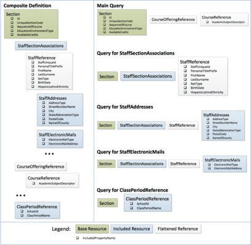
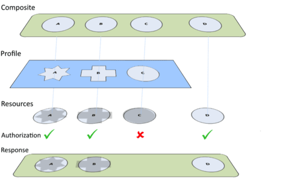

# ODS / API Composite Resources Technical Approach

As part of the evolution of the Ed-Fi ODS / API from primarily supporting _data
collection_ use cases to a widening set of _data integration_ use cases, a
mechanism is needed for exposing Composite Resources. A Composite Resource is a
read-only resource which combines data from multiple standard API resources in a
single call, effectively reducing the “chattiness” of the API interactions. This
document describes the technical approach of the Composite Resources
implementation in the Ed-Fi ODS / API.

## Resources, Profiles, and Composites

As Profiles and Composite Resources are added to the API, it is important to
understand the distinct areas of responsibility for each type of artifact.

* **Resources** (also referred to as standard resources in this document)
    represent the lowest level of granularity for exposed data and authorization
    decisions. Authorization metadata is defined in terms of the standard
    resources, and every authorization decision is based on this metadata
    regardless of whether the incoming API request is for a Composite Resource
    and/or has data policies applied through Profiles.
* **Profiles** define a data policy over one or more Resources. Profiles can
    be used to provide structural constraints over what portions of a resource
    is readable or writable by an API client system.
* **Composite Resources** provide a mechanism for exposing data from multiple
    resources in a single round-trip API call. Since a Composite Resource is
    composed of multiple standard resources, all authorization decisions about
    access to each part of a Composite Resource can be derived from the
    authorization metadata, as described above. Additionally, when accessed in
    the context of an assigned Profile (which defines data policies for the
    standard resources), the API will constrain the Composite Resource’s
    structure appropriately.

These artifacts are used together to precisely shape each caller’s interaction
with the Ed-Fi ODS / API.

## Composite Definition

Composite Definitions are expressed using an XML-based file format (similar in
style to the [Ed-Fi ODS / API
Profiles](../platform-dev-guide/security/api-profiles.md)
definition format). Composite Resources are defined in terms of standard API
resources and their properties, references, collections, embedded objects, and
linked collections (i.e., joins through the model to other API resources). The
definition starts with a single “base” resource and then can include other
members that are accessible through the model to arbitrary depths.

The definition metadata is then used for both runtime query generation and
design-time code generation of the corresponding Swagger metadata (which
supports the SwaggerUI and client SDK generation tooling). It also enables the
appropriate application of security and profile-based data policy restrictions.
Composite Resources are the sum of their parts, and are not separately securable
through authorization metadata.

## Response Construction through Composition

The API uses a compositional approach when forming a JSON response for a
Composite Resource request.

The raw data retrieval is implemented as a set of queries executed in single
batch by NHibernate. The queries are constructed using HQL (Hibernate Query
Language), which leverages the ORM mapping metadata to generate SQL appropriate
for the target database engine. Rather than making extensive use of OUTER JOINs
coupled with post-processing of the query results to remove the redundant values
from joined records, data for each resource in the composite definition is
obtained by a single query that contains a specific slice of data.

The approach is depicted in the images below for the Ed-Fi Enrollment API’s
Section resource:

The results of all the queries are then processed into a generic structure of
`IDictionary<string, object>` instances (representing individual objects) and
`IList<IDictionary<string, object>>` representing collections of objects. These
generic structures are then provided to the Json.NET library and serialized
directly to form the API response.

## Security (Authorization-Based Filtering)

Requests for standard API resources are secured using authorization strategies
that activate NHibernate filters, which are predefined WHERE clauses added to
the queries by NHibernate at execution time. Since the Composite Resources are
just a composition of standard API resources, authorizations of these requests
use the same approach. As the queries are being built for the slice of data
needed for each standard API resource, an authorization check is made to ensure
that the caller has Read permissions on the resource. If so, the query will be
built and included in the batch for that request.

It is also worth noting that due to the compositional behavior, there could be
multiple authorization strategies that would be relevant resulting in multiple
filters being applied to the batch of queries for a single Composite Resource
request.

## Profiles

Profiles define structural filters, or data policies, for one or more standard
API resources. When a Composite Resource is requested, the metadata contained in
the Composite Resource definition enables runtime determination of the
underlying standard API resources that are being accessed. The API then uses the
caller’s assigned Profiles to incorporate all of the necessary data policy
constraints into the HQL queries as they are built. In some cases, queries for
the standard API resources (and everything dependent on them within the
composite) may not be included at all. In this way, data security policy trumps
the Composite Resource definitions, ensuring that the responses only contain the
data elements allowed by the data policies.

For example, if a caller is assigned a Profile that only allows for a student’s
name and home address to be read, a composite definition containing all of a
student’s properties would be constrained by the Profile so that it only
includes the student’s name and home address. See the “Effect of Profiles and
Authorization on Composite Resources” section below for more information.

It's worth noting that Profiles do not set implicit restrictions across the
whole API surface. Resources not referenced by a Profile's data policy are not
affected. Extending the example above, the Profile set on the student resource's
properties does not implicitly restrict all other API resources.

## Composite Resource Metadata

The Ed-Fi ODS / API automatically discovers XML-based Composite Resource
definitions from embedded resources in referenced .NET assemblies. The Composite
Definition allows resources to be grouped into categories, for which entries
appear in the SwaggerUI API "Sections" drop-down list. In other words,
"Composites: Enrollment" and "Composites: Assessments" appear alongside of the
Resources, Types, Descriptors, and Other sections.

Within each category, the generated Swagger metadata and the generated
client-side SDK models for each resource will reflect the full contents of the
Composite Resource definition. However, the content of the actual JSON responses
may vary from one caller to another depending on their assigned Profiles. In a
scenario where an assigned Profile’s data policy constrains the results returned
to the caller, the generated SDK client models would contain null values for any
data not included in the response from the server as a natural consequence of
JSON deserialization.

## Effect of Profiles and Authorization on Composite Resources

In the figure below, the “Green” Composite is depicted as including Resources A,
B, C, and D, and the “Blue” Profile defines a data policy for Resources A, B,
and C (shown as differing shapes).

Suppose that an API caller has been assigned the “Blue” Profile by their API
host. Further, suppose that caller requests the “Green” Composite Resource from
the API. While the caller has been granted Read permissions to Resources A, B,
and D, they have no permissions to read Resource C (as depicted by the
“Authorization”). The response from the API will simply exclude Resource C from
the results (and any resources that are structurally dependent on it, even if
authorization would have been granted on the dependent resources).

**Example of the effects of Profiles, Authorization on a Composite Resource
Response**

With this approach, there is a single, clearly defined location for an API host
to define and manage each aspect of the API’s policies. Additionally, once the
security policy for Resources has been established (through authorization
metadata), and the data policies of the Profile have been defined, they cannot
be undermined or intentionally or inadvertently circumvented by the introduction
of a new Composite Resource. All the permissions and policies already in place
on the standard API resources will be applied to new Composite Resources.
