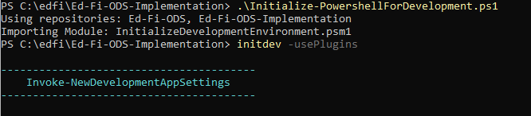
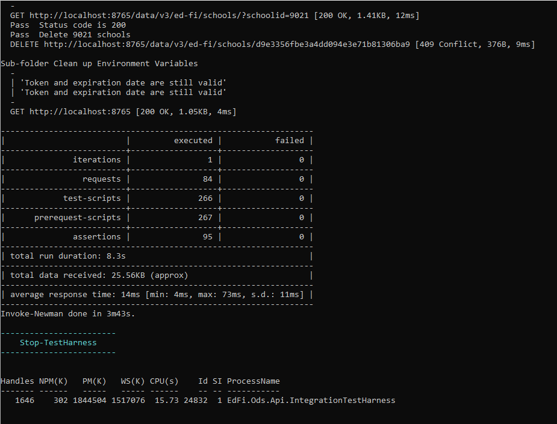
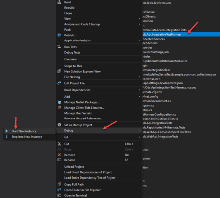
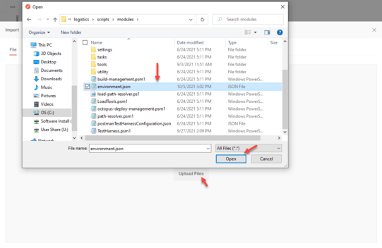
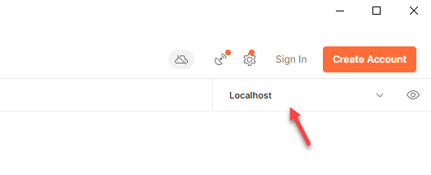
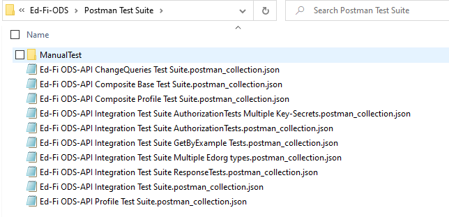
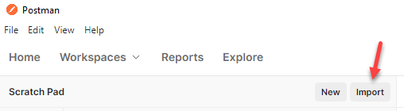
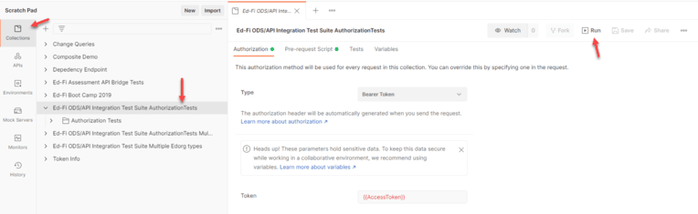
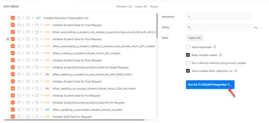
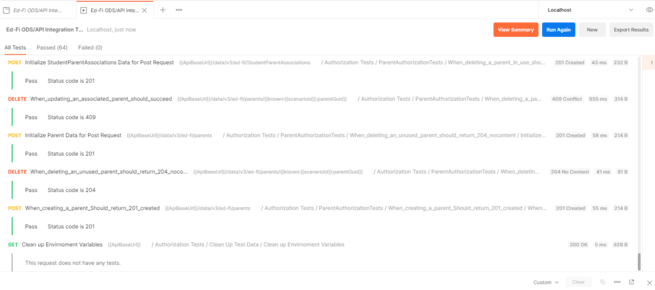

# Running the Postman Integration Tests

The Ed-Fi ODS / API includes several collections of Postman tests that can be
executed against a Test Harness included in the ODS / API source code.

The following instructions assume that the Ed-Fi ODS / API has been successfully
set up and is running in a local environment per the instructions in
the [Getting
Started](../getting-started/readme.md)
documentation. This documentation takes you through running two options for
running postman test collections:

* [Running the Postman Integration Tests](#running-the-postman-integration-tests)
  * [Running Postman Test Collections via PowerShell](#running-postman-test-collections-via-powershell)
  * [Running Postman Test Collections via Postman](#running-postman-test-collections-via-postman)

## Running Postman Test Collections via PowerShell

1. Install NVM, for windows systems you could use [nvm for
    Windows](https://github.com/coreybutler/nvm-windows/releases)
2. As outlined in the [Getting Started
    Guide](../getting-started/source-code-installation/readme.md)
    from a PowerShell prompt run `Initialize-PowershellForDevelopment.ps1`
    script followed by `initdev -usePlugins`  and finally
    `Invoke-PostmanIntegrationTests`  

    

3. Test results are presented as the tests run

    

:::info

To capture the execution output of the Postman tests into a log file for full
review (since the console window buffer may not be large enough to review the
entire results of the test), you can do the following:

1. Create a script (e.g. _run-postman-tests-core.ps1_) in the
   _Ed-Fi-ODS-Implementation_ folder with the following content:

```powershell
.\Initialize-PowershellForDevelopment.ps1
Invoke-PostmanIntegrationTests
```

2. Create a second script (e.g. _run-postman-tests.ps1_) in
   the _Ed-Fi-ODS-Implementation_ folder with the following content:

```powershell
Start-Process powershell.exe .\run-postman-tests-core.ps1 -RedirectStandardOutput .\tests.log
```

This will capture the _stdout_ from the process and write it to the specified
log file instead. The shell window that is opened won't show any activity during
the test run, so you'll just need to wait until it finishes.

:::

## Running Postman Test Collections via Postman

1. Install and launch [Postman](https://www.getpostman.com/downloads/).
2. Run the EdFi.Ods.Api.IntegrationTestHarness project from the ODS solution.
    This will create the Postman Environment file required for the tests to
    run.
    1. Run the EdFi.Ods.Api.IntegrationTestHarness project. Test Harness will
        create test API clients in the EdFi\_Admin\_Test database, create a
        Postman environment file and run a test API instance for the Postman
        tests to interact with.

        

    2. After the test harness is running, import the generated environment file
        located at ~Ed-Fi-ODS-Implementation\\logistics\\scripts\\modules

        [Import Environment](../img/image2021-10-5_17-4-17.png)

        

    3. Ensure the environment is selected on the to right corner of Postman
        window.

        

3. Locate (or download) the Ed-Fi ODS Integration Test Suite collections from
    the Ed-Fi-ODS GitHub repository. See the reference section on the right for
    GitHub link.

    
4. Import one or more of the collections into Postman using the _Import_
    function located in the upper left corner of the Postman window.

    

5. Run the tests using the Collection Runner.

    

    

6. Monitor test execution and review the test results.

    

:::note

The following GitHub link contains postman collection source: [Postman Test
Suite](https://github.com/Ed-Fi-Alliance-OSS/Ed-Fi-ODS/tree/v7.2/Postman%20Test%20Suite)
The postman test harness configuration and environment file will be generated in
the following GitHub location: [Test Harness Configuration and
Environment](https://github.com/Ed-Fi-Alliance-OSS/Ed-Fi-ODS-Implementation/tree/v7.2/logistics/scripts/modules)

:::
