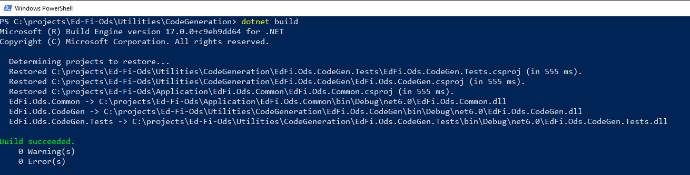
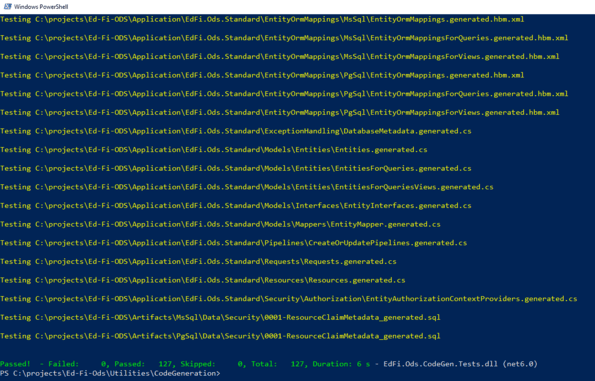
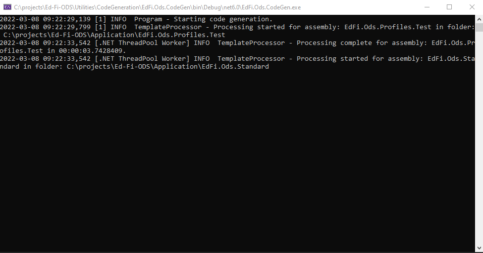
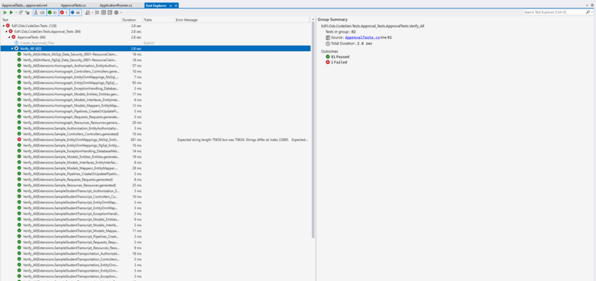
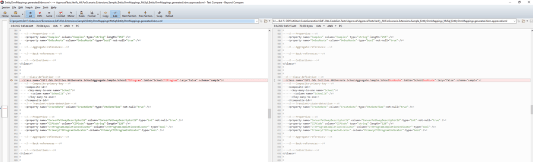

# Working with Code Generation

The Code Generation utility is a .NET 8.0 command-line application that has been
integrated into the Ed-Fi ODS / API `initdev` process. Its responsibility is to
generate C# classes, ORM mapping files for the core application, plus all
profiles and extensions. It uses logic-less `{{mustache}}` templates that are
embedded within the assembly to generate the files. The application depends on
Castle Windsor for its container.

The code generation tool is located in the ODS repository under the folder
Utilities\\CodeGeneration.

## Requirements

The following are required to build the application:

* Visual Studio 2022 / JetBrains Rider 2021.3
* .NET 8.0

## Template Model

Template models generate an anonymous object to drive the mustache template. All
template models implement the interface `ITemplateModel`, and these models are
then installed into the container to be run.

To add a new template model:

1. Create a new class in the TemplateModels namespace.
2. Utilize the [Template Method
    Pattern](https://www.dofactory.com/net/template-method-design-pattern) and
    inherit from `TemplateModelBase`.
3. Implement the `BuildTemplateModel()` method.
4. Optionally, implement the `Configure()` method, if pre-processing is
    necessary.
5. Optionally, add a Constructor for any dependencies to be injected.

The code below shows an example template model:

<details>
<summary>Expand source</summary>

```cs
using System.Collections.Generic;
using System.Linq;
using EdFi.Ods.Common;
using EdFi.Ods.Xml.XmlShredding;

namespace EdFi.Ods.CodeGen.TemplateModels
{
    public class EdOrgReferenceDictionaryProvider : TemplateModelBase
    {
        private readonly IEdOrgReferenceDictionaryProvider _edOrgReferenceDictionaryProvider;

        public EdOrgReferenceDictionaryProvider(IEdOrgReferenceDictionaryProvider edOrgReferenceDictionaryProvider)
        {
            _edOrgReferenceDictionaryProvider = edOrgReferenceDictionaryProvider;
        }

        protected override object BuildTemplateModel()
        {
            IDictionary<string, IMapStep> metadata = _edOrgReferenceDictionaryProvider.GetDictionary();

            var edOrgReferences = metadata.Keys
                                          .Select(
                                               x => new
                                                    {
                                                        EdOrgReferenceType = x, EdOrgReferenceKey = metadata[x].GetXPath()[0]
                                                    })
                                          .ToArray();

            return new
                   {
                       NamespaceName = Namespaces.CodeGen.XmlShredding,
                       EdOrgReferences = edOrgReferences
                   };
        }
    }
}
```

</details>

## Assembly Metadata

The utility introduces a new file within each assembly root folder that requires
code generation, the **assemblyMetadata.json** file:

<details>
<summary>Expand source</summary>

```json
{
    "assemblyModelType": "standard",
    "assemblyMetadataFormatVersion": "1.0.0"
}
```

</details>

* `assemblyModelType` maps the to the template set to generate.
* `assemblyMetadataFormateVersion` is the semantic version of the file.

:::info

For backward compatibility, profiles and extensions are also picked up
using conventions. This may be removed in the future.

:::

## Template Sets

Template Sets are a grouping of Template Models that are to be rendered. This
grouping is stored in an embedded object named **TemplateSets.json** which
contains an array of **TemplateSet** objects.

<details>
<summary>Expand source</summary>

```cs
namespace EdFi.Ods.CodeGen.Models.Configuration
{
    public class TemplateSet
    {
        public string Name { get; set; }

        public string Driver { get; set; }

        public string OutputName { get; set; }

        public string OutputPath { get; set; }

        public override string ToString() => $@"
Name:        {Name}
Driver:      {Driver}
OutputName:  {OutputName}
OutputPath:  {OutputPath}
";
    }
}
```

</details>

* **Name** is the name of the template.
* **Driver** is the C# Template Model.
* **OutputName** is the file name that is created.
* **OutputPath** is the location within the assembly to which the file is
    written.

The listing below shows the TemplateSets.json contents:

<details>
<summary>Expand source</summary>

```json
{
  "standard": [
    {
      "Name": "InterchangeType",
      "Driver": "InterchangeType",
      "OutputName": "InterchangeType.generated.cs",
      "OutputPath": "BulkLoad\\InterchangeType.generated.cs"
    },
    {
      "Name": "DatabaseMetadata",
      "Driver": "DatabaseMetadataProvider",
      "OutputName": "DatabaseMetadata.generated.cs",
      "OutputPath": "ExceptionHandling\\DatabaseMetadata.generated.cs"
    },
    {
      "Name": "Entities",
      "Driver": "Entities",
      "OutputName": "Entities.generated.cs",
      "OutputPath": "Models\\Entities\\Entities.generated.cs"
    },
    {
      "Name": "EntitiesForQueries",
      "Driver": "EntitiesForQueries",
      "OutputName": "EntitiesForQueries.generated.cs",
      "OutputPath": "Models\\Entities\\EntitiesForQueries.generated.cs"
    },
    {
      "Name": "EntitiesForQueriesViews",
      "Driver": "EntitiesForQueriesViews",
      "OutputName": "EntitiesForQueriesViews.generated.cs",
      "OutputPath": "Models\\Entities\\EntitiesForQueriesViews.generated.cs"
    },
    {
      "Name": "EntityInterfaces",
      "Driver": "EntityInterfaces",
      "OutputName": "EntityInterfaces.generated.cs",
      "OutputPath": "Models\\Interfaces\\EntityInterfaces.generated.cs"
    },
    {
      "Name": "EntityRecordInterfaces",
      "Driver": "EntityRecordInterfaces",
      "OutputName": "EntityRecordInterfaces.generated.cs",
      "OutputPath": "Models\\Interfaces\\EntityRecordInterfaces.generated.cs"
    },
    {
      "Name": "EntityMapper",
      "Driver": "EntityMapper",
      "OutputName": "EntityMapper.generated.cs",
      "OutputPath": "Models\\Mappers\\EntityMapper.generated.cs"
    },
    {
      "Name": "CreateOrUpdatePipelines",
      "Driver": "CreateOrUpdatePipelines",
      "OutputName": "CreateOrUpdatePipelines.generated.cs",
      "OutputPath": "Pipelines\\CreateOrUpdatePipelines.generated.cs"
    },
    {
      "Name": "Controllers",
      "Driver": "Controllers",
      "OutputName": "Controllers.generated.cs",
      "OutputPath": "Controllers\\Controllers.generated.cs"
    },
    {
      "Name": "Requests",
      "Driver": "Requests",
      "OutputName": "Requests.generated.cs",
      "OutputPath": "Requests\\Requests.generated.cs"
    },
    {
      "Name": "Resources",
      "Driver": "Resources",
      "OutputName": "Resources.generated.cs",
      "OutputPath": "Resources\\Resources.generated.cs"
    },
    {
      "Name": "ResourceFactories",
      "Driver": "ResourceFactories",
      "OutputName": "ResourceFactories.generated.cs",
      "OutputPath": "XmlShredding\\ResourceFactories.generated.cs"
    }
  ],
  "standard.bulk": [
    {
      "Name": "AggregateLoaders",
      "Driver": "AggregateLoaders",
      "OutputName": "AggregateLoaders.generated.cs",
      "OutputPath": "Core\\Controllers\\Aggregates\\AggregateLoaders.generated.cs"
    },
    {
      "Name": "LoaderCollection",
      "Driver": "LoaderCollection",
      "OutputName": "LoaderCollection.generated.cs",
      "OutputPath": "Core\\Controllers\\Aggregates\\LoaderCollection.generated.cs"
    }
  ],
  "standard.nhibernate": [
    {
      "Name": "EntityOrmMappings",
      "Driver": "EntityOrmMappings",
      "OutputName": "EntityOrmMappings.generated.hbm.xml",
      "OutputPath": "EntityOrmMappings.generated.hbm.xml"
    },
    {
      "Name": "EntityOrmMappings",
      "Driver": "EntityOrmMappingsForQueries",
      "OutputName": "EntityOrmMappingsForQueries.generated.hbm.xml",
      "OutputPath": "EntityOrmMappingsForQueries.generated.hbm.xml"
    },
    {
      "Name": "EntityOrmMappings",
      "Driver": "EntityOrmMappingsForViews",
      "OutputName": "EntityOrmMappingsForViews.generated.hbm.xml",
      "OutputPath": "EntityOrmMappingsForViews.generated.hbm.xml"
    }
  ],
  "standard.security": [
    {
      "Name": "EntityAuthorizationContextProviders",
      "Driver": "EntityAuthorizationContextProviders",
      "OutputName": "EntityAuthorizationContextProviders.generated.cs",
      "OutputPath": "Authorization\\EntityAuthorizationContextProviders.generated.cs"
    }
  ],
  "standard.xmlmetadata": [
    {
      "Name": "ContextMetadata",
      "Driver": "ContextMetadata",
      "OutputName": "ContextMetadata.generated.cs",
      "OutputPath": "XmlMetadata\\ContextMetadata.generated.cs"
    },
    {
      "Name": "EdOrgReferenceDictionaryProvider",
      "Driver": "EdOrgReferenceDictionaryProvider",
      "OutputName": "EdOrgReferenceDictionaryProvider.generated.cs",
      "OutputPath": "XmlMetadata\\EdOrgReferenceDictionaryProvider.generated.cs"
    },
    {
      "Name": "ElementsSchema",
      "Driver": "ElementsSchema",
      "OutputName": "Elements.schema.generated.cs",
      "OutputPath": "XmlMetadata\\Elements.schema.generated.cs"
    },
    {
      "Name": "NoForeignKeyMetadata",
      "Driver": "NoForeignKeyMetadata",
      "OutputName": "NoForeignKeyMetadata.generated.cs",
      "OutputPath": "XmlMetadata\\NoForeignKeyMetadata.generated.cs"
    }
  ],
  "database": [
    {
      "Name": "ResourceClaimMetadata",
      "Driver": "ResourceClaimMetadata",
      "OutputName": "0001-ResouceClaimMetadata_generated.sql",
      "OutputPath": "Data\\EdFiSecurity\\0001-ResouceClaimMetadata_generated.sql"
    }
  ],
  "profile": [
    {
      "Name": "Controllers",
      "Driver": "Controllers",
      "OutputName": "Controllers.generated.cs",
      "OutputPath": "Controllers\\Controllers.generated.cs"
    },
    {
      "Name": "CreateOrUpdatePipelines",
      "Driver": "CreateOrUpdatePipelines",
      "OutputName": "CreateOrUpdatePipelines.generated.cs",
      "OutputPath": "Pipelines\\CreateOrUpdatePipelines.generated.cs"
    },
    {
      "Name": "Requests",
      "Driver": "Requests",
      "OutputName": "Requests.generated.cs",
      "OutputPath": "Requests\\Requests.generated.cs"
    },
    {
      "Name": "Resources",
      "Driver": "Resources",
      "OutputName": "Resources.generated.cs",
      "OutputPath": "Resources\\Resources.generated.cs"
    }
  ],
  "extension": [
    {
      "Name": "EntityAuthorizationContextProviders",
      "Driver": "EntityAuthorizationContextProviders",
      "OutputName": "EntityAuthorizationContextProviders.generated.cs",
      "OutputPath": "Authorization\\EntityAuthorizationContextProviders.generated.cs"
    },
    {
      "Name": "InterchangeType",
      "Driver": "InterchangeType",
      "OutputName": "InterchangeType.generated.cs",
      "OutputPath": "BulkLoad\\InterchangeType.generated.cs"
    },
    {
      "Name": "AggregateLoaders",
      "Driver": "AggregateLoaders",
      "OutputName": "AggregateLoaders.generated.cs",
      "OutputPath": "BulkLoad\\Controllers\\Aggregates\\AggregateLoaders.generated.cs"
    },
    {
      "Name": "LoaderCollection",
      "Driver": "LoaderCollection",
      "OutputName": "LoaderCollection.generated.cs",
      "OutputPath": "BulkLoad\\Controllers\\Aggregates\\LoaderCollection.generated.cs"
    },
    {
      "Name": "EntityOrmMappings",
      "Driver": "EntityOrmMappings",
      "OutputName": "EntityOrmMappings.generated.hbm.xml",
      "OutputPath": "EntityOrmMappings\\EntityOrmMappings.generated.hbm.xml"
    },
    {
      "Name": "DatabaseMetadata",
      "Driver": "DatabaseMetadataProvider",
      "OutputName": "DatabaseMetadata.generated.cs",
      "OutputPath": "ExceptionHandling\\DatabaseMetadata.generated.cs"
    },
    {
      "Name": "Entities",
      "Driver": "Entities",
      "OutputName": "Entities.generated.cs",
      "OutputPath": "Models\\Entities\\Entities.generated.cs"
    },
    {
      "Name": "EntitiesForQueries",
      "Driver": "EntitiesForQueries",
      "OutputName": "EntitiesForQueries.generated.cs",
      "OutputPath": "Models\\Entities\\EntitiesForQueries.generated.cs"
    },
    {
      "Name": "EntitiesForQueriesViews",
      "Driver": "EntitiesForQueriesViews",
      "OutputName": "EntitiesForQueriesViews.generated.cs",
      "OutputPath": "Models\\Entities\\EntitiesForQueriesViews.generated.cs"
    },
    {
      "Name": "EntityInterfaces",
      "Driver": "EntityInterfaces",
      "OutputName": "EntityInterfaces.generated.cs",
      "OutputPath": "Models\\Interfaces\\EntityInterfaces.generated.cs"
    },
    {
      "Name": "EntityRecordInterfaces",
      "Driver": "EntityRecordInterfaces",
      "OutputName": "EntityRecordInterfaces.generated.cs",
      "OutputPath": "Models\\Interfaces\\EntityRecordInterfaces.generated.cs"
    },
    {
      "Name": "EntityMapper",
      "Driver": "EntityMapper",
      "OutputName": "EntityMapper.generated.cs",
      "OutputPath": "Models\\Mappers\\EntityMapper.generated.cs"
    },
    {
      "Name": "CreateOrUpdatePipelines",
      "Driver": "CreateOrUpdatePipelines",
      "OutputName": "CreateOrUpdatePipelines.generated.cs",
      "OutputPath": "Pipelines\\CreateOrUpdatePipelines.generated.cs"
    },
    {
      "Name": "Controllers",
      "Driver": "Controllers",
      "OutputName": "Controllers.generated.cs",
      "OutputPath": "Controllers\\Controllers.generated.cs"
    },
    {
      "Name": "Requests",
      "Driver": "Requests",
      "OutputName": "Requests.generated.cs",
      "OutputPath": "Requests\\Requests.generated.cs"
    },
    {
      "Name": "Resources",
      "Driver": "Resources",
      "OutputName": "Resources.generated.cs",
      "OutputPath": "Resources\\Resources.generated.cs"
    },
    {
      "Name": "ResourceFactories",
      "Driver": "ResourceFactories",
      "OutputName": "ResourceFactories.generated.cs",
      "OutputPath": "XmlShredding\\ResourceFactories.generated.cs"
    }
  ]
}
```

</details>

## Command Line Parameters

The tool accepts the following command line argument:

* `-r <repository path>`. The repository path to the location of the solution
    (e.g., C:\\EdFi\\v3).

## Building Code Generation

The solution can be built using Visual Studio 2022 or Rider 2021.3. Also, it can
be built from the command line using the following command: `dotnet build`.



## Running Tests

Tests can be run using Visual Studio Test Explorer, R# Test Runner of Rider
2021.3. Alternatively, the tests can be run using the command `dotnet test`.



## Running Approval Tests

Included in the testing suite are approval tests that validate the code
generated is as expected.

To run the tests, the following steps are required:

**Step 1 :** Build the solution with Visual Studio.

**Step 2 :** Set **EdFi.Ods.Codegen.Console** as the startup project. Note that
the command argument is not necessary.

**Step 3 :** Run the solution within Visual Studio.



**Step 4 :** Open Test Explorer and look for the Verify\_All test and run it to
see if there are any failures



**Step 5 :** Approve any changes, if appropriate.


