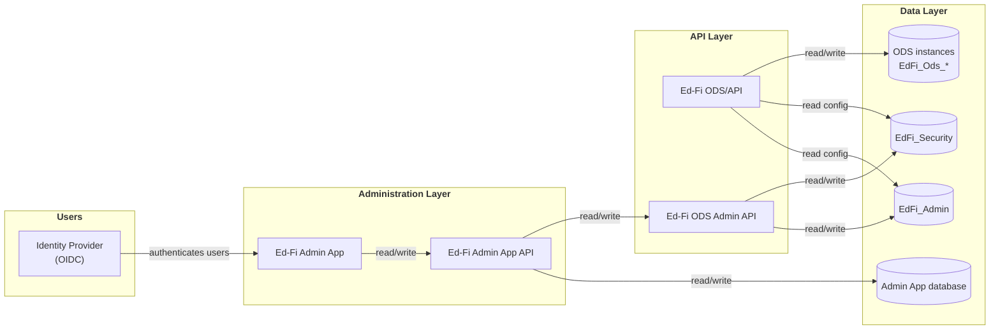
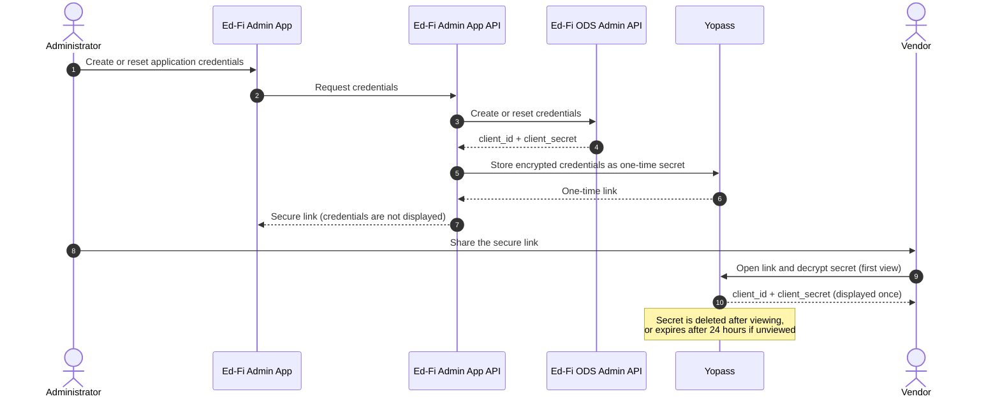
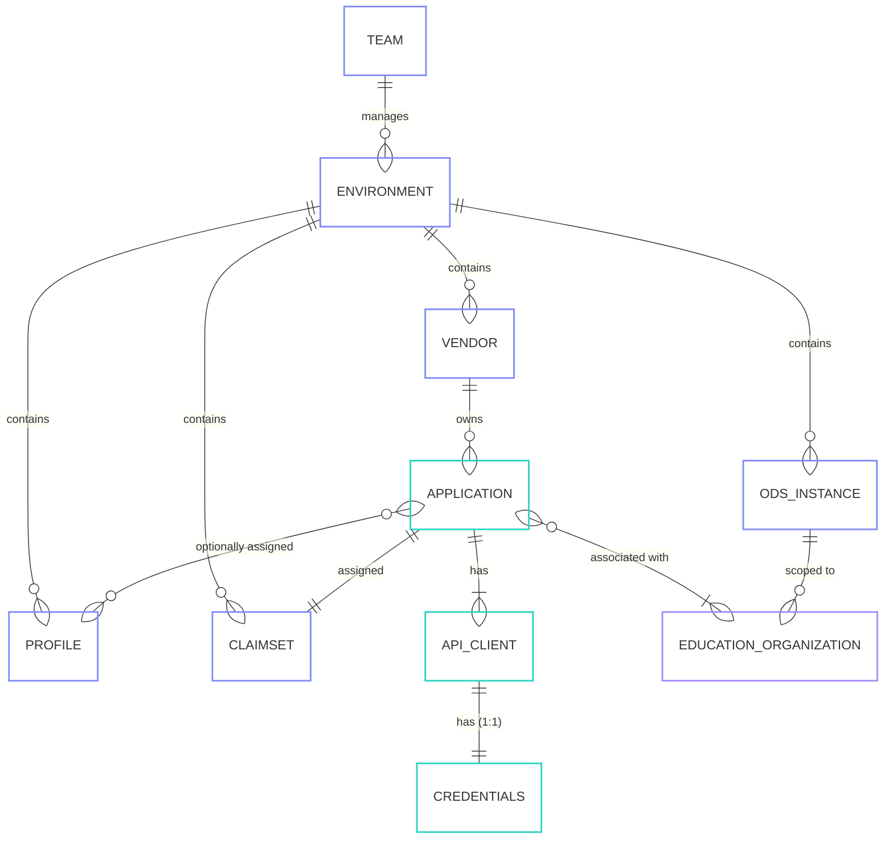

The Ed-Fi Admin App manages vendor credentials for integrating with one or more deployments of the Ed-Fi ODS/API. Each deployment contains one or more ODS database instances — for example, one instance per school year. The Admin App gives administrators a single place to create and manage the vendors, applications, claimsets, and credentials that vendors and integrating systems use to exchange data with each ODS instance.

## Deployment architecture

The diagram below shows the major components involved in an Ed-Fi Admin App deployment and how they relate to one another.

How the components relate:

- The **Ed-Fi Admin App** is the web user interface (a single-page application) that administrators sign in to. It does not access any database directly; instead it sends every request to its backend, the **Ed-Fi Admin App API**.
- The **Ed-Fi Admin App API** is the backend for the Admin App. It stores the application's own state (users, teams, ownership) in the **Admin App database**, and it performs all credential and configuration management by calling the **Ed-Fi ODS Admin API**.
- The **Ed-Fi ODS Admin API** reads and writes the **EdFi\_Admin** database (vendors, applications, claimset assignments, credentials) and the **EdFi\_Security** database (claim/resource authorization metadata).
- The **Ed-Fi ODS/API** serves data to vendors and integrating systems from one or more **ODS instances** (the `EdFi_Ods_*` databases), and reads the same `EdFi_Admin` and `EdFi_Security` databases at runtime to authenticate and authorize API clients.
- The **Identity Provider** authenticates Admin App users; it is not involved in authenticating API clients (which use the credentials managed in `EdFi_Admin`).

## Authentication (Identity Provider)

User authentication for the Admin App requires an OpenID Connect (OIDC) compatible Identity Provider (IdP). The IdP authenticates the administrators who sign in to the Admin App; permissions and roles for those users are then managed within the Admin App itself.

For configuration details and supported providers, see [Configuring an Identity Provider for Ed-Fi Admin App](/reference/admin-app/configuration/identity-provider).

## Network Security

:::warning

Initially, place the Ed-Fi Admin App _inside_ your network security firewall, accessible only by staff and contractors. The Admin App is an administrative tool that can create and reveal API credentials, so limiting who can reach it directly limits the attack surface of your deployment.

:::

## Optional: Yopass

Yopass is an optional component that provides higher security for sharing credentials, at the cost of additional components to install and configure. For installation and configuration details, see the [Yopass Administrator Guide](/reference/admin-app/configuration/yopass-administrators-guide).

The diagram below shows how Yopass fits into the credential-sharing flow. When an administrator creates or resets an application's credentials, the Admin App API stores the encrypted credentials in Yopass and returns a one-time link instead of displaying the key and secret directly. The vendor opens the link once; after that, the secret is permanently deleted.

:::note

Because vendors must be able to open the links you share with them, the Yopass web interface must be reachable by vendors through the firewall, while the Admin App itself stays inside it.

:::

## Core concepts glossary

The Ed-Fi Admin App organizes everything it manages around a small set of core concepts. The definitions below match the [User's Guide to Admin App](/reference/admin-app/user-guide); use this section as the single glossary for the terms.

- **Teams** — A collection of owned resources. Most installations will have a single team consisting of all environments at the top level, and all the related owned resources therein.
- **Environments** — A single deployment of the Ed-Fi ODS/API. Drilling into an environment lists its Tenants, ODSs, Ed-Orgs, Vendors, Applications, and Claimsets.
- **Instances (ODS)** — Operational Data Store. A database that holds operational data for the current school year in the Ed-Fi API, stored per the Ed-Fi Data Standard. A single-tenant or multi-tenant `EdFi_Admin` + `EdFi_Security` pairing can support one or more `EdFi_Ods` instances (for example, one instance per school year).
- **Education Organizations (Ed-Orgs)** — The education organizations with which API credentials are associated. An application can be associated with one or more Ed-Orgs, and data in the environment related to those Ed-Orgs is accessible via the application's credentials.
- **Vendors** — A named entity that owns one or more applications within the system. They are the main link between applications and namespace prefixes — for example, an assessment vendor like iReady or ACT, or a SIS vendor like PowerSchool.
- **Claimsets** — A collection of rules/permissions that define which resources can be accessed, what actions can be performed, and the authorization strategies that apply.
- **Profiles** — Complement claimsets by controlling access at a more granular level — at the columnar or sub-collection level within resources.
- **Applications** — A named entity that associates resource authorizations with API clients. All applications belong to a vendor and are assigned a claimset (and optionally one or more profiles).
- **API Clients** — The client entities through which an application connects to the Ed-Fi ODS/API. An application has one on one API clients. Creating an application automatically creates its first (default) API client.
- **Credentials** — The `client_id` and `client_secret` (aka "key and secret") for authenticating with an Ed-Fi API application. The ODS/API's security database supports multiple sets of credentials per application, as does ODS Admin API version 2.3. However, the Ed-Fi Admin App only supports a one-to-one mapping and treats the credentials as synonymous with the application itself.

The diagram below shows how these concepts relate to one another.

In words:

- One **team** manages one or many **environments**.
- One **environment** can contain one or many **ODS instances** (each scoped to one or more Ed-Orgs/LEAs), as well as many **vendors**, **profiles**, and **claimsets**.
- One **vendor** owns one or many **applications**.
- An **application** is assigned one **claimset** and, optionally, one or more **profiles**, is associated with one or more **education organizations**, and has one or more **API clients**, each with its own set of **credentials** (key and secret).

## What this guide covers

This deployment guide walks you through a focused, end-to-end setup so your team can move quickly:

- A single admin user with full administrative rights
- A single team
- A single environment
- Two school-year ODS instances
- Two local education agencies (LEAs)

Completing this path gives you a working baseline that you can grow into a fuller deployment as your program expands.
