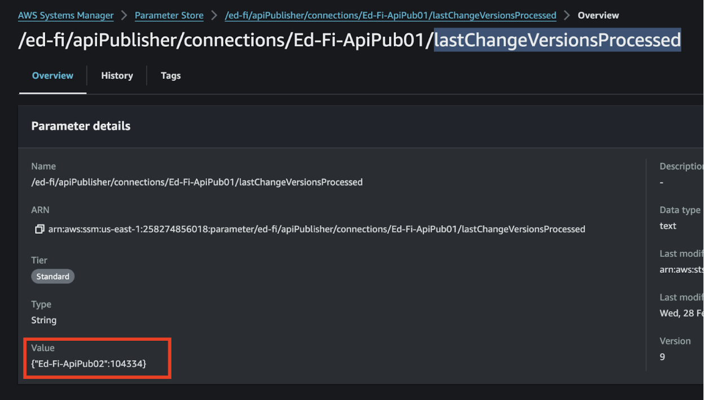

# Running in Docker Desktop

# Setup

## Step 1. Download the Source Code or Clone the Repo

The Ed-Fi ODS Docker deployment source code is in the Ed-Fi repository hosted by
GitHub. A link to the repository is provided in the download panel on the right.
You can clone the repository or download the source code as a ZIP file.

https://github.com/Ed-Fi-Alliance-OSS/Ed-Fi-API-Publisher

## Step 2. Setup Your Environment Variables

Configure your deployments using an environment file. The repository includes a
.env.example listing the supported environment variables.

> Path: /src/Compose/env.example


Copy env.example file and name it .env. Update the values as desired.

```docker
# Nuget version
VERSION=<Package to install from https://dev.azure.com/ed-fi-alliance/Ed-Fi-Alliance-OSS/_artifacts/feed/EdFi/NuGet/EdFi.ApiPublisher/ Eg. 0.0.0-alpha.0.38>

# The section option for apiPublisherSettings file
BEARER_TOKEN_REFRESH_MINUTES=<Default. 28>
RETRY_STARTING_DELAY_MILLISECONDS=<Default. 100>
MAX_RETRY_ATTEMPTS=<Default. 10>
MAX_DEGREE_OF_PARALLELISM_FOR_RESOURCE_PROCESSING=<Default. 10>
MAX_DEGREE_OF_PARALLELISM_FOR_POST_RESOURCE_ITEM=<Default. 20>
MAX_DEGREE_OF_PARALLELISM_FOR_STREAM_RESOURCE_PAGES=<Default. 5>
STREAMING_PAGES_WAIT_DURATION_SECONDS=<Default. 10>
STREAMING_PAGE_SIZE=<Default. 75>
INCLUDE_DESCRIPTORS=<Default. false>
ERROR_PUBLISHING_BATCH_SIZE=<Default. 25>
USE_CHANGE_VERSION_PAGING=<Default. false>
CHANGE_VERSION_PAGING_WINDOW_SIZE=<Default. 25000>

# The file configurationStoreSettings
PROVIDER=<Could be one of the following values: sqlServer, postgreSql, awsParameterStore, or plainText. Default. plainText>
SQLSERVER_SERVER=<If PROVIDER is sqlServer this is required Eg. (local)>
SQLSERVER_DATABASE=<If PROVIDER is sqlServer this is required Eg. EdFi_API_Publisher_Configuration>
POSTGRESQL_HOST=<If PROVIDER is postgreSql this is required Eg. localhost>
POSTGRESQL_DATABASE=<If PROVIDER is postgreSql this is required Eg. edfi_api_publisher_configuration>
AWS_PROFILE=<If PROVIDER is awsParameterStore this is required Eg. default>
AWS_REGION=<If PROVIDER is awsParameterStore this is required Eg. us-east-1>

# PlainText connections
SOURCE_NAME=<Name for the source connection Eg. Hosted_Sample_v5.2>
SOURCE_URL=<Url for the source connection Eg. https://api.ed-fi.org/v5.2/api/>
SOURCE_KEY=<Key for the source connection Eg. RvcohKz9zHI4>RvcohKz9zHI4
SOURCE_SECRET=<Secret for the source connection Eg. E1iEFusaNf81xzCxwHfbolkC>

TARGET_NAME=<Name for the target connection Eg. Local_v5.2>
TARGET_URL=<Url for the target connection Eg. http://localhost:54746/>
TARGET_KEY=<Key for the target connection Eg. RvcohKz9zHI4>
TARGET_SECRET=<Secret for the target connection Eg. E1iEFusaNf81xzCxwHfbolkC>

# Logging using Serilog
WRITE_TO_FILE_PATH=<Path to store the logging file Eg. ../tmp/logs/Ed-Fi-API-PublisherSerilog.log>
```

Sample .env provide all the different parameters for run ApiPublisher with
different configurations. Please provide the information necessary for a
specific configuration.

## Change Configuration on .env file

### 2.a. Nuget Version

:::info note:

    If you want to run a different version than the release, you can modify

the version in this file using the name of the generated build. (Docker file
i.e. ENV VERSION="1.0.1-alpha.0.17") 

:::


### 2.b. Section ApiPublisherSettings file

If you like, you can change the default parameters or leave them as is.

[API Publisher Configuration](API-Publisher-Configuration.md)

### 2.c. Section ConfigurationStoreSettings and Plain Text Connections

These two sections can be configured using
[API Connection Management](API-Connection-Management.md)

## Step 3. Run Docker Compose

In this step you need to run a command in any shell terminal that support Docker
commands (i.e. PowerShell in Windows)

Go to the root of the project and run this command:

```shell
docker-compose -f src/Compose/compose-build.yml --env-file src/Compose/.env up -d
```

## Step 4. Verify Your Deployments


You can also check these files to see if all the settings in the .env file are
used in the API Publisher configuration.


## Step 5. Run API Publisher

We have two ways to run API Publisher inside or outside the created container.

### Outside Container.

```shell
docker exec -it ed-fi-ods-apipublisher dotnet EdFiApiPublisher.dll --sourceUrl={{SourceUrl}}/WebApi/ --sourceKey={{SourceKey}} --sourceSecret={{SourceSecret}} --targetUrl=https://{{TargetUrl}}/WebApi/ --targetKey={{TargetKey}} --targetSecret={{TargetSecret}} {{Additional Parameters}}
```


### Inside Container.

Using Docker Dashboard it is possible to enter the container and use its
terminal. Once inside it is necessary to run the command without the docker
parameter... i.e.


```shell
dotnet EdFiApiPublisher.dll --sourceUrl={{SourceUrl}}/WebApi/ --sourceKey={{SourceKey}} --sourceSecret={{SourceSecret}} --targetUrl=https://{{TargetUrl}}/WebApi/ --targetKey={{TargetKey}} --targetSecret={{TargetSecret}} {{Additional Parameters}}
```


# Additional Configurations.

## AWS Parameter Store.

### Configuration

It is necessary to have the store parameters created on AWS
[Configuration Aws Parameter Store](ConfigurationStore/Aws-Parameter-Store.md)

Export AWS credentials to consume AWS parameters store inside the container


### B. Execution

Having all this configured it is possible to run ApiPublisher with the
AWSParameterStore parameter

```shell
dotnet EdFiApiPublisher.dll --configurationStoreProvider=awsParameterStore --sourceName=Ed-Fi-ApiPub01 --targetName=Ed-Fi-ApiPub02 --ignoreIsolation=true --maxRetryAttempts=4 --retryStartingDelayMilliseconds=1000 --streamingPageSize=1000 --maxDegreeOfParallelismForResourceProcessing=1 --includeOnly=grades,students
```


### C. Validate Results.

After completing the execution the 'lastChangeVersion Processed' parameter value
should be updated



# CloudWatch.

## Configuration

Configure the AWS log storage parameters in the configuration file.
[Configuration CloudWatch](CloudWatch-configuration.md)

## Execution.

Run any ApiPublisher command to start storing the execution results.

```shell
dotnet EdFiApiPublisher.dll --configurationStoreProvider=awsParameterStore --sourceName=Ed-Fi-ApiPub01 --targetName=Ed-Fi-ApiPub02 --ignoreIsolation=true --maxRetryAttempts=4 --retryStartingDelayMilliseconds=1000 --streamingPageSize=1000 --maxDegreeOfParallelismForResourceProcessing=1 --includeOnly=grades,students
```

To review the results we have to go to the 'logGroup' and then look for the last
logStream created.


