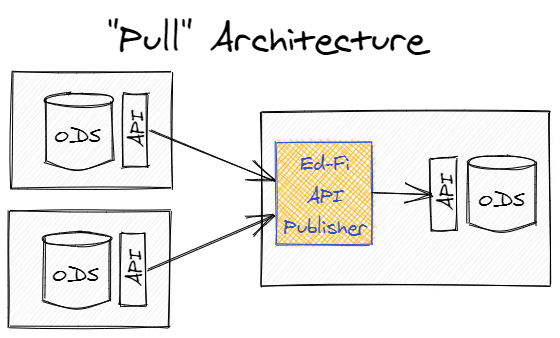
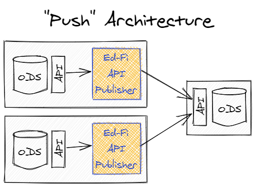
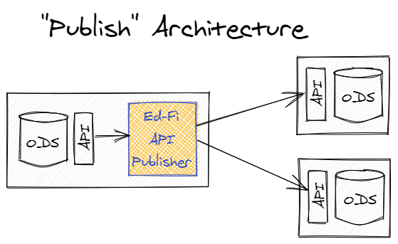

# API Publisher

[](https://securityscorecards.dev/viewer/?uri=github.com/Ed-Fi-Alliance-OSS/Ed-Fi-API-Publisher)

## Introduction
The Ed-Fi API Publisher is a utility that can be used to move data and changes from one Ed-Fi ODS API instance to another instance of the _same_ version of Ed-Fi. It operates as a standard API client against both API endpoints (source and target) and thus it does not require any special network configuration, direct ODS database access or a particular database engine. From a data security/privacy perspective, it is also subject to all authorization performed by the Ed-Fi ODS API endpoints with which it communicates.

Operationally, it can be used in a "Pull" model where it is deployed alongside a target (central) API and gathers data from multiple source APIs.
<br/>


Alternatively, it could also be used in a "Push" model where the utility is deployed alongside the source APIs and pushes data to the central target.
<br/>


However, it can also be used in a "Publishing" model where it is installed alongside a source API and pushes data to multiple targets (e.g. to both a State Education Agency and a collaborative).
<br/>


If a source API supports the "Change Queries" feature, the Ed-Fi API Publisher will perform a full publishing of the source data on the first run, and then will only publish changed data to the target on subsequent runs. The change versions that have been published to a particular target are maintained in a configuration store automatically for each source/target combination.

## Quick Start

To demonstrate how the API Publisher works, this exercise copies all the data from [the sample hosted Ed-Fi ODS API](https://api.ed-fi.org) to a local sandbox Ed-Fi ODS API using the API client for the "minimal" template. (The database scripts are written for SQL Server.)

### Configure Local Sandbox Environment

Before using the API Publisher on a target ODS, you must create and configure an API client with the appropriate permissions for publishing.  The source and destination ODS/API must be of the same version.

For Ed-Fi ODS / API 5.1 through 5.3 only: create and assign a claim set for the API Publisher by running the following database scripts:
  * [Create-API-Publisher-Writer-Security-Metadata.sql](eng/Create-API-Publisher-Writer-Security-Metadata.sql)
  * [Configure-Minimal-Sandbox-Client-as-API-Publisher-Writer.sql](eng/Configure-Minimal-Sandbox-Client-as-API-Publisher-Writer.sql)

### Use the API Publisher

The API Publisher has three options to use the product.  The API Publisher requires [.NET 8.0](https://dotnet.microsoft.com/en-us/download/dotnet/8.0) to run:

#### Option 1 - From binaries

 1. Download the latest published API Publisher package here:  [Ed-Fi API Publisher v1.0](https://dev.azure.com/ed-fi-alliance/Ed-Fi-Alliance-OSS/_artifacts/feed/EdFi/NuGet/EdFi.ApiPublisher/overview/1.1.0).  Visit the page and click download.
 2. This will download a NuGet package to your computer.  Rename this file, `EdFi.ApiPublisher.1.1.0.nupkg`, to include .zip extension: `EdFi.ApiPublisher.1.1.0.zip`.
 3. The binary mentioned below is in the `EdFi.ApiPublisher.Win64` folder, as `EdFiApiPublisher.exe`.

#### Option 2 - From Docker images

The Docker image for the Ed-Fi API Publisher is available here: [Ed-Fi API Publisher v1.0 on Docker Hub](https://hub.docker.com/layers/edfialliance/ods-api-publisher/v1.1.0/images/sha256-4930ca34fbc71dee2fbbec09c904f980d86db536e0486f713fd03341ea5854d5?context=explore).  Use this to include in your Docker environment and alongside other components of the Ed-Fi stack.

#### Option 3 - Build the API Publisher from source code

If you would like to build the API Publisher from source, build the solution by running the following command from the repository's root directory:

`dotnet build`

The API Publisher executable (`EdFiApiPublisher.exe`) will be located in the _.\EdFi.Tools.ApiPublisher.Cli\bin\Debug\net8.0_ subfolder.

### Publish Data to Local Sandbox

> **IMPORTANT: After changing security metadata for the API, YOU MUST RESTART the local sandbox Ed-Fi ODS API if it is already running.**

Next, locate the key/secret for the API client for the minimal template sandbox. You can use the Sandbox Admin tool, or can just run the following query against the `EdFi_Admin` database:

```sql
SELECT  [Key], [Secret]
FROM    EdFi_Admin.dbo.ApiClients
WHERE   Name = 'Minimal Demonstration Sandbox'
```

The following table shows the command-line arguments that will be used for publishing.

> NOTE: Due to the nature of the Quick Start configuration (assuming SQL Server and the Ed-Fi-ODS API are running on a local development machine), we'll limit the parallelism for POST requests to `5`. Architectures with dedicated API and database resources should be able to accommodate much higher numbers.

| Parameter                                        |     | Value                             |
| ------------------------------------------------ | --- | --------------------------------- |
| `--sourceUrl`                                    | `=` | `https://api.ed-fi.org/v5.2/api/` |
| `--sourceKey`                                    | `=` | `RvcohKz9zHI4`                    |
| `--sourceSecret`                                 | `=` | `E1iEFusaNf81xzCxwHfbolkC`        |
| `--targetUrl`                                    | `=` | `http://localhost:54746/`         |
| `--targetKey`                                    | `=` | (Minimal Sandbox API _key_)       |
| `--targetSecret`                                 | `=` | (Minimal Sandbox API _secret_)    |
| `--ignoreIsolation`                              | `=` | `true`                            |
| `--maxDegreeOfParallelismForPostResourceItem`    | `=` | `5`                               |
| `--maxDegreeOfParallelismForStreamResourcePages` | `=` | `3`                               |
| `--includeDescriptors`                           | `=` | `true`                            |
| `--exclude`                                      | `=` | `surveys`                         |

Run the Ed-Fi API Publisher from the folder containing all the binaries by executing the following command, substituting your own API client's key and secrets.  (Below development keys as shown in other Ed-Fi examples):
```
.\EdFiApiPublisher.exe --sourceUrl=https://api.ed-fi.org/v5.2/api/ --sourceKey=RvcohKz9zHI4 --sourceSecret=E1iEFusaNf81xzCxwHfbolkC --targetUrl=http://localhost:54746/ --targetKey=minimal_sandbox_API_key --targetSecret=minimal_sandbox_API_secret --ignoreIsolation=true --maxDegreeOfParallelismForPostResourceItem=5 --maxDegreeOfParallelismForStreamResourcePages=3 --includeDescriptors=true --exclude=surveys
```
> NOTE for Ed-Fi ODS API v5.2 only: The `--exclude` flag is used to prevent trying to move any survey data due to an issue with the security metadata (described in [ODS-4974](https://tracker.ed-fi.org/browse/ODS-4974)) in the Ed-Fi ODS API v5.2 release. If you remove this argument, the publishing operation will fail due to unsatisfied dependencies in the data.  This has been fixed in future versions of the ODS/API platform.

For more documentation on API Publisher's parameters, please see the [API Publisher Configuration](technical-articles/API-Publisher-Configuration.md) markdown file for other runtime options.

For more information in relation to key changes and deletes, please see [Considerations in relation to key changes and deletes](technical-articles/API-Publisher-Configuration.md#considerations-in-relation-to-key-changes-and-deletes)

## Known Limitations for Ed-Fi ODS / API 5.1 through 5.3

Currently, Ed-Fi ODS / API 5.1 through 5.3 has the following known issues related to Change Queries and the Ed-Fi API Publisher.  These have been resolved in [Ed-Fi ODS / API 5.3-cqe patch](https://techdocs.ed-fi.org/display/EFTD/Change+Query+Enhancements) and [Ed-Fi ODS / API 6.1](https://techdocs.ed-fi.org/pages/viewpage.action?pageId=138642238).

* [Change Queries implementation doesn't provide enough information to communicate deletes between ODS databases](https://tracker.ed-fi.org/browse/ODS-3672)
* [Add support to Change Queries for tracking deletes by natural key](https://tracker.ed-fi.org/browse/ODS-4423)
* [Change Queries does not capture deletes on derived resources](https://tracker.ed-fi.org/browse/ODS-4087)
* [Change Queries does not support primary key changes](https://tracker.ed-fi.org/browse/ODS-5005)

(Feedback on the need for resolution to the Ed-Fi ODS API issues listed above should be provided to the Ed-Fi Alliance through [Ed-Fi Support](https://support.ed-fi.org/).)

The Ed-Fi ODS/API only exposes the "Id" of the resources that are deleted, however since the "Id" is not intended to be a global, portable identifier for the resource (Ed-Fi uses domain key values for that identity), and thus the _current implementation_ of the deletes resource is of limited value for API Publishing.

Even with delete support added by exposing the primary key values, tracking and publishing deletions of Descriptors will still not be possible due to internal implementation details within the Ed-Fi ODS API through (at least) v5.3.

Changes to primary keys (on the API resources that support it) in source API will currently result in stale copies of the "old" version of the resources (and all impacted dependencies) remaining in the target API. 

An additional limitation of the Ed-Fi API Publisher is the current lack of support for API Profiles (for defining resource/property level data policies for API clients). Create a support case to request Profiles support if this of interest to you.

More technical details on some of these issues can be found [here](technical-articles/Known-Issues-Details.md).


## Next Steps

When you're ready to look further, review these other topics:

* [API Connection Management](technical-articles/API-Connection-Management.md)
* [API Publisher Configuration](technical-articles/API-Publisher-Configuration.md)
* [Considerations for API Hosts](technical-articles/Considerations-for-API-Hosts.md)
* [Considerations for Docker Configuration and Execution](technical-articles/Considerations-docker-configuration-and-execution.md)
* [How to use the TextFormatter class](technical-articles/Use-TextFormatter-Serilog.md).

## Support

For support with the API Publisher, please use [Ed-Fi Support](https://support.ed-fi.org/) to open a support case and/or feature request.

## Legal Information

Copyright (c) 2023 Ed-Fi Alliance, LLC and contributors.

Licensed under the [Apache License, Version 2.0](../LICENSE) (the "License").

Unless required by applicable law or agreed to in writing, software distributed
under the License is distributed on an "AS IS" BASIS, WITHOUT WARRANTIES OR
CONDITIONS OF ANY KIND, either express or implied. See the License for the
specific language governing permissions and limitations under the License.

See [NOTICES](../NOTICES.md) for additional copyright and license notifications.
