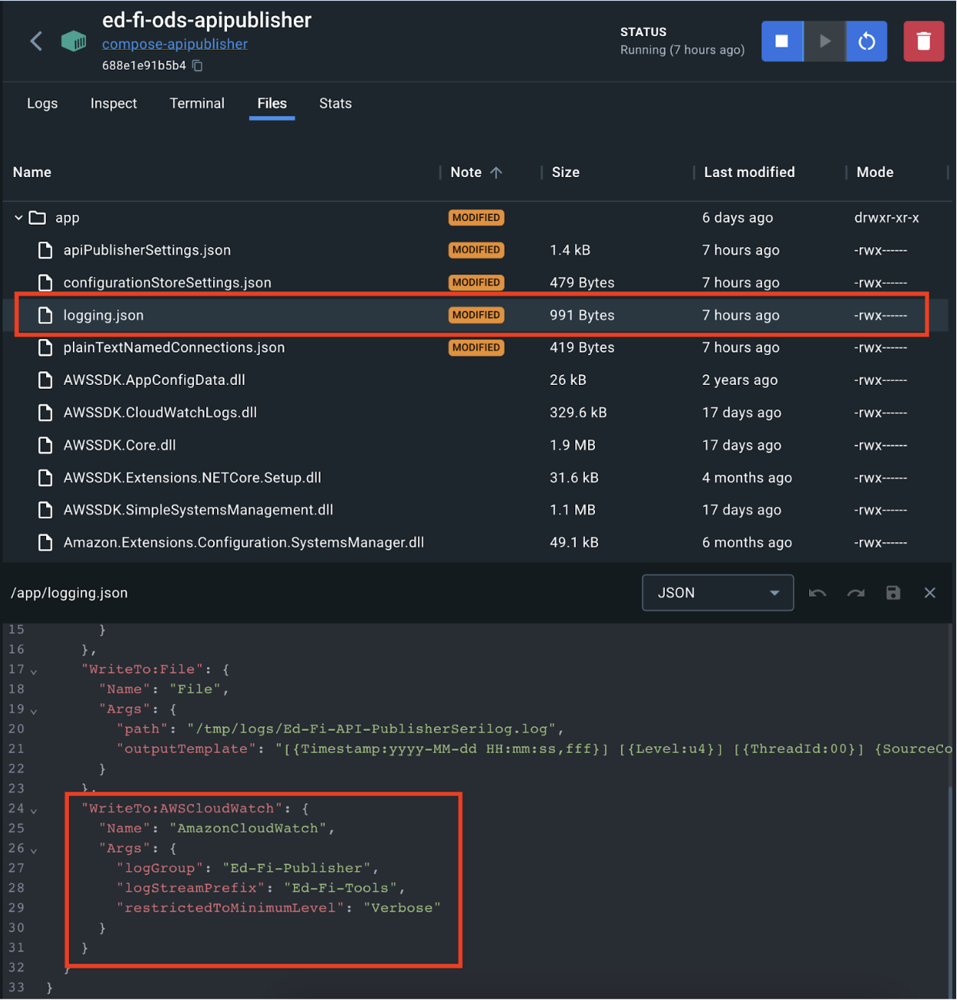
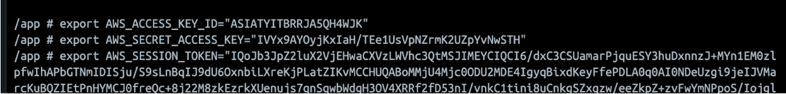

# Configuration CloudWatch

Enables management of individual connection settings with encryption support for securely storing keys and secrets in the [AWS Systems Manager Parameter Store](https://docs.aws.amazon.com/systems-manager/latest/userguide/systems-manager-parameter-store.html).

## Configure AWS SDK

Ensure that the AWS SDK has the necessary [configured AWS credentials](https://docs.aws.amazon.com/sdk-for-net/latest/developer-guide/net-dg-config-creds.html).

## Configure API Publisher

Configure the AWS log storage parameters in the configuration file.

Export AWS credentials to consume AWS parameters store inside the container

## Looking for a different output format?
The default sink for AWSCloudWatch publish the log as a JsonFormat, if you want to use a different one, check the following link:
[How to use the TextFormatter class](Use-TextFormatter-Serilog.md).