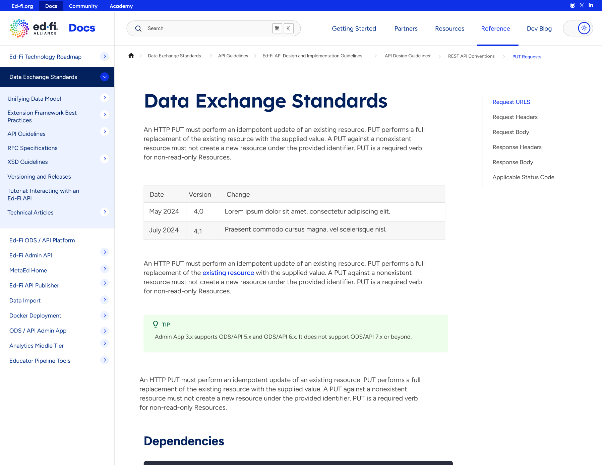
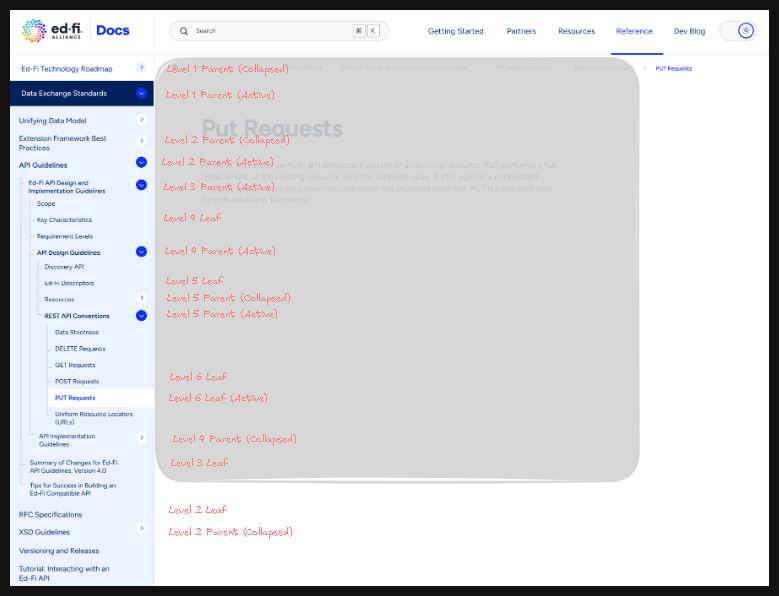

# UI Rebranding Design Doc

## Summary

The Ed-Fi Documentation site (docs.ed-fi.org) is undergoing a UI refresh as part of a larger rebranding effort for the Ed-Fi Alliance. This document outlines the design approach used for styling the site layout and components to match the rebrand specifications

## Background

The Ed-Fi Alliance is introducing a new brand identity to premiere at the Annual Ed-Fi Summit. The UI refresh will help to bring cohesiveness across other Ed-Fi properties delivering an improved user experience.

The Documentation system utilizes Docusaurus, a node / typescript powered web framework, to manage documents. Each document is written in Markdown (.md or .mdx) and supports the use of JSX style syntax for creating and styling components within the page. Please see here for a comprehensive overview of the Docusaurus system.

## Design Overview

The rebrand is being largely driven by concept designs provided for each of the major components of the documentation site layout. The design approach will tackle each of these major components as separate concerns.

### Project Scaffold

This phase requires creating a branch `doc-rebrand-2025` that will be used to track the rebrand work. All feature branches should be based on this branch. Note: Long-lived branches are an anti-pattern, however this is serving as a preview in the absence of a staging environment.

### Code Implementation

Once the project is scaffolded, each component will be handled by creating a branch from `doc-rebrand-2025` and implementing the required changes. Once implemented, a PR is opened to merge back into the `doc-rebrand-2025` branch.

Note: The `doc-rebrand-2025` branch will need to be synced with main frequently to avoid drift in documentation changes.

An overview of changes for each of the components is provided below:

#### Header Section

The Heading Section will consist of the following adjustments

**Header Layout:**

- Increase header height
- Include global link bar at top

**Logo Replacement:**

- Update Ed-Fi Logo and Typeface
- Add "Docs" as part of the headking logo text

**Search Bar:**

- Position search left of Top nav links
- Improve styling of search icon
- Update Placeholder font and shortcut icons
- Update size, border and layout to match.

**Top Nav Links:**

- Modify Hover and Active Colors
- Adjust Font size and weight
- Adjust active bottom border color

**Dark-mode Toggle Chip:**

- Create container for toggle chip
- Style to match fill and shadow of design.

#### Side Nav Pane

This section manages the navigation items located on the left side of this page. Each item should be classified as one of the following:

- Top Level Parent List Items (Level 1)
- Top Level Parent List containers (Level 1)
- Top Level Leaf List Item (Level 1)
- Parent List Items (Level 2 and Level 3)
- Parent List Containers (Level 2 and Level 3)
- Leaf List Items (Level 2 and Level 3)

A visual overview of the concept seen here:

#### Admonitions

This section handles the styling and layout of the admonitions provided by Docusaurus by default. The properties that will need to be updated include:

- Padding, margin, spacing
- Font, size and color
- Iconography

#### Common Elements

Combining basic and shared elements used across the site. These elements include:

- Headings: font, size, and color
- Link and anchor text color and sizing
- Line spacing within content and containers
- Breadcrumbs
- Button shadows and text
- Layout borders and underlining
- Table formatting (size, font, color, spacing)
- Table of Contents formating
- Generic container margin, padding, and spacing

As these things may change as docs are added, the scope of this change will cover elements viewed from our Top CUJ's

### Testing and Verification

Once code is implemented, the project will go through the steps outlined in the Testing strategy, following handoff to the Web team for final verification and user acceptance.

## Design Details

The following adds implementation details to the UI Refresh approach outlined above

WIP

## Testing Strategy

Testing for the changes will happen at two points, during build time and after.

During build time, Snapshot testing will be used to ensure individual components are rendered as expected, using a predetermined set of inputs and expected outputs.

After building, a static, servable version of the website is available, at which point critical user journeys (CUJ's) will be tested to verify user actions are triggering events as expected.

### User Acceptance Testing

User acceptance testing involves walking through CUJ's to ensure that the expected conditions meet the test criteria.

- Search Blog
- Search Reference
- Search the DS
-

### Snapshot Testing

Ensure individual components render as expected based on inputs received. This will allow components to be treated as libraries and tested independently from the integrated portions

WIP

## Major Milestones

- [] Review design changes Sept, 19th, 2025
- [] Launch Sept 25th, 2025

## Open Questions

- Do we have specifications for Dark mode?
- Is there specific acceptance criteria or CUJ's to validate against?
- Format / Plan for implementation?
