# Ed-Fi Overview and ESA Implementation

This Docusaurus-compatible Markdown version preserves the content of the source slide deck as structured headings, tables, Mermaid diagrams, visible visual descriptions, and accessible fallback images.

## Package contents

- `index.md`: primary Docusaurus page with screenshots, structured text, tables, and Mermaid diagrams.
- `README_TEXT_ONLY.md`: crawler-friendly and screen-reader-friendly version without full-slide screenshots.
- `ACCESSIBILITY.md`: alt-text policy and image alt-text table.
- `CONVERSION_NOTES.md`: conversion approach, assumptions, and review checklist.
- `assets/images/pages/`: rendered full-page slide images.
- `assets/diagrams/`: editable Mermaid source files.
- `assets/static/`: extracted embedded images and manifest.
- `original/`: source PDF.

## Page 1 — Ed-Fi Overview and ESA Implementation

**Visual context:** The cover introduces an Ed-Fi Alliance presentation about Ed-Fi and Educational Service Agency implementation.


<details>
<summary>Extracted source text</summary>

```text
Ed-Fi Overview and ESA 
Implementation
```

</details>

## Page 2 — State, ESA, and district pain points

**Visual context:** The slide groups pain points by stakeholder. State education agencies struggle with timeliness, inconsistent district formats, missing information, and costly data processing. ESAs are framed as change agents that fill LEA staffing and data-management gaps. Local districts face reporting burden, delayed absenteeism alerts, limited assessment views, and limited visibility into college and career readiness.

| Stakeholder | Pain points |
|---|---|
| State Education Agencies | Timeliness, data quality, costly collection. |
| Education Service Agencies | Change-agent responsibilities, visibility into district needs, and shared cost pressure. |
| Local Districts | Reporting workload, absenteeism alerts, assessment data access, and college/career readiness visibility. |


<details>
<summary>Extracted source text</summary>

```text
States and districts have many pain points. 
They need data. ESAs connect everyone
Reporting. Avg of 6 head 
count ($0.5M) per district to 
collect and format data
Absenteeism. Need earlier 
alerts of potential chronic 
absenteeism – vs months 
later
Assessments. Don’t have 
access to a consolidated 
student level view of 
assessment results 
College Career Readiness. 
Limited visibility into how 
performing against state 
targets 
Local Districts
State Education Agencies 
Timeliness. Can take weeks 
and even months to respond 
to legislative data requests
Data quality. Data received 
from districts is often in 
different formats and missing 
info
Costly collection. Avg SEA has 
10-15 head count ($1.1M+) 
processing and cleaning 
district data   
Education Service Agencies 
Change Agents. Asked to 
cover LEA staffing and data 
management gaps
Visibility. Responsible for 
helping districts without data 
processes
Costs. Cost is a problem for 
everyone involved.
```

</details>

## Page 3 — Ed-Fi interoperability mission

**Visual context:** The diagram shows districts connecting through an ESA to Ed-Fi, while states and vendors also connect to Ed-Fi. The right side identifies three core supports: data standard, open-source APIs, and community resources.

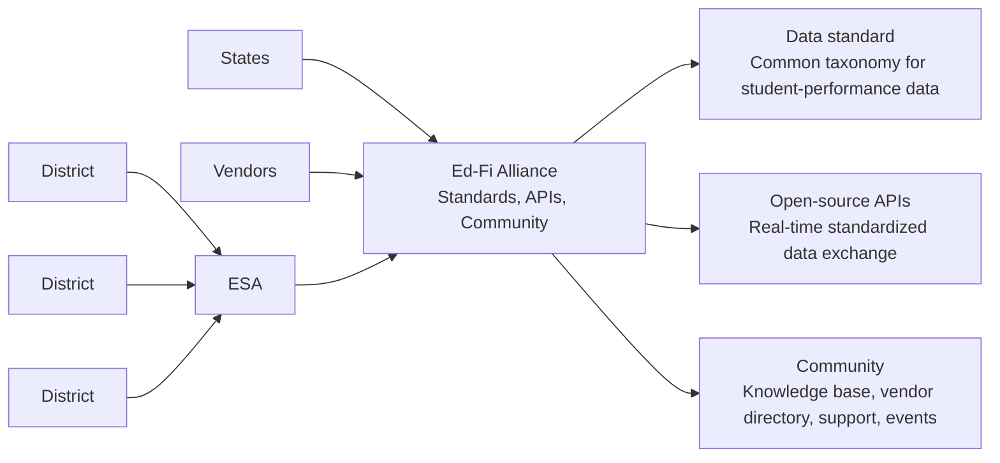

Mermaid source: [`page-03-edfi-interoperability.mmd`](./assets/diagrams/page-03-edfi-interoperability.mmd)


<details>
<summary>Extracted source text</summary>

```text
Ed-Fi’s mission is to enable data 
interoperability across K12 
States
ESA
Vendors
Data standard. Common taxonomy for data elements related to 
student performance 
Open-source APIs. API specs that vendors use to send real-time 
standardized data, securely without human intervention
Community. Knowledge base of technical info, vendor directory, 
support ticketing system, and national / regional events with peers
Districts
Districts
Districts
```

</details>

## Page 4 — State Ed-Fi adoption for reporting

**Visual context:** The bar chart shows state adoption increasing from 3 states in 2013 to 5 in 2016, 6 in 2019, and 14 total states in 2022, split between 8 production and 6 implementing.

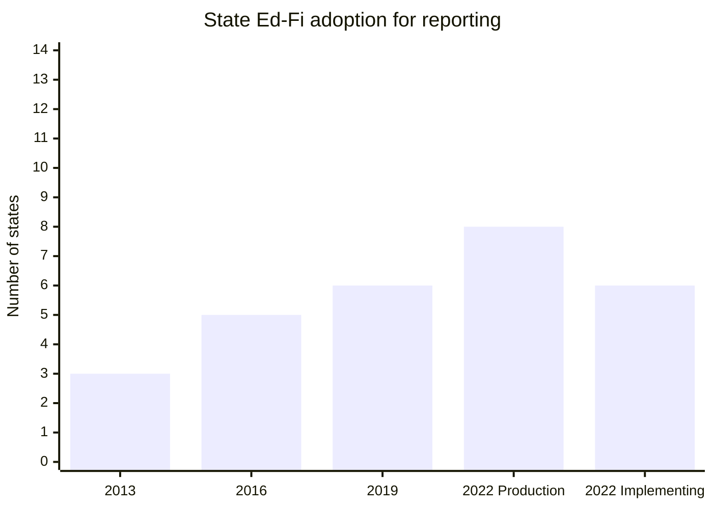

Mermaid source: [`page-04-state-adoption-chart.mmd`](./assets/diagrams/page-04-state-adoption-chart.mmd)


<details>
<summary>Extracted source text</summary>

```text
State adoption of the Ed-Fi standard has 
accelerated …
State Ed-Fi Adoption for Reporting
3
5
6
8
2013
2016
2019
6
2022
Implementing
Production
# of States
```

</details>

## Page 5 — District adoption through ESAs

**Visual context:** The chart shows LEA adoption via ESAs growing from 65 districts in 2013 to 1,283 in 2022, described as a 7.8x increase from 2019 to 2022. The slide notes that this local-use-case adoption is separate from 1.9k districts in states using Ed-Fi for state reporting.

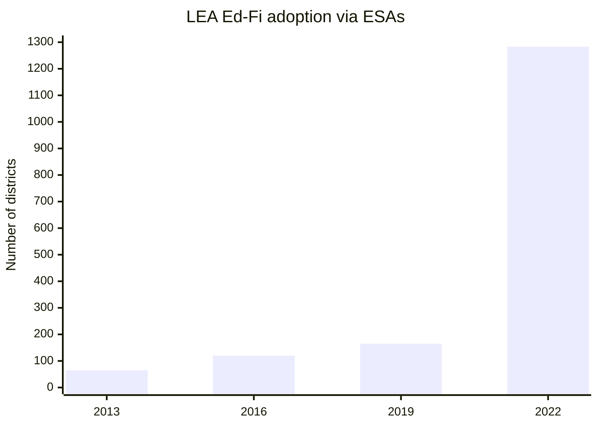

Mermaid source: [`page-05-lea-adoption-chart.mmd`](./assets/diagrams/page-05-lea-adoption-chart.mmd)


<details>
<summary>Extracted source text</summary>

```text
… As has district adoption of Ed-Fi; enabled 
by Educational Service Agencies
65
120
165
1,283
2013
2016
2019
2022
7.8x
LEA Ed-Fi adoption via ESAs
In the last 3 years we have 
seen an ~8x increase in 
LEA’s adopting Ed-Fi to 
address local use cases (e.g., 
CCR, absenteeism)
This is separate from the 
1.9k districts in states that 
use Ed-Fi for state reporting 
Year
# of Districts
```

</details>

## Page 6 — Michigan local-use-case examples

**Visual context:** Michigan examples are grouped into new analytics, new tools, and vendor integrations. MiRead and Digital Equity Data Collection support analytics; MiStrategyBank and MiEWIMS provide tools; Ed-Fi reduces the need for LEAs to manage separate integrations.

| Category | Description of impact |
|---|---|
| New analytics | MiRead identifies students struggling to read at grade level; Digital Equity Data Collection identifies internet-access equity gaps. |
| New tools | MiStrategyBank provides evidence-based strategies; MiEWIMS creates plans for attendance and behavior issues. |
| Vendor integrations | LEAs do not need to implement and manage all vendor integrations; the slide says Ed-Fi provides 10 integrations per school. |

> “The ability to obtain immediate information on newly enrolled students has improved our ability to provide timely services.” — Sarah Mohler, Madison District


<details>
<summary>Extracted source text</summary>

```text
Ed-Fi is used to address key local use 
cases in Michigan
Vendor 
integrations
• LEAs don’t need to implement and manage vendor integrations; via Ed-Fi 
now have 10 integrations per school 
New 
analytics 
• MiRead; identifies students struggling to read at grade level 
• Digital Equity Data Collection; identifies gaps in equity of internet access
New 
tools
• MiStrategyBank; evidence-based strategies for addressing student needs 
• MiEWIMS; creates plans to target the attendance and behavior issues
Description of impact 
Michigan
example
“The ability to obtain immediate 
information on newly enrolled 
students has improved our ability 
to provide timely services. 
Before we would have to wait for 
the previous school to send student 
status related to special education, 
English language, homelessness, 
etc., which caused a delay in 
needed services”
- Sarah Mohler, Madison District
```

</details>

## Page 7 — Common ESA-driven local use cases

**Visual context:** The slide lists local data services that ESAs can drive, ranging from assessment and attendance to data warehousing and rostering.

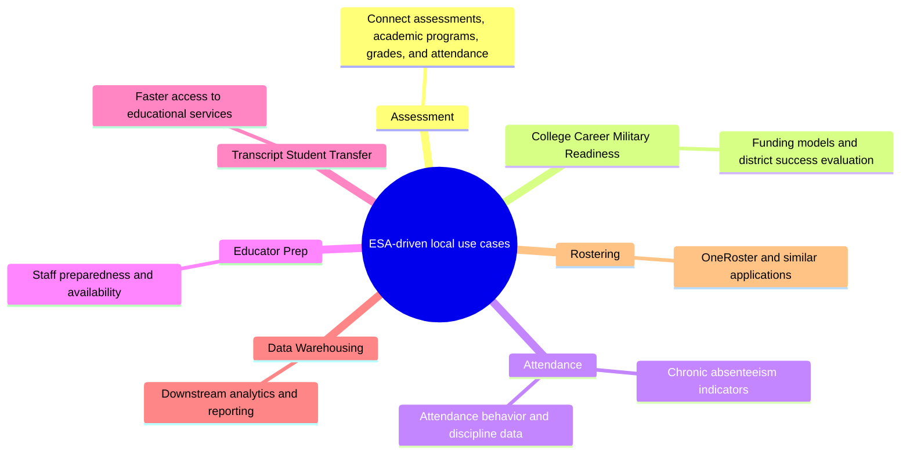

Mermaid source: [`page-07-local-use-cases.mmd`](./assets/diagrams/page-07-local-use-cases.mmd)


<details>
<summary>Extracted source text</summary>

```text
Common Local Use Cases driven by 
Education Service Agencies
Assessment. Connecting student 
assessments with academic programs, 
grades, and attendance can drive better 
outcomes
College, Career, and Military Readiness 
(CCMR). CCMR is a leading driver of 
funding models and evaluation of district 
success.
Attendance. Chronic absenteeism is a 
leading indicator of student success and is 
comprised of attendance, behavior, and 
discipline data.  
Educator Prep. Staff preparedness and availability drive 
student outcomes in the classroom 
Transcript/Student Transfer. Fast and comprehensive 
transfer of student data allows for faster student access 
to educational services.
Data Warehousing. Many districts need a data 
warehouse to drive their downstream analytics and 
reporting processes
Rostering. Sourcing data for rostering applications like 
using OneRoster
```

</details>

## Page 8 — Why ESAs are positioned to provide data services

**Visual context:** This slide frames the ESA opportunity across existing market relationships, an expanded service offering, and the broader state/district/vendor ecosystem.

| Area | Description of impact |
|---|---|
| Existing Market | ESAs are involved in contracts and services, while districts struggle with data access and interoperability. |
| Your Opportunity | ESAs can offer a technology stack that helps districts now and supports layered ESA services later; the slide says this is better when ESAs work with others and share resources. |
| Ecosystem | ESAs may not determine state direction, but they can enable district needs, include the state to drive vendor requirements, and reduce district burden. |


<details>
<summary>Extracted source text</summary>

```text
ESAs are uniquely positioned to provide 
data services
Ecosystem
• You can’t determine what your state is doing but you can enable what your 
districts need.
• You can include the state to drive vendor requirements and support you 
through policy and potential funding.
• You can increase value/impact and decrease burdens for your districts.
Existing 
Market
•
You are involved in Contract and Service provisions.  
•
Districts are struggling with data access and interoperability
Your 
Opportunity
Description of impact 
TODO:  FLCODE or Region 4 quote 
to describe use case value for ESA
•
You can offer a tech stack that will help them today and allow you to layer 
ESA services on top of an expanded offering.
•
Better when you work with others and share resources
```

</details>

## Page 9 — Examples working today

**Visual context:** The slide presents South Carolina District Data Governance, Texas Education Exchange, and Michigan DataHub as examples of ESA/state data-service models working today.


<details>
<summary>Extracted source text</summary>

```text
Sounds difficult but South Carolina and 
Michigan are examples of it working today
```

</details>

## Page 10 — Three implementation approaches

**Visual context:** The comparison table presents three approaches. “Do It Together + State Vendor Support” is marked as the best-practice option because it combines implementation partners, state involvement, vendor expectations, and local use-case support.

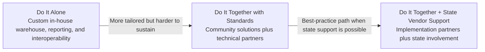

Mermaid source: [`page-10-implementation-approaches.mmd`](./assets/diagrams/page-10-implementation-approaches.mmd)

| Category | Do It Alone | Do It Together with standards | Do It Together + State Vendor Support |
|---|---|---|---|
| Description | Build data warehouse, reporting, and interoperability solutions in-house for district members. | Use community solutions and technical partners to deliver core services, then layer ESA support and use-case services on top. | Build warehousing, reporting, and interoperability with implementation partners and state involvement to drive vendor expectations. |
| Benefits | Tailored to priority use cases; can include state legislative priorities. | Shortest time to impact; addresses local district use cases; lowest cost and limited SEA role; clear sustainability model; national vendor support. | Greatest impact; shorter time to impact; addresses local use cases with state legislative consideration. |
| Tradeoffs | Expensive custom development and maintenance; hard to get vendor participation; challenging sustainability plan. | May lack state legislative extension support in the region; extra expenses and services for offering a core platform. | State focus may be on legislative rather than local use cases; requires SEA/ESA coordination. |
| When to adopt | Unique legislative requirements and use cases in the region. | State reporting modernization is not a priority, but ESAs can deliver use cases on a common platform. | ESA model drives local use cases and wants to de-risk reporting modernization. |


<details>
<summary>Extracted source text</summary>

```text
There are 3 primary approaches to 
implementing Ed-Fi 
Do It Alone
Do It Together with standards
Do it Together + State Vendor Support
Description 
Build Data Warehouse, reporting, and 
interoperability solutions in-house for 
your district members.
Leverage community implemented 
solutions and technical partners to 
deliver core services to your districts 
and provide layered support and use 
case driven services in addition
Building warehousing, reporting, and 
interoperability with implementation 
partners and state involvement to drive 
vendor expectations.
Benefits 
• Tailored to your priority use cases
• Easily include State legislative priority 
requirements
• Shortest (1.5-2 yr) time to impact
• Address local district use cases 
• Lowest cost / limited SEA role
• Clear sustainability model
• National vendor support 
• Greatest impact; $30M + local use cases
• Shortens (1.5-2 yr) time to impact
• Addressing local use cases with state 
legislative consideration
Tradeoffs 
• Expensive with custom development
• Expensive maintenance and support
• Hard to get vendor participation
• Challenging sustainability plan
• Lack of state legislative extension 
community support in your region
• Additional expenses and services for 
offering a core platform
• States focus is on legislative use cases 
and not local use cases
• Some SEA/ ESA coordination required 
When adopt
Unique legislative requirements and use 
cases unique to your region
State reporting modernization is not a 
priority but ESA’s can deliver use cases 
on a common platform
ESA model drives local use cases and want 
to de-risk reporting modernization effort 
Best 
practice
```

</details>

## Page 11 — District challenges in using data

**Visual context:** The slide emphasizes that an ESA data hub does not compete with district SaaS tools. Instead, it helps districts extract value across those tools and wrap ESA programs and services around them.

| Challenge | Meaning |
|---|---|
| Low staff capacity | Most districts do not have the staff to run data-project infrastructure. |
| Complexity | Data infrastructure requires different expertise than data analysis. |
| Expensive walled gardens | Vendor systems make it hard to use district data across tools or choose best-of-breed tools. |
| Timeliness | Data visibility can be too slow and disconnected to be useful. |


<details>
<summary>Extracted source text</summary>

```text
Challenges districts face when trying to use 
data
Low Staff capacity. Most districts don’t have the staff 
necessary to run the required infrastructure for data 
projects
Challenges 
Timeliness. Data visibility can be too slow and too 
disconnected to be useful.
Expensive Walled Gardens. Vendor “walled gardens” 
create challenges for districts to use their own data 
across systems and to choose best of breed tools.
Complexity. There is a different expertise needed to 
run data infrastructure than provide data analysis.
Your district buys SaaS tools
This does NOT compete with those 
SaaS tools.  
You can help them extract value 
across those tools AND wrap your 
own programs/services around 
that.
```

</details>

## Page 12 — Reporting + data hub architecture

**Visual context:** LEA systems such as SIS, assessment, HR, LMS, and other applications send data through Ed-Fi APIs into an ESA data hub. The ESA hub supports analytics, data warehousing, and data services, and can send reporting data to the SEA Ed-Fi environment, where state/federal reporting is produced.

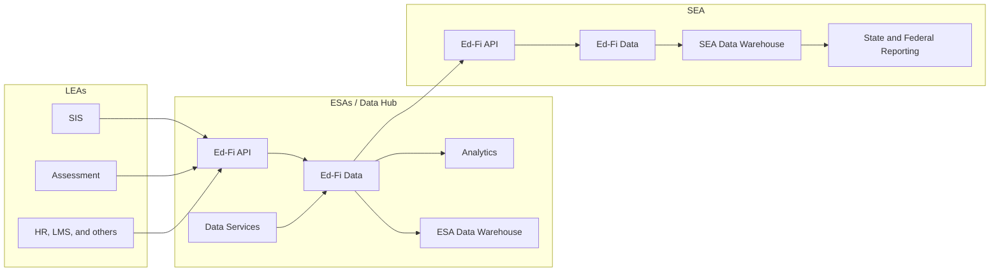

Mermaid source: [`page-12-reporting-data-hub-architecture.mmd`](./assets/diagrams/page-12-reporting-data-hub-architecture.mmd)


<details>
<summary>Extracted source text</summary>

```text
“Reporting + data hub” approach has a common architecture
```

</details>

## Page 13 — Contact slide

**Visual context:** The slide provides Ed-Fi Alliance contacts for follow-up questions.

| Name | Role | Email |
|---|---|---|
| David Clements | Solutions Architect | <david.clements@ed-fi.org> |
| Eric Jansson | VP, Solutions | <eric.jansson@ed-fi.org> |


<details>
<summary>Extracted source text</summary>

```text
Other Questions?
Ed-Fi 
Alliance
David Clements
Solutions Architect
david.clements@ed-fi.org
Ed-Fi 
Alliance
Eric Jansson
VP, Solutions
eric.jansson@ed-fi.org
```

</details>

## Page 14 — Implementation section divider

**Visual context:** This divider introduces the implementation portion of the playbook. A note says the remaining slides are for leaders trying to bring their team on board and that additional details are available in the knowledge base repository.


<details>
<summary>Extracted source text</summary>

```text
Implementation*
* The audience of the remaining slides is the leader trying to bring their team on board. Other details can be found in our knowledge base repository.
```

</details>

## Page 15 — Organizational roles

**Visual context:** Four vertical role columns describe responsibilities for SEA, LEAs, vendors, and ESAs/data hubs.

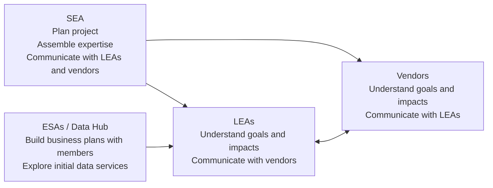

Mermaid source: [`page-15-organizational-roles.mmd`](./assets/diagrams/page-15-organizational-roles.mmd)

| Organization | Role in implementation |
|---|---|
| SEA | Plan the project, assemble internal and external expertise, and launch communications with LEAs and vendors. |
| LEAs | Understand the goals and impacts of the state modernization project and initiate communications with vendors. |
| Vendors | Understand project goals and impacts and initiate communications with LEAs. |
| ESAs / Data Hub | Build business plans collaboratively with members and explore candidates for initial data services. |


<details>
<summary>Extracted source text</summary>

```text
SEA
• Plan the project
• Assemble 
internal and 
external 
expertise
• Launch key 
communications 
with LEAs and 
vendors
LEAs
• Understand the 
goals and 
impacts of the 
state 
modernization 
project
• Initiate 
communications 
with their 
vendors
Vendors
• Understand the 
goals and 
impacts of the 
state 
modernization 
project
• Initiate 
communications 
with LEAs
ESAs (Data Hub)
• Build business 
plans 
collaboratively 
with their 
members
• Explore 
candidates for 
initial data 
services with 
their members
Organizational Roles
```

</details>

## Page 16 — The four phases

**Visual context:** The implementation roadmap has four phases: market research, planning, pilot, and growth. The key success message is to be in production within a year, align with the school calendar, and use vendor awareness, MSPs, and established best practices to accelerate production.

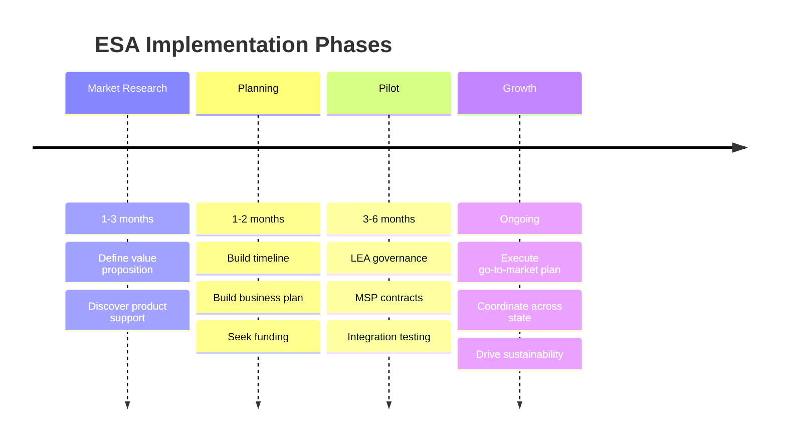

Mermaid source: [`page-16-four-phases.mmd`](./assets/diagrams/page-16-four-phases.mmd)

| Phase | Time | ESA activities |
|---|---:|---|
| Market Research | 1–3 months | Define value proposition and discover key product support. |
| Planning | 1–2 months | Build timeline and business plan, and seek funding. |
| Pilot | 3–6 months | LEA governance, MSP contracts, and integration testing with LEAs. |
| Growth | Ongoing | Execute go-to-market plan, coordinate across the state, and drive toward sustainability. |


<details>
<summary>Extracted source text</summary>

```text
The Four Phases
Market 
Research
Planning
Pilot
Time
ESA Activities  
1-3m
1-2m
3-6m
Define your value proposition 
and discover key product support
Building Timeline, Business Plan, 
and seek funding
LEA governance, MSP contracts, 
Integration testing with LEAs
Key to Success 
Best practice is to be in production in a year 
and align with the school calendar. A faster 
timeline helps with project sustainability and 
clear connection between the project and 
LEA valuable use cases.
With vendor awareness, use of MSPs and 
access to well-known best practice, the 
timeline to production has become much 
more rapid than in years past.
Growth
∞
Execute go-to-market plan, 
coordinate across state, drive 
toward sustainability
```

</details>

## Page 17 — Market Research Phase: ESA tasks

**Visual context:** The slide instructs ESAs to define their value proposition by talking to districts and stakeholders, exploring existing services, identifying market fit, and checking support for standards in their region.

| Task area | Questions or actions |
|---|---|
| Talk to districts | What pressing data needs are districts facing? |
| Talk to stakeholders | Who are the stakeholders and what are their data priorities? |
| Investigate existing services | Which current data services could benefit from a consistent data platform? |
| Identify market fit | Where can the ESA grow through new services and regional partners? |
| Identify product support | Are SIS vendors Ed-Fi certified? Are state initiatives blockers? Which implementation partners and MSPs can help? |


<details>
<summary>Extracted source text</summary>

```text
Market Research Phase - ESA Tasks
Talk to your districts. What are the pressing data 
needs are your districts facing?
Define your value proposition (What is your product?) 
Identify market fit and competitive edge. Where can 
you grow through new services and what partners are 
in your region that can help you get there?
Investigate expansion of existing service. Which data 
services do you already provide that could benefit 
from a consistent data platform?
Talk to your stakeholders. Who are your stakeholders 
and what are their data priorities?
Identify key product support for 
standards in your region (Ed-Fi can help!)
•
Are your SIS vendors Ed-Fi certified?
•
Are there state initiatives that may be 
a blocker?
•
Which implementation partners and 
managed service providers can help?
Note:  Ed-fi maintains a badging and certification 
registry of vendors that can be a useful place to start
```

</details>

## Page 18 — Engage Ed-Fi expertise

**Visual context:** The slide recommends hiring a badged Ed-Fi Managed Service Provider or consultant, arguing that MSPs accelerate work, know common gotchas, understand hosting and maintenance, debug integrations, and provide vendor support.

| Recommendation | Rationale |
|---|---|
| Hire a badged MSP or consultant | MSPs have done the work repeatedly and understand best practices. |
| Avoid a pure DIY approach | Learning the full implementation path from scratch can slow progress and create avoidable mistakes. |
| Use subcontracting when needed | Existing consultants or preferred vendors can subcontract with experienced Ed-Fi MSPs. |
| Get references | Ed-Fi maintains a list of badged MSPs, and other Ed-Fi ESAs can provide references. |


<details>
<summary>Extracted source text</summary>

```text
Engage Ed-Fi Expertise
Hire a badged Ed-Fi Managed Service 
Provider (MSP) or Consultant
• MSPs dramatically accelerate progress
• It is tempting to do take a DIY approach, but a 
managed provider will have done this work many 
times over and understand the gotchas
• An MSP will understand best practice with 
regards to hosting options, maintaining current 
Ed-Fi products and tools, debugging integrations, 
providing vendor support and many other 
processes.
• If you have an existing consultant or a preferred 
vendor list, ESAs have successfully asked those 
providers to sub-contract with an experienced Ed-
Fi MSP
How?
• Ed-Fi maintains a list of badged MSPs
• Get references from other Ed-Fi ESAs. The Ed-
Fi Alliance can provide contacts for these 
states (see Solution Architect contact 
information below) and help review RFP 
language
```

</details>

## Page 19 — Data mapping and specifications development

**Visual context:** The slide contrasts recommended and not-recommended practices for initial mapping and specifications.

| Recommended | Not recommended |
|---|---|
| Use your MSP to create mappings and initial data specifications. | Doing Ed-Fi mappings on your own with staff new to Ed-Fi standards. |
| Follow Ed-Fi Descriptor Guidance for code sets in specifications. | Using default Ed-Fi Descriptor values for data elements critical to collections. |
| Train staff on Ed-Fi Data Standard language through the MSP and participation in the process. | Letting this process take more than two months; refinement can continue during the pilot. |


<details>
<summary>Extracted source text</summary>

```text
Data Mapping & Specifications Development 
Use your MSP to do mappings and create 
the initial data specifications: it takes time to 
learn the Ed-Fi Data Standard. MSPs can 
help you avoid mistakes and maintain 
project momentum.
Follow Ed-Fi Descriptor Guidance for code 
sets in your specifications.
Train your staff on the Ed-Fi Data Standard 
language using your MSP and by having 
them participate in the process.
Doing the Ed-Fi mappings on your own with 
staff new to Ed-Fi standards.
Using default Ed-Fi Descriptor values for 
data elements critical to your collections.
Allowing this process to take more than 2 
months – you have time to refine during 
the Pilot phase.
Recommended
Not Recommended
```

</details>

## Page 20 — Planning Phase: ESA tasks

**Visual context:** Planning is organized into building a timeline, building a business plan, and seeking funding. The slide also offers examples of minimal viable products and common funding sources.

| Workstream | Actions |
|---|---|
| Build Timeline | Reserve 1–3 months for market research, align with the academic year or procurement timelines, and identify a minimal viable product. |
| Build Business Plan | Identify MSPs and implementation partners, build costs, marketing costs, and sustainability costs. |
| Seek Funding | Explore state grants, philanthropic grants, self-funding, and mixed funding models. |

**MVP examples from the slide:** Texas Education Exchange started with 4 apps; Indiana INSite started with a dashboard; Michigan DataHub started with 3rd-grade reading intervention using MIRead.


<details>
<summary>Extracted source text</summary>

```text
Planning Phase - ESA Tasks
Build 
Timeline
• 1-3 months for market research
• Align with Academic Year and/or standard procurement timeframe
• Identify Minimal Viable Product to get started
• The Texas Exchange started with 4 apps
• Indiana INSite started with a dashboard
• Michigan DataHub started with 3rd grade reading intervention (MIRead)
Build 
Business Plan
• Identify a Managed Service Provider (MSP) and implementation partners which match the expertise you need to be 
successful
• Identify build costs
• Identify marketing costs
• Identify sustainability costs
Seek Funding
• Common sources of funding through early project stages
• State Grants (e.g. Texas, Michigan)
• Philanthropic Grants (e.g. South Carolina)
• Self-Funded (e.g. Riverside, CA)
• Business plans frequently include a mix of funding sources
```

</details>

## Page 21 — Pilot Phase: ESA tasks

**Visual context:** The pilot phase should last 3–6 months and align to the academic calendar. District budgeting around February and district catalog timing are called out as important constraints.

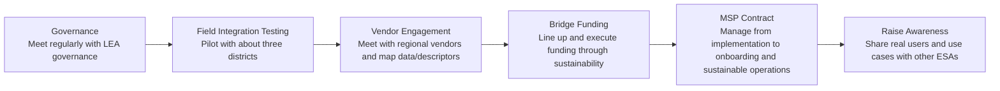

Mermaid source: [`page-21-pilot-phase-tasks.mmd`](./assets/diagrams/page-21-pilot-phase-tasks.mmd)

| Task | Action |
|---|---|
| Governance | Start meeting regularly with LEA governance. |
| Field Integration Testing | Pilot with about three districts. |
| Vendor Engagement | Meet regularly with regional vendors and conduct data/descriptor mapping within Ed-Fi. |
| Bridge Funding | Line up and execute funding through sustainability. |
| MSP Contract | Manage the MSP contract from implementation into onboarding and sustainable management. |
| Raise Awareness | Share real pilot users and use cases with other ESAs. |


<details>
<summary>Extracted source text</summary>

```text
Pilot Phase - ESA Tasks
Governance
•Start meeting 
regularly with 
LEA governance
Field Integration Testing
•Pilot with ~3 
districts
Vendor Engagement
•Start regular 
meetings with 
regional vendors 
(continue 
updates from 
planning phase)
•Go through a 
mapping exercise 
with vendors for 
data and 
descriptor 
mapping within 
Ed-Fi
Bridge Funding
•Line up and 
execute funding 
through 
sustainability
MSP Contract
•Manage the MSP 
contract from 
implementation 
into onboarding 
and sustainable 
management
•Make these 
meaningful 
meetings 
covering the real 
solutions you are 
providing 
through your 
pilots
Raise Awareness
•Raise awareness 
with other ESA’s 
now that you 
have real users 
with your pilot on 
a real use case
This phase should last 3-6 months.  It is important to align with academic calendar.  Districts tend to set budget in February and 
put solutions into the district catalog.  Be careful to not let the first 3 phases run long because it greatly impacts project 
sustainability and success.  Stakeholders will start to lose interest and possibly see the time as being unable to execute.  You will 
also want to start executing your go-to-market plan.
```

</details>

## Page 22 — Growth and Expansion Phase

**Visual context:** Growth and expansion should occur during the school year after the pilot. The slide warns that longer periods can affect sustainability, word of mouth, and bridge funding requirements.

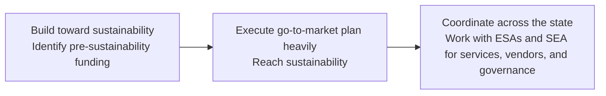

Mermaid source: [`page-22-growth-expansion.mmd`](./assets/diagrams/page-22-growth-expansion.mmd)

| Focus | Actions |
|---|---|
| Build toward sustainability | Identify pre-sustainability funding and execute the go-to-market plan to reach sustainability. |
| Execute go-to-market plan heavily | Expand adoption after the pilot and convert project momentum into ongoing service demand. |
| Coordinate across the state | Work with other ESAs for statewide service coverage and work with the state on vendor and data governance support. |


<details>
<summary>Extracted source text</summary>

```text
Growth and Expansion Phase
Coordinate across the state
• Work with other ESAs to provide services 
across the state
• Work with the state for statewide vendor and 
data governance help
Execute Go-to-Market Plan heavily
Build towards Sustainability
• Identify pre-sustainability funding
• Execute your go-to-market plan to reach 
sustainability
Growth and Expansion should take place for the school year following the pilot.  Longer periods of time affect sustainability, 
word of mouth, and bridge funding requirements.
```

</details>

## Page 23 — Do this, not that

**Visual context:** The slide advises focus, scaling, state relevance, and ecosystem building while warning against over-scoping, working in isolation, and targeting LEA subgroups that cannot scale.

| Recommended | Not recommended |
|---|---|
| Go to market with focused core use cases and add additional use cases over time. | Boiling the ocean with too many vendor dependencies, use cases, or drill-downs. |
| Continue to grow districts. | Doing the project in isolation without vendors, MSPs, and district support. |
| Identify use cases that could also be interesting to the state. | Targeting LEA subgroups that cannot scale. |
| Establish a statewide ecosystem by engaging multiple ESAs. | Depending on only a couple willing LEAs rather than building a path for wider adoption. |


<details>
<summary>Extracted source text</summary>

```text
Do this, Not that!
Go to market with focused core use cases. 
Feather in additional use cases over time.  
Continue to grow districts.
Identify use cases that could also be 
interesting to the state.
Establish a statewide ecosystem by engaging 
multiple ESAs.
Boiling the ocean.  Too many vendor 
dependencies, too many use cases, and too 
many “drill downs” will stall projects.
Doing the project in isolation.  You will need 
vendors, MSPs, and districts to support the 
initiative.
Targeting LEA subgroups that can’t scale.  
You need more than a couple willing LEAs.  
You need LEAs that will create a path for 
more LEAs to use your services.
Recommended
Not Recommended
```

</details>

## Page 24 — When the state already uses Ed-Fi for reporting

**Visual context:** The diagram shows that SEA reporting data is a subset of the broader data needed for local analytics and integration. The slide says existing state reporting creates a vendor-readiness advantage, but ESAs still need their own specifications, vendor engagement, and SEA collaboration.

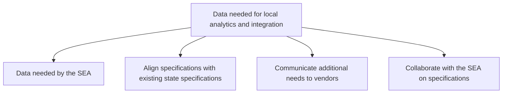

Mermaid source: [`page-24-local-vs-sea-data.mmd`](./assets/diagrams/page-24-local-vs-sea-data.mmd)

| Key action | Example |
|---|---|
| Align data specifications with existing state specifications to avoid confusing vendors or creating unnecessary work. | If the state has an existing attendance-data integration, start with its definitions and usage in planning. |
| Communicate additional needs to vendors and explain what those needs enable; maintain an ESA vendor-engagement team. | If the state does not collect transcript information but the ESA needs it, open vendor conversations about adding that data. |
| Open a conversation with the SEA about collaboration and specifications. | Meet with the person who manages state specifications and set up a regular cadence to explore collaboration. |


<details>
<summary>Extracted source text</summary>

```text
What if my state is already doing Ed-Fi for 
state reporting?
Ed-Fi Alliance
24
• If your state education agency is already using Ed-Fi for state reporting, this means 
vendors in your state have some ability to use Ed-Fi standards already – that’s a big 
advantage.
• However, be aware that SEA specifications are often a subset of the data that LEAs 
need and also that state specifications have different goals in using data than you 
do (see the diagram to the right).
Data needed for local 
analytics and integration
Data 
needed by 
the SEA
Key Actions
Align your data specifications with existing state specifications to 
avoid confusing vendors or causing more work for vendors. 
Communicate with vendors on the additional needs you have and 
what those needs will enable – you must have your own vendor 
engagement team. 
Open a conversation with the SEA about collaboration and how you 
can work with them to design specifications that meet  
For example, the state may not collect student transcript 
information, but you may need that information. Open 
conversations with your vendors about adding that data.
If the state has an existing integration of attendance data, start 
with their definitions and usage in your planning.
Action
Example
Meet with the person who manages the state data 
specifications and talk with them about your effort. Setup a 
regular cadence of meeting to explore opportunities for 
collaboration.
```

</details>
