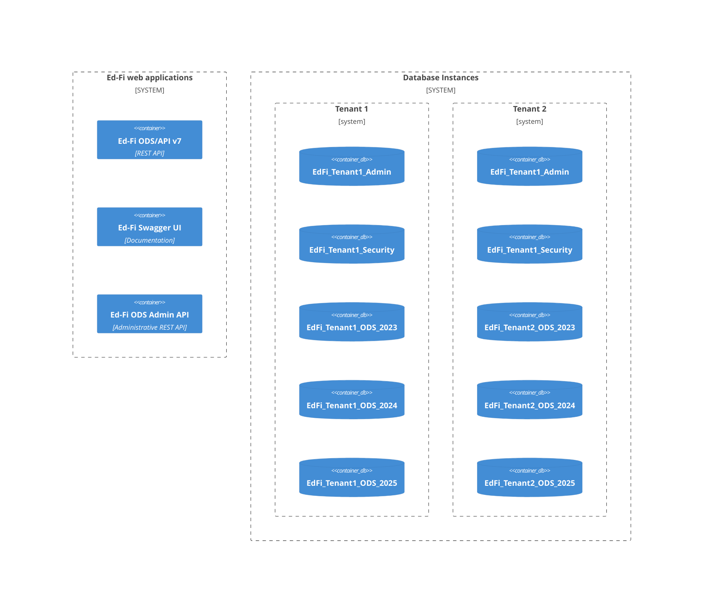

# How-To: Perform Multi-Tenant Database Deployment from Source Code

Version 7.0 of the Ed-Fi ODS/API introduced a multi-tenant concept that supports
segregation of tenant ODS database and security information into different
databases on different servers. For example, an education service agency (ESA)
might serve multiple local education agencies (LEA), and segregate each LEA as a
tenant. In turn, the LEA might have several _instances_ of the ODS database:
these might be development environments (dev, stg, prod) or could be using
year-based routing (2023, 2024, 2025). A single Ed-Fi ODS/API _web application_
can support routing the incoming HTTP requests to the correct databases, when
properly configured.



This article demonstrates the steps required to configure this multi-tenant and
multi-instance environment. Furthermore, it shows how to use the
`Ed-Fi-ODS-Implementation` PowerShell scripts to create the databases used by
this setup. The steps described here can be adapted to work with the
`EdFi.Suite3.RestApi.Databases` NuGet package for automating deployments in
remote environments, without the use of the full set of C# source code.

:::tip

When deploying with only the `EdFi.Suite3.RestApi.Databases` package - not the
rest of the source code - the user secrets modifications described below can be
performed in the `configuration.json` file.

:::

:::warning

Do not use multitenancy with the `initdev` command when building the source code
and extensions.

:::

## Getting Started

1. Download or clone both repositories.
   1. [Ed-Fi-ODS](https://github.com/Ed-Fi-Alliance-OSS/Ed-Fi-ODS)
   2. [Ed-Fi-ODS-Implementation](https://github.com/Ed-Fi-Alliance-OSS/Ed-Fi-ODS-Implementation)
2. Run `initdev` out of the box with no modifications to download tools and get
   the scripts set up. Might be able to provide an alternate script to simplify.

## Deploy the Databases

Create a [user secrets
file](https://learn.microsoft.com/en-us/aspnet/core/security/app-secrets?view=aspnetcore-8.0&tabs=windows)
in the WebAPI project.

```json
{
    "ConnectionStrings": {
        "EdFi_Admin": "server=(local);trusted_connection=True;database=EdFi_Tenant1_Admin;Application Name=EdFi.Ods.WebApi",
        "EdFi_Security": "server=(local);trusted_connection=True;database=EdFi_Tenant1_Security;persist security info=True;Application Name=EdFi.Ods.WebApi",
        "EdFi_Master": "server=(local);trusted_connection=True;database=master;Application Name=EdFi.Ods.WebApi"
    },
    "InstallType": "MultiTenant"
}
```

Run the following commands. Note that the _security_ command must come before
the _admin_ command.

```powershell
Reset-MinimalTemplateDatabase
Reset-PopulatedTemplate
Reset-SecurityDatabase
Reset-AdminDatabase -DropDatabase:$false
```

Now edit the user secret file, change the tenant name in the connection strings,
and rerun the commands above.

## Configure ODS Instances

Next, need to setup the `dbo.OdsInstances` table in each
`EdFi_Tenant{?}_Security` database. Note that the `OdsInstanceName` and
`OdsInstanceType` are both free text fields where you can put any string that is
meaningful to you.

```sql
DECLARE @OdsInstanceName nvarchar(100) = '<Tenant 1>'
DECLARE @OdsInstanceType nvarchar(100) = 'LEA'
DECLARE @OdsInstanceConnectionString nvarchar(500) =
 'server=(local);trusted_connection=True;database=EdFi_Tenant1_{0};application name=EdFi.Ods.WebApi;Encrypt=False'

DECLARE @OdsInstanceId int

-- Ensure OdsInstance exists
SELECT @OdsInstanceId = OdsInstanceId FROM [dbo].[OdsInstances]
 WHERE [Name] = @OdsInstanceName and InstanceType = @OdsInstanceType

IF(@OdsInstanceId IS NULL)
BEGIN
    INSERT INTO [dbo].[OdsInstances] ([Name], InstanceType, ConnectionString)
    VALUES (@OdsInstanceName, @OdsInstanceType, @OdsInstanceConnectionString)
    SET @OdsInstanceId = SCOPE_IDENTITY()
END
ELSE
BEGIN
    UPDATE [dbo].[OdsInstances] SET ConnectionString = @OdsInstanceConnectionString WHERE OdsInstanceId = @OdsInstanceId
END
```

## App Settings for Multi-Tenancy

Finally, update the tenancy-settings in the `appSettings` file or use equivalent
environment variables.

```json
{
    "ApiSettings": {
        "Features": [
            {
                "IsEnabled": true,
                "Name": "MultiTenancy"
            }
        ]
    },
    "Tenants": {
        "Tenant1": {
            "ConnectionStrings": {
                "EdFi_Admin": "Server=(local); Database=EdFi_Tenant1_Admin; Trusted_Connection=True; Application Name=EdFi.Ods.WebApi;",
                "EdFi_Security": "Server=(local); Database=EdFi_Tenant1_Security; Trusted_Connection=True; Persist Security Info=True; Application Name=EdFi.Ods.WebApi;"
            }
        },
        "Tenant2": {
            "ConnectionStrings": {
                "EdFi_Admin": "Server=(local); Database=EdFi_Tenant2_Admin; Trusted_Connection=True; Application Name=EdFi.Ods.WebApi;",
                "EdFi_Security": "Server=(local); Database=EdFi_Tenant2_Security; Trusted_Connection=True; Persist Security Info=True; Application Name=EdFi.Ods.WebApi;"
            }
        }
    }
}
```

## Bonus: Combining Admin and Security Databases

To lower the maintenance and cost burden, you can deploy the `EdFi_Admin` and
`EdFi_Security` databases to the _same database_, so long as you first deploy
the Security database, and then deploy the Admin database _with `dropdatabases`
disabled_ as shown in the script above. Then, simply use the same database name
in both the `EdFi_Admin` and `EdFi_Security` connection strings.

:::note

Before Ed-Fi ODS/API v7, both databases had a table called `dbo.Applications`,
which prevented combining the tables. The deployment scripts are migrations, and
the v7 deployment actually creates and drops the `dbo.Applications` table from
the `EdFi_Security` database. Thus, `EdFi_Security` must come before
`EdFi_Admin` - otherwise the `EdFi_Security` deployment script will throw an
error when seeing that `dbo.Applications` already exists.

:::

:::warning

Do not try running `initdev` with the same database names, as it will run the
Admin database deploy first and the Security database deploy will fail.

:::

## Using Admin API

Admin API v2.3 supports management of credentials for a multi-tenant ODS/API
deployment. Please see [Multi-tenant Configuration for Admin API
2.x](/reference/admin-api/admin-api-2.x/technical-articles/multi-tenant-configuration-for-admin-api-2x).
