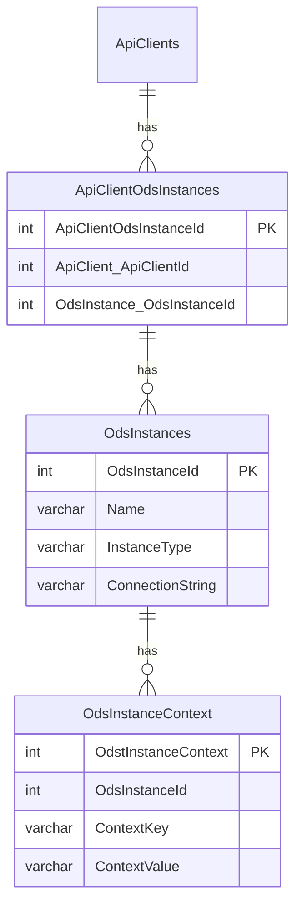
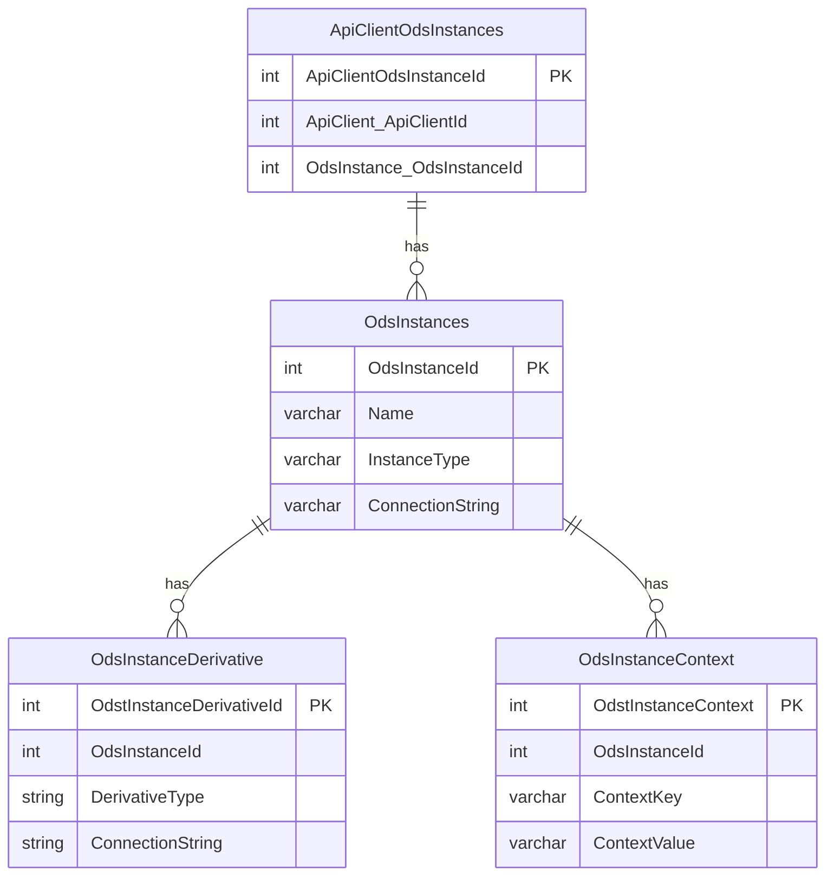

# API Client and ODS Instance Configuration

## Ed-Fi ODS "Instances"

The connection strings for the ODS are configured in the `EdFi_Admin` database.
The Ed-Fi ODS / API can be configured with the desired database segmentation and
routing strategy using the configuration entities discussed on this page. In the
schema diagram shown below, each ODS instance entry contains its connection
string. With exception of development environment, the connection strings stored
in the `EdFi_Admin` database are encrypted with an AES key. This measure guards
against the possibility that someone who gains unauthorized access to the
database can retrieve ODS connection strings in the system.

To provide a simple experience for API clients with a fixed API base URL without
route segments for school year, district, etc., each API client can be
associated with one ODS instance. This association provides the required context
to identify the specific ODS instance for the API request.

If school year and district segments in the API routes are desired, a
[context-based route setting](./context-based-routing-for-year-specific-ods.md)
can be used. With this setting, the same API key/secret can be used to connect
to more than one ODS instance by using the entries in the ODSInstanceContext
table. The combination of API client and ODS instance association, along with
the context provided in the request route, will be used to identify the
appropriate ODS instance for the API request."

## Ed-Fi ODS "Derivatives"

Ed-Fi ODS / API supports two use cases in which API requests are not served by
the primary ODS, but by a copy (or "derivative") of it. The first use case is
for supporting GET requests using a read-replica of the ODS database to offload
read workloads. The second use case is for the snapshots feature, which provides
processing isolation during change processing by API clients. Connections to
these derivative ODSs can be configured in the `OdsInstanceDerivative` table.

