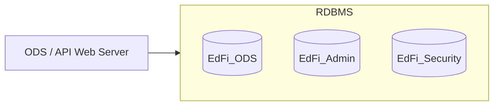
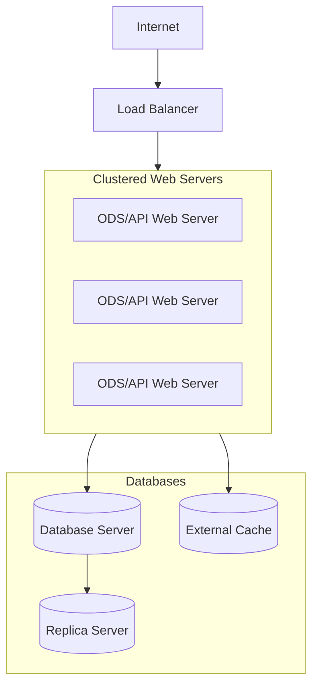

# Production Deployment

The Ed-Fi ODS / API supports a wide variety of deployment models for a
production environment, including on-premises and cloud-based deployments,
virtualized deployments, load-balanced deployments, and so on.

This section of the documentation covers the key concepts API platform hosts
should understand before deploying to a production environment, along with
details about specific configurations.

## Production System Components

There are several websites and databases that work together to provide primary
and supporting functions for a Production instance:

* **Websites**
  * **Ed-Fi ODS API.** The REST endpoint for client applications.
* **Databases**
  * **`EdFi_ODS.*`.** A database that stores data for the Ed-Fi ODS / API.
  * **`EdFi_Admin`.** A database containing authentication information for API
    clients.
  * **`EdFi_Security`.** A database containing authorization information for API
    clients.

Of particular note: production deployments should _not_ include the Swagger
Documentation UI, Sandbox Administration UI, or the `EdFi_ODS_*` databases.
Those components are included by default in the code distribution — and are
appropriate for a Sandbox instance of the ODS / API — but should not be deployed
to production.

## Configuration

Beyond changes to database connection strings, the Ed-Fi ODS / API is
configurable using application **feature flags**.

API provides feature on/off flags for several built in features. Also the system
can be extended by creating a feature service and registering the service by
creating an Autofac module class that inherits from ConditionalModule class.
See [Adding Custom ODS / API
Features](../../technical-articles/adding-custom-ods-api-features.md) for more
information on customizing the application.

Changes to the processing pipelines, caching mechanisms, data repository, and
many other considerations can be adapted by changing the corresponding Autofac
modules called from the Startup class when the website is loaded.

## Planning for a Secure Production Deployment

The security of student information is a primary concern of any API platform
host. This section outlines considerations for platform hosts when planning
Ed-Fi ODS / API deployments.

The information in this section can be used as a checklist or as input into a
threat modeling exercise during the deployment planning cycle.

### Important Security Information

The technical article [Education Agency Business Process Security
Considerations](../../technical-articles/education-agency-business-process-security-considerations.md)
contains important background information that all implementers should know
before deploying a production instance of the Ed-Fi ODS / API.

### Value Assets

A list of high-value assets and a brief description of each follow:

| Asset | Description |
| --- | --- |
| Ed-Fi Operational Data Store | The operational data store contains student, parent, and staff personally identifiable information data, along with potentially sensitive financial information (e.g., employee payroll, budgets). |
| Ed-Fi Administration Data Store | The Admin data store contains sensitive information such as the API key/secret pairs used to validate OAuth authentication requests. |
| Ed-Fi Web Services | Platform hosts and end users expect the Ed-Fi ODS / API to be reliable. Outages can cause serious operational problems for hosts. |
| Personally Identifiable Information | Information such as student names, demographic information, academic performance, and disciplinary records can be valuable to attackers — and disclosure of this information is regulated by laws such as the Family Educational Rights and Privacy Act (FERPA). |
| OAuth Credentials | REST client application systems authenticate to the Ed-Fi ODS / API using a key/secret pair. Once the key and secret are generated, it’s the responsibility of the client application system owner to guard the values. Should an attacker gain access to these credentials, they can attempt to establish their own connection to the API. |

### Security Recommendations for Production Deployments

The following are recommendations and precautions for implementers to consider
when planning a production deployment.

An obvious disclaimer applies: these are just general guidelines offered in
summary form. Platform hosts should include trained security professionals in
their deployment planning and conduct security audits prior to deployment and
periodically thereafter.

#### Recommendations for the API

* Ensure that only intended client applications can interact with the Ed-Fi ODS
    / API.
* Implement a process for client application owners to refresh their key/secret
    pair.
* Verify the IP address of incoming requests.
* Ensure client applications have the least-privileged access to the database.
* Encrypt connection strings in configuration files.
* Throttle or limit the rate of incoming requests to prevent denial of service
  attacks.
* Encrypt sensitive data, including database storage.
* Ensure the OAuth secret is hashed in the database.
* Allow only HTTPS connections.
* Set "Persist Security Info" to false in the database connection string.
* Ensure the ODS database does not accept external connections.

#### Recommendations for the Ed-Fi Sandbox Administration Portal

* Do not deploy the Sandbox Administration Portal to a Production instance.
* Ensure any Sandbox development tools and configurations are not included in
  Production.
* Remove the Swagger documentation pages from Production instances.

## Reference Models for Production Deployment

The following sections provide a number of archetypical deployment models. These
reference models are not intended to be a complete prescription for any given
installation, but rather a starting point to weigh options and plan a deployment
that serves your organization’s needs.

### On-Premises, Two-Server Deployment Model

Very small deployments (up to about 7,500 students) can function on a simple,
two-server model. One server hosts the API application and the other hosts the
SQL Server platform and the ODS data store.

This configuration is excellent for small organizations because it is
inexpensive, easy to maintain, and leverages common technologies that are
usually supportable by in-house staff. It allows the database server to remain
in the internal network while the web server is placed in the DMZ. When properly
configured, this approach ensures that even in the event that a server in the
DMZ is compromised, the student data would remain secure. This model may also be
used for a cloud-based or hybrid deployment.

### Load-Balanced Deployment Model

A load-balanced deployment, whether on-site or in the cloud, includes an HTTP
Load Balancer that analyzes and routes incoming network traffic, multiple web
servers, an external cache, and mirrored database servers. In this example, a
basic load balancing scenario is described; more extreme examples of fault
tolerance such as geographic redundancy are possible, but beyond the scope of
this document.

The load balancer does exactly what its name implies: routing incoming requests
as efficiently as possible to individual web servers, providing additional
capacity as well as redundancy.

Mirrored database servers do not provide any performance or scalability
improvements, but they do provide redundancy.

Multiple web servers with identical configurations are deployed and registered
with the load balancer. Database configurations and connection strings are
altered to implement [always on availability
groups](https://learn.microsoft.com/en-us/sql/database-engine/availability-groups/windows/overview-of-always-on-availability-groups-sql-server?view=sql-server-ver16).

Several entity types (including Ed-Fi Descriptors) are cached in the web API. It
is possible for these caches to get out of sync if they are local to each web
server. In a load-balanced configuration, an external cache should be used.

## Scale and Reliability Techniques for Production Deployment

Production deployments have complex techniques to achieve particular
requirements for scale, security, uptime, and so forth. This section outlines a
few common technologies and their applicability in an Ed-Fi ODS / API
deployment.

### Load Balancers

The Ed-Fi ODS / API is built to be part of a load-balanced solution. The API
does not use server state information, so multiple ODS / API physical servers
may be installed as part of a cloud-based or on-premises load-balanced solution.
The Ed-Fi ODS / API does cache frequently used data, so a distributed cache
solution must be used in a load-balanced deployment.

### Domain Controllers

As members of a domain, the servers may be configured to use domain service
accounts for database authentication. This is the preferred configuration over
SQL authentication, as it is more secure.

### Continuous Integration

An automated build and continuous integration environment is a great benefit in
all but the most trivial uses of the Ed-Fi ODS / API. The Ed-Fi ODS / API uses
code generation techniques to incorporate extensions directly into the core of
the compiled code. As a result, the libraries, database structure, API, SDK, and
other artifacts are an atomic package that may not operate properly if their
components are out of sync.

The Ed-Fi ODS / API also has an extensive set of unit and integration tests.
These tests can take up to an hour to run.

An automated build and deploy process minimizes the chances that an unknown
dependency gets injected into the code-base unintentionally, and ensures that no
process step is omitted when deploying.

### CPU, Memory, and SSD RAID Drives

The Ed-Fi ODS / API is a CPU- and memory-intensive solution, especially when
performing bulk load operations. Using a 64-bit operating system, installing a
sufficient amount of memory (recommended is at least 16 GB of RAM), and a
server-quality CPU with several cores will maximize the performance of the web
server.

Using the fastest drives available on production servers is always a good idea.
With the rise of solid state disk technology in terms of improved reliability,
faster data access, and improvements in capacity, it is advantageous to consider
these drives over more traditional RAID spindle drives. A single SSD drive can
outperform an array of spindle drives. The guiding principle of redundancy has
not been repealed, however, so it is still prudent to use redundant drives for
critical system components.

The Ed-Fi ODS web servers should use solid state drives where possible.
Microsoft Windows and IIS perform much better when SSDs are used. From a
performance perspective, it is not necessary to have a separate data drive
containing the Ed-Fi ODS / API website. It is relatively small. The website may
be easily installed in the `C:\inetpub` directory.

System drives should be the first drives on the database server upgraded to use
solid state drives, followed by data drives. Where budget allows, the data
drives may also be upgraded for a smaller (relative) performance improvement.

### Data Segmentation

The data stored in the ODS database can be segmented into multiple ODS databases
in various ways. The simplest strategy is to deploy ODS databases according to a
logical distinguishing characteristic of the data to be stored (e.g. by year, by
district, by API client, etc.) and associate each API client with a single ODS
(_implicit_ segmentation). An alternative would be to configure additional
context in the API request path that is required from API clients and define
corresponding ODS context values to allow the API to select the appropriate ODS
database for each request (_explicit_ segmentation). More detail can be found in
the Database Segmentation Strategy section of [Platform Dev Guide -
Extensibility & Customization](../extensibility-customization/readme.md).

## Environmental Considerations

Every production deployment has its own environmental considerations that are
unique. The following items, while not unique to the Ed-Fi ODS / API, should be
considered when planning for a production deployment.

### Windows Domain and Service Accounts

In any non-trivial deployment (more than a few servers), it is recommended that
the IIS Servers be members of a DMZ domain. One of the key benefits of having a
DMZ domain is that domain service accounts can be used for all credentials
between services in the domain. Windows Authentication is more secure, and less
brittle than storing usernames and passwords using clear text or encrypted
configuration files.

### IIS Load Balancing

Multiple IIS servers are needed for load balancing and horizontal scaling.
Provisioning multiple servers should be performed in conjunction with automated
deployment scripts to minimize the potential for differences in configuration.

### Microsoft SQL Server

It is highly recommended that **Windows Authentication** be used instead of SQL
authentication, and that SQL Server authentication be disabled in SQL Server.
Running each IIS application domain as a windows service account, and providing
the appropriate permissions to those service accounts in SQL server allows the
connection strings to contain no usernames or passwords. It is recommended that
SQL Servers be mirrored and that connection strings settings include failover
settings. Best practice always includes good database backup policies.

## Pre-Deployment Development Tasks

The ODS / API is designed to be customized. That being the case, the as-shipped
configuration of the Ed-Fi ODS is suitable for a developer machine and sandbox
deployment, not a production deployment. For example, the solution ships with
developer-friendly implementations that demonstrate basic functionality but may
not represent functionality required for a specific installation.

Also, the Ed-Fi ODS / API is built on the [Ed-Fi Data
Standard](/reference/data-exchange/data-standard), which is made
to be extended. Schema extensions often include individual attributes as well as
the addition of completely new entities that may be created to provide
solution-specific information. A common scenario includes state education agency
platform hosts that extend the data model to include information related to
mandatory data collections.

Configuration considerations that your organization should evaluate include:

* An approach to Unique IDs
* Client key/secret generation and distribution scenarios
* Use of database-per-year ODS databases
* Use of per-district ODS databases

These items represent the key areas where the as-shipped components of the ODS /
API must be configured for production use. A discussion of each consideration
follows.

### Unique Identity Systems

Because the concept of person identity is closely related to student data, the
Ed-Fi ODS / API includes a common interface for accessing a unique identity
system. This API provides a common minimalistic interface that may be backed by
an identity system of choice. Where tighter integration with a unique identity
system is desired (such as validating identity information during data updates),
the POST/PUT pipeline should be extended to call the identity system.

### Client Key / Secret Distribution

Key and secret pairs are used as authorization credentials for Ed-Fi ODS / API
client applications. Secure generation and distribution of these keys and
secrets should receive proper attention when planning a deployment of the Ed-Fi
ODS / API.

## Conclusion

Every organization has its own requirements and resources so no two deployments
will be exactly alike. This document has outlined several technical options, but
when evaluating your options, you should, of course, remember to take into
account factors like cost, support expertise in your organization, security and
privacy requirements, and so on.
