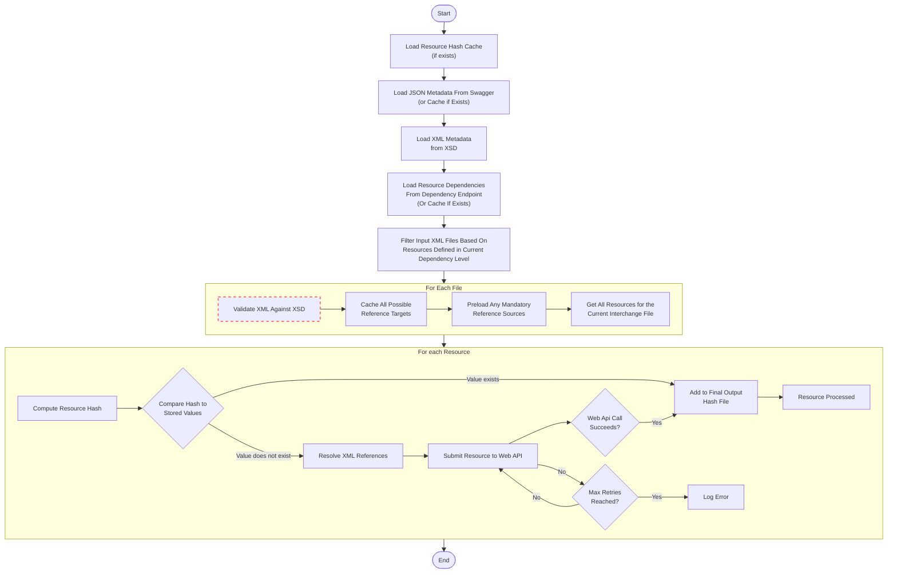

# Bulk Load Client Utility

The Ed-Fi Bulk Load Client utility is designed to facilitate consistent and
efficient loading of XML data files through the transactional API with its
associated security. The primary feature of the tool is the ability to process
only those data elements that have changed since the last run. This leads to
substantial load time improvements on subsequent loads once an initial full
import is completed. Other features include the option to effectively resume a
load after stopping as well as the ability to load data using the full security
model, including profiles.

This documentation covers the basics, runtime options, and general usage
guidelines for the Bulk Load Client. A walkthrough of typical use can be found
at [How To: Load the ODS with Sample XML Data using Bulk Load Client Utility](../../how-to-guides/how-to-load-the-ods-with-sample-xml-data-using-bulk-load-client-utility.mdx).

## Ed-Fi ODS Populated Template

The populated template is generated with the Loader using sample XML data
contained in the public Ed-Fi-Standard GitHub repository:

* [v5.1.0 Descriptors](https://github.com/Ed-Fi-Alliance-OSS/Ed-Fi-Data-Standard/tree/v5.1.0/Descriptors)
* [v5.1.0 Samples Sample XML](https://github.com/Ed-Fi-Alliance-OSS/Ed-Fi-Data-Standard/tree/v5.1.0/Samples/Sample%20XML)

## Ed-Fi ODS Minimal Template

The minimal template is generated with the Loader by loading Ed-Fi
descriptors contained in the public Ed-Fi-Standard GitHub
repository ([v5.1.0 Descriptors](https://github.com/Ed-Fi-Alliance-OSS/Ed-Fi-Data-Standard/tree/v5.1.0/Descriptors)).

## Overview of Solution Architecture

The Bulk Load Client consists of a .NET 8 solution. It uses C# as the primary
language, with TPL (Task Parallel Library) for pipeline processing support.
Infrastructure libraries include log4net for logging, nUnit for unit test, and
Newtonsoft.Json and Microsoft's WebApi client libraries for web API integration.
The solution consists of five projects, with the primary output being a console
application for use on the command line.

The projects involved are:

* EdFi.LoadTools: Main class library, provides all functionality used by the
    application, including pipeline management, resource parsing, resource
    transformation, and resource posting.
* EdFi.BulkLoadClient.Console: Output project to generate the executable for
    running the application.
* EdFi.LoadTools.Test: Contains all unit and integration tests for the
    application.

The general design of the application is a pipeline that takes XML files as
input. The pipeline has the following general flow:

| Step | Action |
| --- | --- |
| **Load Resource Hash Cache** | *   Loads the most recently saved file version of the hash in a folder based on configuration or command line parameters. |
| **Load JSON Metadata From Swagger** | *   Loads the metadata information from a local cache, if available. Otherwise, loads it from the Swagger URL provided through configuration or command line parameters. |
| **Load Dependency Data From Dependency Endpoint** | *   Loads resource dependency information from a local cache, if available. Otherwise, loads it from the Dependency Endpoint URL provided through configuration or command line parameters. |
| **Load XML Metadata From XSD** | _Loads the metadata information from the XSD Metadata URL or XSD files contained in a folder specified in the configuration or as a command line parameter. _   This step is used to provide data type and other metadata used to create mappings between the XML and API. |
| **Validate XML Against XSD** | _Schema validates the input file against the provided XSD. _   The files are validated based on their filename against the provided XSD. The internal declaration is ignored. *   This step may be skipped by providing an `-n` on the command line flag. |
| **Cache All Possible Reference Targets** | *   Scans the XML file to detect any elements with an XML id and adds them to a file specific XmlReferenceCache for later use. |
| **Pre-load Any Mandatory Reference Sources** | *   Scans the XML file to detect any elements with an xml ref and pre-loads any that are found before the id they reference. |
| **Get All Resources For The Current Interchange File** | *   Scans the XML file and streams out every top level node as a resource for further processing. |
| **Compute and Compare Resource Hash** | _Calculates the algorithmic hash of the XML node string representation, after standardizing for formatting and spacing. _   Determines if the hash value exists in the hash file from the previous run:     _If a matching value exists, that indicates that the resource already exists and is unchanged since the last load and may be skipped.  _   If a matching value doesn't exist, that indicates that the resource is either new or changed since the last load and should be _upserted;_ POST methods in the ODS / API perform update or insert operations. |
| **Resolve XML References** | _Checks for any XML id elements and loads them into the XmlReferenceCache. _   Checks for any XML ref elements and resolves them against the XmlReferenceCache. |
| **Map XML Element to JSON Element Names** | *   Uses a best-match string algorithm to identity relevant mappings between the XML metadata and the JSON metadata. |
| **Submit Resource to Web API** | *   Uses a web client instance to submit the resource to the configured API endpoint using a configured key and secret. If the submission errors, it goes into an auto retry loop based on the configuration. |
| **Add to Final Output Hash File** | *   Updates the new hash file, which is saved as the application runs. This will be used on the next run of the application. |
| **Log Error** | *   Any errors are logged based on log4net configuration to provide information for following up on load errors. |

## Usage Guidelines

Generally speaking, the Bulk Load Client is designed to be integrated into an
existing automation system.

The application supports configuring a variety of settings, including the max
retry count and locations for the input files and XSDs. These settings can all
be configured through the app.config or by passing them in as command line
parameters. Anything not passed in by command line will default back to the
app.config settings.

It is recommend to run the tool daily, but it can be run at any frequency based
on the data coming in. The tool will only process what has changed since the
last time it was run. The tool does rely on receiving full extracts of the data,
so partial files might cause it to resubmit some records. It relies on a record
existing in every file to know that that entry hasn't changed. This is still
fairly low risk, and as the ODS / API will handle upserting the record as
needed, the issue this raises is just a time and efficiency cost.

The code for the Bulk Load Client is located in the Ed-Fi-ODS repository in the
`./Utilities/DataLoading/EdFi.ApiLoader.Console directory.

Input files are loaded based on pattern-based matching derived from the
interchange names. As the application goes through each interchange, it checks
for valid files that can be imported for the current interchange. This requires
files to match one of three patterns, where InterchangeName represents the name
of an interchange:

1. Named "InterchangeName.xml"
2. Matches the file name pattern "InterchangeName-\*.xml"
3. Files located inside a sub folder named "InterchangeName", with a file name
    matching the pattern "\*.xml"

### Command Line Parameter Definitions

| Arg | Long Arg | Description |
| --- | --- | --- |
| `b` | `baseurl` | The base url used to derived api, metadata, oauth, and dependency urls (e.g., `<http://server>`). If provided, `apiurl`, `dependenciesurl`, `metadataurl`, `oauthurl` and `xsd` parameters can be skipped. |
| `c` | `connectionlimit` | Maximum concurrent connections to api |
| `d` | `data` | Path to folder containing the data files to be submitted |
| `e` | `extension` | The extension name to download Xsd Schema files for |
| `f` | `force` | Force reload of metadata from metadata url |
| `k` | `key` | The web API OAuth key |
| `l` | `maxRequests` | Max number of simultaneous API requests |
| `n` | `novalidation` | No argument. Do not validate the XML document against the XSD before processing |
| `p` | `profile` | The name of an API profile to use (optional) |
| `r` | `retries` | The number of times to retry submitting a resource |
| `s` | `secret` | The web API OAuth secret |
| `t` | `taskcapacity` | Maximum concurrent tasks to be buffered |
| `w` | `working` | Path to a writable folder containing the working files, such as the swagger metadata cache and hash cache |
| `y` | `year` | The target school year for the web API (e.g., `2018`) |
|     | `include-stats` | Include timing stats |

## Use Tips

### Hash Files

Each time that the Bulk Load Client runs, it creates a new .hash file. This file
contains state information for every element submitted to the ODS / API.

When the tool runs, it computes the hash value of the incoming XML elements
against the values contained in the file. When a match is found, the element is
not submitted, but the hash value is copied into the new .hash file. By doing
so, only unchanged elements are loaded. If the actual data in the database
changes using any mechanism other than the Bulk Load Client, the .hash files are
rendered invalid and should be deleted. Some scenarios where it is useful to
delete one or more .hash files are:

* A clean database load from a minimal ODS database is desired.
* A database restore occurred (if the exact time of the backup is known, it
    may be correlated to the corresponding .hash file).
* The underlying database was updated via a SQL client.
* Another tool (Console Bulk Loader, Bulk Upload API client, or Transactional
    API client) has modified data.

### Metadata Files

When the Bulk Load Client runs, it checks for a metadata.json file that contains
a summary of the Swagger metadata published by the ODS / API. This file is
automatically created when the tool runs and takes a few seconds to complete. If
the Bulk Load Client fails to connect to the ODS / API during this process, an
empty metadata.json file may be created. An empty metadata.json file should be
deleted before running the tool again. Likewise, if the ODS / API changes for
any reason, the metadata.json file should be deleted so that new mapping
information can be stored.

An alternate, and possibly preferred, approach is to include the `-f` flag to
force metadata to be reloaded rather than using the locally cached information.

## Debugging

While the Bulk Load Client is considered stable, there can still be issues when
loading large chunks of data. Individual resources can fail to load for a
variety of reasons. In general though, the application will either fail early in
the file processing or it will fail on the API submission of individual
resources.

If an input file fails XSD validation, the source data and any subsequent
transform processes leading up to the XML file output should be investigated.
Common issues that can cause XSD validation failure are malformed XML (missing
closing brackets or invalid characters), missing a source element for an
embedded XML reference, or data not matching the Data Standard. Other scenarios
that can happen at file processing time include not finding input files or
metadata configuration. Ensure all the input directories and configuration
settings are correctly configured. See above for configuration documentation.

In some cases, the data provided has some issues. These are typically problems
with references, such as trying to create a Program at a school that doesn't
exist, or are related to API security, such as trying to add parents to a
student without first enrolling the student. In this case, the provider of the
data needs to review and determine a solution for fixing the data. These issues
are typically associated with 400-series HTTP error codes, and occasionally they
can be the cause of a 500-series error.

In other cases, the mapping logic can end up misaligned, particularly if the
data standard is being changed or new extensions are being added. The mapping
uses a best match string algorithm to determine where to line up XSD components
with JSON components, and the mappings that are being used can be reviewed by
running unit tests in the EdFi.LoadTools.Test project (specifically, by running
the MetadataMappingFactoryTests). Mapping issues are usually a symptom of
400-series HTTP error codes, and occasionally they can be the cause of a
500-series error.

As a last resort, you can check the API itself. Particularly in 500-series error
code scenarios, its worthwhile to check the API log file to determine the
details of the reported error. At this point normal debugging rules apply for
working through Ed-Fi ODS / API issues.
