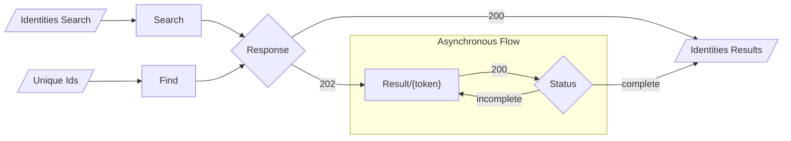
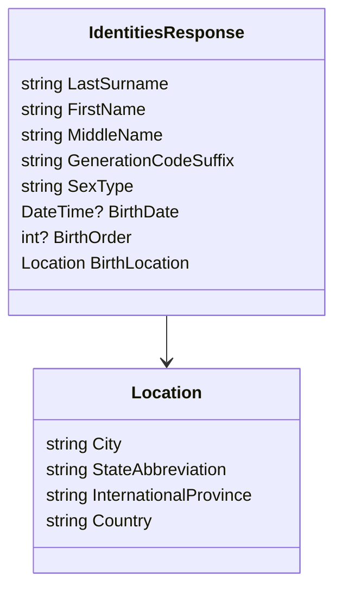
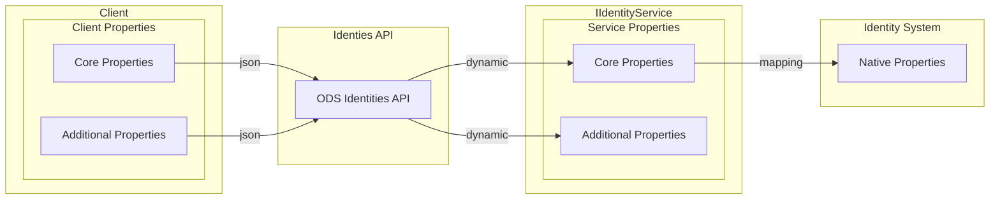

# Identities API

The Ed-Fi Identities API provides an abstraction wrapper for an optional native
identity system. Because the underlying system as well as individual methods are
optional, coordination with the owner of the implementation is essential when
consuming these methods. The Ed-Fi Identities API attempts to (as far as
possible) minimize the vendor customization needed to work with an identity
system.

The Identity System Web API (available at `/identity/v2/`) supports the
following methods:

* POST `identities`_._ Creates a new Unique ID for the given Identity
    information.
* GET `identities/{id}`. Retrieve a single person record from their Unique ID.
* POST `find*.*` Retrieve a multiple person records from their Unique IDs.
* GET `results/{id}`. Retrieve asynchronously prepared results from a
    previously accepted search/find request.
* POST `search`. Look up existing Unique IDs for a person, or suggest possible
    matches.

If a particular method is not available for an underlying implementation, or
there is no implementation, an HTTP `404 Not Found` response is issued.

## Synchronous and Asynchronous Bulk API

For the Find and Search endpoints, a client should accept either an HTTP `200
Success` result with data or a `202 Accepted` result. When a `202 Accepted`
result is returned, a Location header value is included in the response that
should be called to retrieve the results at a later time from the Result
endpoint.

The Result endpoint will return a `200 Success` response with a search response
status of “Incomplete” with no data or “Complete” with the results. The
following diagram provides an overview of the program workflow:



**Figure 1.** Identities API workflow

This workflow allows for server resources to be minimized while performing
potentially expensive identity operations on remote resources and also allows
for flexibility in the Identity Service in performing synchronous or
asynchronous operations as appropriate for the performance characteristics of
the back-end identity service.

Client code should follow the pattern of the following pseudo-code in most
cases:

```text
result <= client.Post(queryURL, queryData)
While result.HttpStatus is 201 or 202
    result <= client.Get(result.location)
if result.HttpStatus = 200 && result.Data.Status = “Complete”
    return result.data
return Error condition
```

## Identity Service Interfaces

Identity service wrappers are written by implementing a synchronous interface —
and optionally, an asynchronous interface. While it is recommended to implement
each method of both interfaces to provide a consistent Identity API for software
vendors, it is not required if the platform host's policy forbids Create and/or
Find.

## Synchronous Identity Service Interface

The generic synchronous interface (IIdentityService) consists of the following
methods:

```csharp
IdentityServiceCapabilities IdentityServiceCapabilities { get; }

Task<IdentityResponseStatus<string>> Create(TCreateRequest createRequest);

Task<IdentityResponseStatus<TSearchResponse>> Find(params string[] findRequest);

Task<IdentityResponseStatus<TSearchResponse>> Search(params TSearchRequest[] searchRequest);
```

### Synchronous Identity Service Capabilities

This property describes to the Identities API which of the other methods are
supported by the service. The values Create, Find, and Search correspond to
their respective methods. Returns a logical OR of the supported methods as
represented by the `IdentityServiceCapabilities` enumeration values.

### Identity Response Status

Each of the remaining methods returns an Identity Response Status wrapped by a
task. These codes are used to communicate success or failure conditions with the
API controller. The Identity Response Status is one of following result codes:

* ```text
    Success – the request has been processed and the results are available in the body of the response.
    ```

* ```text
    Incomplete – the search result is not yet ready.
    ```

* ```text
    InvalidProperties – there is a problem with the provided data.
    ```

* ```text
    NotFound – the requested identity or search token was not valid.
    ```

### Returning Tasks

Wrapping native results in Tasks allows for asynchronous handling of
resource-intensive requests. This approach allows the web server (typically
Microsoft IIS) to perform more efficiently and handle more requests without
blocking.

An implementer of the Identity Service will use the async/await code pattern to
call the actual back-end service. For an integrated Identity Service, returning
"Task.FromResult(result)" instead of just "result" is sufficient to integrate
with this model. Calls to external Identity Services should be invoked using
await for calls to external resources (such as databases and web services).

An implementation that uses "worker threads" in the course of processing
identities is likely not properly using the async/await pattern. Please see
[http://blog.stephencleary.com/2013/11/taskrun-etiquette-examples-using.html](http://blog.stephencleary.com/2013/11/taskrun-etiquette-examples-using.html)
if you have questions regarding correct async/await code patterns.

### Synchronous Create

This method returns the Unique ID of a newly created identity. Bulk identity
creation is not supported by the service interface. This method returns
"Success" or "Invalid Properties" Identity Response Status values.

### Synchronous Find

For each provided Unique ID, this method returns an array of
`IdentityResponses`. Each `IdentityResponses` object contains an array of zero
or one `IdentityResponse` objects. There must be zero elements in the array if
there is no corresponding `Identity` and one element if there is a match. This
method returns a "Success" Identity Response Status value.

### Synchronous Search

For each Identity Search Request value, this method returns an
`IdentityResponses` containing zero or more `IdentityResponse` values. The
`Score` property of the `IdentityResponse` indicates how well the
`IdentityResponse` matches the provided Identity Search Request: 100 is a
perfect match. It is strongly suggested that the number of matches be limited to
statistically likely matches. This method returns a "Success" Identity Response
Status value.

### Properties

The properties of the transfer objects in the Ed-Fi Identities API are as
follows:



As noted above, platform hosts may implement variations on the Identities API
suitable for their environment. It is _highly_ recommended that any Identity
System support these properties. However, if a system does not support these
properties, each of them accepts a null value. In the case of Location, an empty
location object should be returned even if the location values are not
supported.

## IdentitySearchResponse

`IdentitySearchResponse` is a wrapper class that contains a Search Response
Status property called "Status" that has a value of "Incomplete" or "Complete".
For a synchronous response or a resolved asynchronous response, the value is
"Complete". It also contains an array of Identity Search Responses called
"SearchResponses", one array for each Identity Search Request or Unique ID
provided to the Search or Find endpoints respectively. These results are
arranged in the same order as the original requests.

Additionally, some systems will also have more information that may be used to
establish uniqueness among identities. Some examples of this sort of additional
information include:

* School registration information
* Government-issued identity numbers
* Ethnicity or race information
* Aliases or previous names

The as-shipped Ed-Fi ODS / API does not include this additional information.
Adding every permutation of these fields is a maintenance challenge and can
obfuscate the core properties that are universally useful.

Any additional properties attached to the `IdentityCreateRequest`,
`IdentitySearchRequest`, and `IdentityResponse` classes are transparently passed
through to the Identity Service implementations as dynamic properties, and may
be accessed like any other property. In C# this may be accomplished by declaring
a variable of one of these classes as _dynamic_. Other client languages may work
directly with JSON results or use other calling mechanisms. The
`TestIdentitiesService` and `IdentitiesModelTests` unit tests demonstrate this
capability in C#.

The following diagram shows a process flow that illustrates how additional
properties are transparently passed through the Identities API for processing by
the back-end Identity System:



**Figure 2.** Identity API process flow

The process flow steps are as follows:

1. The client application (typically a SIS) provides the core Ed-Fi Identities
    properties as well as some additional properties used by the Ed-Fi Identity
    System. The additional properties are serialized with the core properties in
    the request body as JSON properties. Strong or weak typing may be employed
    in the client application.
2. The Identities API transparently passes these additional properties to the
    `IIdentityService` implementer as dynamic properties.
3. The `IIdentityService` implementer, as a wrapper for the back-end identity
    system, is aware of the additional properties and accesses them by casting
    the request or response objects as _dynamic_ and accessing the properties
    normally. They map the Ed-Fi Identity object properties and additional
    properties to the Identity System native properties and call the back-end
    identity system.
4. Responses follow the same flow back through to the client application.

## Asynchronous Identity Service Interface

The generic asynchronous interface (`IIdentityServiceAsync`) consists of the
following methods:

* `IdentityServiceCapabilities IdentityServiceCapabilities { get; }`
* `Task<IdentityResponseStatus<string>> Find(params string[] findRequest);`
* `Task<IdentityResponseStatus<string>> Search(params TSearchRequest[]
    searchRequest);`
* `Task<IdentityResponseStatus<TSearchResponse>> Response(string
    requestToken);`

These methods are described below.

### Asynchronous Identity Service Capabilities

Bulk Create is not supported, therefore Create is ignored as an Identity Service
Capability. If either Find or Search are supported, then the Response method
must also be implemented.

#### Bulk Asynchronous Workflow

Under the bulk asynchronous workflow, results are not immediately returned when
a Find or Search request is issued, instead a search token is issued. This token
may be “redeemed” later for the search results by calling the Response method of
the interface. Tokens should remain valid for a “reasonable” amount of time
(minutes, not hours), or until they have been redeemed for the search results.

### Asynchronous Find

A find operation for the provided Unique IDs is initiated and a token returned
to the caller. "Success" is the only valid Identity Response Status.

### Asynchronous Search

A search operation for the provided identity search request values is initiated
and a token returned to the caller with a "Success" Identity Response Status or
an "Invalid Properties" Identity Response Status.

### Asynchronous Response

If the previously initiated find or search request is complete, then the results
are returned along with a "Success" Identity Response Status. Otherwise, an
"Incomplete" Identity Response Status is returned with a location header value.
If the token is not recognized, a "Not Found" Identity Response Status is
returned.
