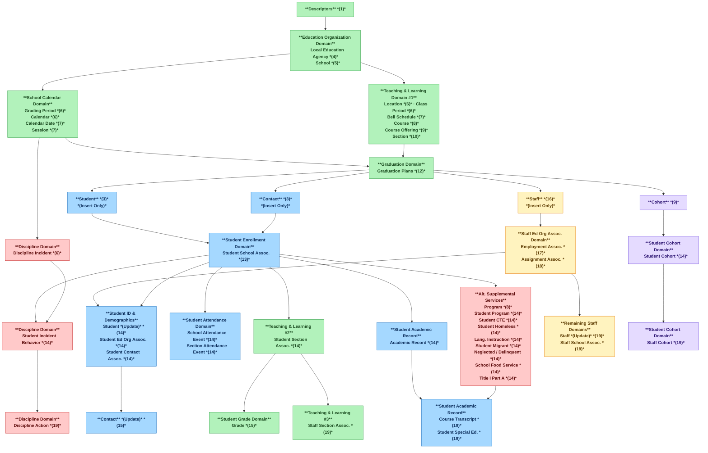

# Resource Dependency Order

Resources must be loaded into an Ed-Fi ODS / API instance according to a set
dependency order.

## Dependency Order Overview

The dependency order is enforced through entity relationships in the ODS
database or by authorization.

- **Dependency order enforced by the entity relationships.** Like in any
    relationship-based database, many entities in the ODS have foreign key
    relationships with other entities. The ODS / API will return validation
    errors if constraints for these relationships are not met. While loading or
    updating data it is important to consider these dependencies to avoid
    validation errors from the database.
- **Dependency order enforced by authorization.** Many resources in the ODS /
    API are authorized by their relationship to education organization and/or
    people. For example, access to Student and student-related data is
    restricted by the StudentSchoolAssociation. The same is true for staff
    members and their relationships provided by the
    StaffEducationOrganizationEmploymentAssociation and the
    StaffEducationOrganizationAssignmentAssociation. Access to Parent
    information is restricted by the accessible Students and their
    StudentParentAssociations. For example, if "Student A" is accessible, then
    any Parents to which Student A has a StudentParentAssociation will be
    accessible as well.

## Loading Sequence

The flow runs **top-to-bottom** following dependency order. Each tier must be
fully loaded before proceeding to the next. Entities sharing the same order
number can be loaded **in parallel** within that tier. The **(xx)** notation
indicates loading dependency order number.

| Color | Domain Category |
| ----- | --------------- |
| Green | Core structure (descriptors, ed org, calendar, teaching & learning, graduation) |
| Blue | Student-related entities |
| Amber | Staff-related entities |
| Red/Pink | Behavioral & supplemental services |
| Purple | Cohort entities |



Download the diagram: [ [PDF Version](https://edfidocs.blob.core.windows.net/$web/assets/reference/ed-fi-api/Ed-Fi%20-%20Data%20Model%20Logical%20Loading%20Sequence%20V2%20(1).pdf) | [Vizio format](https://edfidocs.blob.core.windows.net/$web/assets/reference/ed-fi-api/Ed-Fi%20-%20Data%20Model%20Logical%20Loading%20Sequence%20V2%20(1).vsdx) ]

## Domain Reference

### Core Structure

| Entity | Order | Notes |
| ------ | ----- | ----- |
| Descriptors | 1 | Foundation for all coded values |
| Local Education Agency | 4 | Required before School |
| School | 5 | Required before calendar/schedule entities |
| Grading Period | 6 | Parallel with Calendar |
| Calendar | 6 | Parallel with Grading Period |
| Calendar Date | 7 | Requires Calendar |
| Session | 7 | Requires Grading Period |
| Location | 6 | Parallel with Class Period |
| Class Period | 6 | Parallel with Location |
| Bell Schedule | 7 | Requires Class Period |
| Course | 8 | Requires Ed Org |
| Course Offering | 9 | Requires Course + Session |
| Section | 10 | Requires Course Offering + Location + Class Period |
| Graduation Plans | 12 | Requires Section |

### Student Entities

| Entity | Order | Notes |
| ------ | ----- | ----- |
| Student | 3 | Insert only at this stage |
| Contact | 3 | Insert only at this stage |
| Student School Assoc. | 13 | Requires Student + School |
| Student (Update) | 14 | Full demographic update |
| Student Ed Org Assoc. | 14 | Requires Student + Ed Org |
| Student Contact Assoc. | 14 | Requires Student + Contact |
| Student Section Assoc. | 14 | Requires Student + Section |
| School Attendance Event | 14 | Requires Student School Assoc. |
| Section Attendance Event | 14 | Requires Student Section Assoc. |
| Academic Record | 14 | Requires Student School Assoc. |
| Contact (Update) | 15 | Full contact detail update |
| Grade | 15 | Requires Student Section Assoc. + Grading Period |
| Course Transcript | 19 | Requires Academic Record + Section |
| Student Special Education | 19 | Requires Student Program |

### Staff Entities

| Entity | Order | Notes |
| ------ | ----- | ----- |
| Staff | 16 | Insert only at this stage |
| Staff Ed Org Employment Assoc. | 17 | OR use Assignment Assoc. |
| Staff Ed Org Assignment Assoc. | 18 | OR use Employment Assoc. |
| Staff (Update) | 19 | Full staff detail update |
| Staff School Assoc. | 19 | Requires Staff + School |
| Staff Section Assoc. | 19 | Requires Staff + Section |
| Staff Cohort | 19 | Requires Staff + Cohort |

### Behavioral & Supplemental Services

| Entity | Order | Notes |
| ------ | ----- | ----- |
| Discipline Incident | 6 | Requires Ed Org (no student yet) |
| Program | 8 | Requires Ed Org |
| Student Incident Behavior | 14 | Requires Student + Discipline Incident |
| Student Program | 14 | Requires Student + Program |
| Student CTE | 14 | Requires Student Program |
| Student Homeless | 14 | Requires Student Program |
| Language Instruction | 14 | Requires Student Program |
| Student Migrant | 14 | Requires Student Program |
| Neglected / Delinquent | 14 | Requires Student Program |
| School Food Service | 14 | Requires Student Program |
| Title I Part A | 14 | Requires Student Program |
| Discipline Action | 19 | Requires Student Incident Behavior |

### Cohort Entities

| Entity | Order | Notes |
| ------ | ----- | ----- |
| Cohort | 9 | Requires Ed Org |
| Student Cohort | 14 | Requires Student + Cohort |
| Staff Cohort | 19 | Requires Staff + Cohort |

## Dependency Order Endpoint

As an API client developer, it is useful to know the dependency order of
resources to load the data and minimize authorization and validation errors in
API responses.

The ODS / API provides a dependency metadata endpoint at
`/metadata/data/v3/dependencies` to show this dependency order based on each
HTTP operation. The default GET generates a JSON response with an order group of
resource endpoints that can be loaded at the same time. The response also
includes the "Create" and "Update" operations that can be performed in that
order group. "Delete" operations are to be performed at the reverse order of
Create operations. API Client developers can use this as documentation or can
use it programmatically for orchestration of API calls.

```json title="Partial listing of the Dependencies endpoint"
{
  ...
  {
    "resource": "/ed-fi/studentTransportations",
    "order": 14,
    "operations": [
      "Create",
      "Update"
    ]
  },
  {
    "resource": "/tpdm/financialAids",
    "order": 14,
    "operations": [
      "Create",
      "Update"
    ]
  },
  {
    "resource": "/ed-fi/contacts",
    "order": 15,
    "operations": [
      "Update"
    ]
  },
  {
    "resource": "/ed-fi/credentials",
    "order": 15,
    "operations": [
      "Create",
      "Update"
    ]
  },
  {
    "resource": "/ed-fi/grades",
    "order": 15,
    "operations": [
      "Create",
      "Update"
    ]
  }
  ...
}
```

Adding a header `Accept` with a value of `application/graphml` can be passed to
obtain dependency output in the [graphml XML
format](https://en.wikipedia.org/wiki/GraphML).

```xml title="Partial listing of the Dependencies endpoint in GraphML
<?xml version="1.0" encoding="UTF-8"?>
<graphml xmlns="http://graphml.graphdrawing.org/xmlns" xmlns:xsi="http://www.w3.org/2001/XMLSchema-instance" xsi:schemaLocation="http://graphml.graphdrawing.org/xmlns http://graphml.graphdrawing.org/xmlns/1.0/graphml.xsd">
<graph id="EdFi Dependencies" edgedefault="directed">
<node id="/ed-fi/absenceEventCategoryDescriptors"/>
<node id="/ed-fi/academicHonorCategoryDescriptors"/>
<node id="/ed-fi/academicSubjectDescriptors"/>
<node id="/ed-fi/academicWeeks"/>
<node id="/ed-fi/accommodationDescriptors"/>
<node id="/ed-fi/accountabilityRatings"/>
<node id="/ed-fi/accountTypeDescriptors"/>
<node id="/ed-fi/achievementCategoryDescriptors"/>
...
```

The example below shows the dependency order enforced by authorization on the
Students resource. You can see that Student creation is at
order 3, StudentSchoolAssociation creation is at order 13, and the Student
update is at order 14. This shows that a client cannot edit a student record it
has created until an enrollment record has been established.

```json
{
  ...
  {
    "resource": "/ed-fi/students",
    "order": 3,
    "operations": [
      "Create"
    ]
  },
  ...
  {
    "resource": "/ed-fi/studentSchoolAssociations",
    "order": 13,
    "operations": [
      "Create",
      "Update"
    ]
  },
  ...
  {
    "resource": "/ed-fi/students",
    "order": 14,
    "operations": [
      "Update"
    ]
  },
  ...
}
```

:::note

You can explore the dependency endpoint at the Ed-Fi Alliance-hosted
sandbox: [Dependency Endpoint in Ed-Fi ODS / API
Sandbox](https://api.ed-fi.org/v7.3/api/metadata/data/v3/dependencies)

:::
