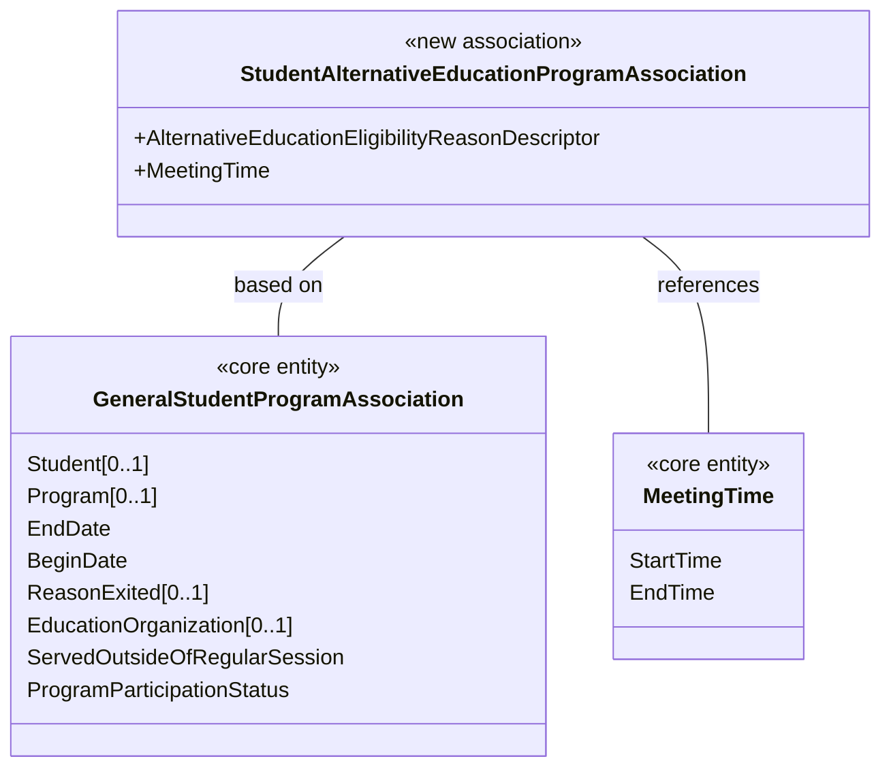

# How To: Extend the Ed-Fi ODS / API - Alternative Education Program Example

In this example, we will create a new program called Alternative Education
Program. This program will be exposed in Ed-Fi ODS / API through a new API
resource called **studentAlternativeEducationProgramAssociations.**

Before you begin:

* This example uses MetaEd to generate extended artifacts and documentation.
  MetaEd is a free tool developed by the Ed-Fi Alliance and is the recommended
  way to add new fields to the Ed-Fi ODS / API. You should [download and install
  MetaEd](/reference/metaed) before beginning. This example goes step-by-step,
  so it's okay if you've never used MetaEd before. If you prefer to generate
  extended artifacts manually instead of using MetaEd, the steps are listed in
  [Appendix A](#appendix-a-adding-manually-created-extensions) of this page.
* This example assumes that the Ed-Fi ODS / API has been successfully downloaded
  and is running in a local development environment per the instructions in
  the [Getting
  Started](../getting-started/source-code-installation/readme.md) documentation.
* Back up any existing code or scripts in source control or your file system.
  This is important if you or your team have performed these steps before. The
  MetaEd deployment feature replaces existing files, some of which may contain
  hand-crafted customizations (e.g., to define an authorization strategy).

## Step 1. Design Your Extension

In a real project, you would design your extension as a preliminary step. We'll
propose a design.

This example will create a new Alternative Education Program. The ODS / API data
model has several programs where students can be enrolled, but there is no
Alternative Education Program where a specific Meeting Time can be added. We'll
add and relate our new program to existing parts of the data model.

The following diagram shows the new Alternative Education Program (on the left)
and its properties. Our new program is based on the
GeneralStudentProgramAssociation and references the common MetingTime, already
in the ODS / API data model.



You'll notice that an Alternative Education Eligibility Reason is shown with a
type of "descriptor." The Ed-Fi Descriptor is analogous to an enumeration. It's
an Ed-Fi-specific design pattern that allows for enumeration-like definition and
validation within an operational context but may vary between contexts. We'll
see more about how these are implemented below.

This simple example illustrates most of the essential concepts required to
extend the Ed-Fi ODS / API. Let's continue with the mechanics.

## Step 2. Author Your Extension Using MetaEd

In this step, we'll create a new project in MetaEd and author our new entity.
It's easy, but you need to [download and install MetaEd](/reference/metaed) to
do this step. Do that now if you haven't already.

### Step 2a. Set or Confirm MetaEd Target Version

MetaEd allows you to target different Ed-Fi technology stack and data model
versions. Confirm that your MetaEd IDE is targeting v7.3 by following the
instructions in the [Version
Targeting](/reference/metaed/ide-user-guide/creating-and-maintaining-your-extension#step-4-add-the-correct-data-model-project)
documentation for the MetaEd IDE.

The desired model for the latest ODS / API is "ed-fi-model-5.2".

### Step 2b. Create a New Extension Project

Create a new extension by following the steps in [MetaEd IDE - Creating and
Maintaining Your
Extension](/reference/metaed/ide-user-guide/creating-and-maintaining-your-extension).
For this example, place your extension in a folder called
"AlternativeEducationProgram".

<details>
<summary>Listing of files</summary>

Note that this represents two folders open at the same time in VS Code.

```none
ed-fi-model-5.2/
├─ Association/
├─ Choice/
├─ Common/
├─ Descriptor/
├─ Domain/
├─ DomainEntity/
├─ Enumeration/
├─ Interchange/
├─ Shared/
├─ package.json
├─ README.md

AlternativeEducationProgram
├─ Association/
├─ Descriptor/
├─ package.json
```

</details>

### Step 2c. Update the package.json File

Open the package.json file by double-clicking on the file in the tree view to
the left and provide an appropriate name for your project. In this case we will
call it "SampleAlternativeEducationProgram".

```json
{
  "metaEdProject": {
    "projectName": "SampleAlternativeEducationProgram",
    "projectVersion": "1.0.0"
  }
}
```

Click **File** > **Save** (**Ctrl + S**) to save your changes.

### Step 2d. Add an Association File to Your Project

We're going to add an Association source file to the project we just created.
Note that MetaEd files are required to be organized into subfolders. Folders are
generally named after their entity type. When you followed the steps in [MetaEd
IDE - Creating and Maintaining Your
Extension](/reference/metaed/ide-user-guide/creating-and-maintaining-your-extension)
one of the folders you created was called "Association". We will now add a
MetaEd source file to that folder.

**Right-click** on the folder **Association**, and select New File.

Name the new file `StudentAlternativeEducationProgramAssociation.metaed` to
match the name of the new entity to be created.

Note the new file appears in the tree view to the left. **Double-click** on the
file in the tree view to open it.

<details>
<summary>Listing of files</summary>

```none
ed-fi-model-5.2/

AlternativeEducationProgram
├─ Association/
| ├─ StudentAlternativeEducationProgramAssociation.metaed
├─ Descriptor/
├─ package.json
```

</details>

### Step 2e. Author and Save Your Extension

Type or copy and paste the code listing below into your MetaEd file. Note that
an error will be listed in the linter panel until the referenced Descriptor is
created in a future step.

<details>
<summary>MetaEd Source for StudentAlternativeEducationProgramAssociation Association</summary>

```none
Association StudentAlternativeEducationProgramAssociation based on EdFi.GeneralStudentProgramAssociation
    documentation "This association represents Students in an Alternative Education Program."
    descriptor AlternativeEducationEligibilityReason
        documentation "The reason the student is eligible for the program."
        is required
    common EdFi.MeetingTime
        documentation "The times at which this Alternative Education Program is scheduled to meet."
        is optional collection
```

</details>

If you're new to Ed-Fi technology, it's worth understanding the Ed-Fi Descriptor
pattern because it occurs throughout the model. In essence, Descriptors provide
states, districts, vendors, and other platform hosts with the flexibility to use
their own enumerations and code sets. A Descriptor is consistent within an
operational context such as a single district, but may be different in another
operational context.

**Right-click** on the Descriptor folder, select **New File**. Name the file
`AlternativeEducationEligibilityReason.metaed`.

Replace the template text in your new Descriptor source file with the following
code.

<details>
<summary>MetaEd Source for AlternativeEducationEligibilityReason Descriptor</summary>

```none
Descriptor AlternativeEducationEligibilityReason
    documentation "This descriptor describes the reason a student is eligible for an Alternative Education Program"
```

</details>

Click **File** > **Save All** (**Ctrl + K S**) to save your changes.

## Step 3. Generate Extended Technical Artifacts Using MetaEd

In this step, we'll build our new MetaEd project. This is fairly
straightforward.

### Step 3a. Build Your Project

**Click Build** in the VSCode Editor to generate artifacts. Note that you must
have a file open for the Build button to be displayed.

### Step 3b. View MetaEd Output

You can expand the project in the tree view and click "MetaEdOutput" to explore
generated artifacts. The artifacts include technical output such as SQL scripts,
API metadata, and XSD used by the code generation, but also updated
documentation such as data dictionaries that add your extension definitions to
the ODS / API documentation.

<details>
<summary>Listing of files</summary>

```none
ed-fi-model-5.2/

AlternativeEducationProgram/
├─ Association/
| ├─ StudentAlternativeEducationProgramAssociation.metaed
├─ Descriptor/
├─ MetaEdOutput                            <----- NEW DIRECTORY
| ├─ Documentation/
| ├─ EdFi/
| ├─ SampleAlternativeEducationProgram/
|   ├─ ApiMetadata/
|     ├─ ApiModel-EXTENSION.json
|   ├─ Database/
|   ├─ Interchange/
|   ├─ XSD/
├─ package.json
```

</details>

We'll look at how to use this MetaEd output in your code below. First, we'll
need to set up our extension project in Visual Studio.

## Step 4. Create Extension Project in ODS / API Solution

This step will create the C# Extension files necessary to build your extended
solution. This step assumes you've successfully downloaded and can run the ODS /
API in a local development environment per the instructions in the [Getting
Started](../getting-started/readme.md)
documentation. Do that now if you haven't already.

### Step 4a. Set Up the C# Project Template

Visual Studio Project Templates can be installed by following steps in [Project
Templates
Installation](../getting-started/source-code-installation/project-templates-installation.md)
section of this documentation.

### Step 4b. Create new Extension Project

**4b.1.** To add a project to your Ed-Fi-Ods Visual Studio
Solution, **right-click** on the Ed-Fi Extensions Folder. Select **Add** > **New
Project**.

**4b.2.** Search and select the **Ed-Fi API Extensions Project Template** option
and click **Next**.


In the Project Name field
enter `EdFi.Ods.Extensions.SampleAlternativeEducationProgram` and
click ****Create**.**

:::info

To ensure MetaEd outputs are correctly deployed to ODS / API extension project,
the last section of the project name should match the namespace you provided in
Step 2.c.

:::

### Step 4c. Rename the "Marker" Interface file

**4c.1.** **Right-click** on the
`EdFi.Ods.Extensions.ExtensionName.nuspec` file in newly created
`EdFi.Ods.Extensions.SampleAlternativeEducationProgram` project and Rename the
file to `EdFi.Ods.Extensions.SampleAlternativeEducationProgram.nuspec`.

**Right-click** on the
`Marker_EdFi_Ods_Extensions_ExtensionName.cs` file and Rename the file to
`Marker_EdFi_Ods_Extensions_SampleAlternativeEducationProgram.cs`.

**4c.2.** When prompted choose to rename all references to the code element
`Marker_EdFi_Ods_Extensions_ExtensionName`.

### Step 4d. Integrate Extension into the Solution

In this step, we'll integrate the extension into the solution.

**4d.1.** Locate the **EdFi.Ods.WebApi** project, within the "Entry Points"
folder. **Right-click**, select **Add** > **Project** **Reference...**, then
select
the `EdFi.Ods.Extensions.`SampleAlternativeEducationProgram` project.


**4d.2.** Locate any profile projects in the
solution. **Right-click**, select **Add** > **Project** **Reference...**, then
select
the **EdFi.Ods.Extensions.**SampleAlternativeEducationProgram**** project. This
step is needed only if any of the Profile resources in the Profiles.xml document
are extended, or extension entities are being constrained by a particular
Profile.

## Step 5. Deploy your Extended Artifacts to the ODS / API Solution

In this step, we'll use the MetaEd "Deploy" feature and integrate the files
you've generated with the ODS / API Solution. The MetaEd IDE can deploy the
generated artifacts necessary for an ODS / API build of an extension project.
These include the generated SQL, generated XSD, and other material.

You can easily configure the MetaEd IDE to copy the generated files to the
correct locations for the ODS / API project.

### Step 5a. Confirm MetaEd Deployment Settings

Ensure that your Ed-Fi ODS / API source directory is set properly in the MetaEd
Extension settings. In VS Code open Settings **Ctrl+,** and switch to the
Workspace tab, find the MetaEd extension and update the "Ods Api Deployment
Directory" to point to the folder that contains the Ed-Fi-ODS and
Ed-Fi-ODS-Implementation folders.

### Step 5b. Deploy Your Extended Artifacts

:::warning

As noted above, deployment will remove existing SQL scripts —
including modifications to establish the authorization strategy as described
in the next step. Verify that you have a source control copy or file backup of
previous work before running deployment.

:::

Deploy by clicking the **Deploy** button in the upper right corner of the window
(must have a file open, otherwise the button is not displayed).

This will run a new build of all artifacts, and the artifacts required for your
Extended ODS / API project will be copied over to the correct locations. For
instructions on how to perform the steps manually, see [Appendix
A](#appendix-a-adding-manually-created-extensions), below.

## Step 6. Configure Security

The Ed-Fi ODS / API is secure by default. One implication of this design
principle is that new entities and elements may not be accessed until an
authorization strategy is applied. This prevents accidental release of
confidential information, but does require active steps on the part of system
developers to enable access to Extensions.

Create a security SQL script called
`0001-AlternativeEducationProgram_ResourceClaims.sql` and place it in
the`Ed-Fi-ODS-Implementation/Application/
EdFi.Ods.Extensions.SampleAlternativeEducationProgram/Versions/1.0.0/Standard/5.2.0/Artifacts/MsSql/Data/Security` folder
(Create 'Security' folder if it does not exist). Copy the contents of the
following SQL DML script into the newly created file and save.

<details>
<summary>0001-AlternativeEducationProgram_ResourceClaims.sql</summary>

```sql
DECLARE @SystemDescriptorsId INT
SELECT @SystemDescriptorsId = resourceclaimid
FROM   [dbo].[resourceclaims]
WHERE  resourcename = 'systemDescriptors'

INSERT INTO [dbo].[resourceclaims]
            ([resourcename],
             [claimname],
             [parentresourceclaimid])
VALUES      ('alternativeEducationEligibilityReasonDescriptor',
'http://ed-fi.org/ods/identity/claims/sample-alternative-education-program/alternativeEducationEligibilityReasonDescriptor',
@SystemDescriptorsId)


DECLARE @ParentResourceClaimId INT
SELECT @ParentResourceClaimId = ResourceClaimId
FROM [dbo].[ResourceClaims]
WHERE ResourceName = 'relationshipBasedData'

INSERT INTO [dbo].[ResourceClaims] ( [ResourceName]
                                     ,[ClaimName]
                                     ,[ParentResourceClaimId]
                                     )
VALUES ('studentAlternativeEducationProgramAssociation'
        ,'http://ed-fi.org/ods/identity/claims/sample-alternative-education-program/studentAlternativeEducationProgramAssociation'
        ,@ParentResourceClaimId
        )
```

</details>

### Preventing Resource Name Conflicts

It is possible to create extension resources that use the same
name as an Ed-Fi standard resource. The authorization metadata supports this
through a change in behavior so it no longer uses just the resource name to
identify the resource, but instead uses the ClaimName. To prevent possible
naming conflicts, the claim name's URI value should include the schema
representation, using the following format:

```none
http://ed-fi.org/ods/identity/claims/{schema}/{resourceName}
```

The URI representation of the schema name should be derived by splitting the
terms in the name of the extension, inserting hyphens and converting to lower
case. For example, "SampleAlternativeEducationProgram" would be separated into
"Sample", "Alternative", "Education", and "Program"; and then combined with
hyphens and converted to lower case as "sample-alternative-education-program".

The resource name should be the camel-cased (also known as "medial capitals"),
singularized name of the resource (e.g.,
"studentAlternativeEducationProgramAssociation" not
"StudentAlternativeEducationProgramAssociation" or
"studentAlternativeEducationProgramAssociations").

Note that in `0001-AlternativeEducationProgram_ResourceClaims.sql` script
above, the resulting ClaimName value is
`http://ed-fi.org/ods/identity/claims/sample-alternative-education-program/studentAlternativeEducationProgramAssociation`.

## Step 7. Run Code Generation and Verify Changes

Save all modified files, close Ed-Fi-ODS.sln, and re-run the code generation
steps outlined in the [Getting Started
Guide](../getting-started/source-code-installation/readme.md) (i.e.,
from a PowerShell prompt run `Initialize-PowershellForDevelopment.ps1` script,
followed by the `initdev` command). Then, run the application and view the Ed-Fi
ODS / API in the Swagger UI. The following new API resource should be visible:


## Next Steps & Further Information

Congratulations, you've successfully extended an instance of the Ed-Fi ODS /
API. The Ed-Fi Extension in this example is fairly simple. It's a good place to
start, but most enterprise users have more complicated needs. The following
links are useful for developing more complex extensions and getting the
development work into production.

* [Student Transcript Extension
    Example](./how-to-extend-the-ed-fi-ods-api-student-transcript-example.md).
    Working through this example is a great next step if you want to move on to
    more complicated extension scenarios.
* [The MetaEd
    Cookbook](/reference/metaed/cookbook).
    This documentation provides excellent examples of common scenarios, from the
    simple to very complex.

## Appendix A: Adding Manually Created Extensions

### Step A1. Set Up the C# Project Template

Visual Studio Project Templates can be installed by following steps in [Project
Templates
Installation](../getting-started/source-code-installation/project-templates-installation.md)
section of this documentation.

### Step A2. Create new Extension Project

#### A2.1

To add a project to your Ed-Fi-Ods Visual Studio Solution, **right-click** on
the Ed-Fi Extensions Folder. Select **Add** > **New Project**.

#### A2.2

Search and select the **Ed-Fi API Extensions Project Template** option and
click **Next**.


In the Project Name field,
enter `EdFi.Ods.Extensions.SampleAlternativeEducationProgram` and
click **Create**.

### Step 3. Rename the "Marker" Interface File

**3.1.**  **Right-click** on the `EdFi.Ods.Extensions.ExtensionName.nuspec` file
in newly created `EdFi.Ods.Extensions.SampleAlternativeEducationProgram` project
and Rename the file
to `EdFi.Ods.Extensions.SampleAlternativeEducationProgram.nuspec`.

**Right-click** on the `Marker_EdFi_Ods_Extensions_ExtensionName.cs` file and
Rename the file to
`Marker_EdFi_Ods_Extensions_SampleAlternativeEducationProgram.cs`.

**3.2.** When prompted choose to rename all references to the code
element `Marker_EdFi_Ods_Extensions_SampleAlternativeEducationProgram`.

### Step 4. Integrate Extension into the Solution

In this step, we'll integrate the extension into the solution.

**4.1.** Locate the **EdFi.Ods.WebApi** project, within the "Entry Points"
folder. **Right-click**, select **Add** > **Project** **Reference...**, then
select
the `EdFi.Ods.Extensions.SampleAlternativeEducationProgram` project.


**4.2.** Locate any profile projects in the
solution. **Right-click**, select **Add** \> **Project Reference...**, then
select
the `EdFi.Ods.Extensions.SampleAlternativeEducationProgram` project. This
step is needed only if any of the Profile resources in the Profiles.xml document
are extended, or extension entities are being constrained by a particular
Profile.

### Step 5. Add Extension Metadata

The code listings in this section use the sample extension material from
Ed-Fi-ODS/Samples/Extensions/AlternativeEducationProgram.

**5.1.** Map Artifacts

* Copy the metadata files to the implementation project.

```powershell
xcopy /y "Ed-Fi-ODS\Samples\Extensions\AlternativeEducationProgram\AlternativeEducationProgramMetaEd\MetaEdOutput\SampleAlternativeEducationProgram\Database\SQLServer\ODS\Structure" `
  "Ed-Fi-ODS-Implementation\Application\EdFi.Ods.Extensions.SampleAlternativeEducationProgram\Versions\1.0.0\Standard\5.2.0\Artifacts\MsSql\Structure\Ods\*"

xcopy /y "Ed-Fi-ODS\Samples\Extensions\AlternativeEducationProgram\AlternativeEducationProgramMetaEd\MetaEdOutput\SampleAlternativeEducationProgram\Database\PostgreSQL\ODS\Structure" `
  "Ed-Fi-ODS-Implementation\Application\EdFi.Ods.Extensions.SampleAlternativeEducationProgram\Versions\1.0.0\Standard\5.2.0\Artifacts\PgSql\Structure\Ods\*"

xcopy /y "Ed-Fi-ODS\Samples\Extensions\AlternativeEducationProgram\AlternativeEducationProgramMetaEd\MetaEdOutput\SampleAlternativeEducationProgram\ApiMetadata" `
  "Ed-Fi-ODS-Implementation\Application\EdFi.Ods.Extensions.SampleAlternativeEducationProgram\Versions\1.0.0\Standard\5.2.0\Artifacts\Metadata\*"

xcopy /y "Ed-Fi-ODS\Samples\Extensions\AlternativeEducationProgram\AlternativeEducationProgramMetaEd\MetaEdOutput\SampleAlternativeEducationProgram\XSD" `
  "Ed-Fi-ODS-Implementation\Application\EdFi.Ods.Extensions.SampleAlternativeEducationProgram\Versions\1.0.0\Standard\5.2.0\Artifacts\Schemas\*"

xcopy /y "Ed-Fi-ODS\Samples\Extensions\AlternativeEducationProgram\AlternativeEducationProgramMetaEd\MetaEdOutput\SampleAlternativeEducationProgram\Interchange" `
  "Ed-Fi-ODS-Implementation\Application\EdFi.Ods.Extensions.SampleAlternativeEducationProgram\Versions\1.0.0\Standard\5.2.0\Artifacts\Schemas\*"

```

### Step A6. Configure Security

The Ed-Fi ODS / API is secure by default. One implication of this design
principle is that new entities and elements may not be accessed until an
authorization strategy is applied. This prevents accidental release of
confidential information, but does require active steps on the part of system
developers to enable access to Extensions.

Create a security SQL script called
`0001-AlternativeEducationProgram_ResourceClaims.sql` and place it in
the `Ed-Fi-ODS-Implementation/Application/
EdFi.Ods.Extensions.SampleAlternativeEducationProgram/Versions/1.0.0/Standard/5.2.0/Artifacts/MsSql/Data/Security` folder
(Create 'Security' folder if it does not exist). Copy the contents of the
following SQL DML script into the newly created file and save.

<details>
<summary>0001-AlternativeEducationProgram_ResourceClaims.sql</summary>

```sql
DECLARE @SystemDescriptorsId INT
SELECT @SystemDescriptorsId = resourceclaimid
FROM   [dbo].[resourceclaims]
WHERE  resourcename = 'systemDescriptors'

INSERT INTO [dbo].[resourceclaims]
            ([resourcename],
             [claimname],
             [parentresourceclaimid])
VALUES      ('alternativeEducationEligibilityReasonDescriptor',
'http://ed-fi.org/ods/identity/claims/sample-alternative-education-program/alternativeEducationEligibilityReasonDescriptor',
@SystemDescriptorsId)
```

</details>

### Step A7. Run Initdev

Save all modified files, close Ed-Fi-ODS.sln, and re-run the code generation
steps outlined in the [Getting Started
Guide](../getting-started/source-code-installation/readme.md) (i.e.,
from a PowerShell prompt run `Initialize-PowershellForDevelopment.ps1` script,
followed by the `initdev` command). Then, run the application and view the Ed-Fi
ODS / API in the Swagger UI. The following new API resource should be visible:


:::note
The following GitHub links contain source files for this extensibility sample.

* [Alternative Education Program MetaEd Source](https://github.com/Ed-Fi-Alliance-oss/Ed-Fi-ODS/tree/v7.3/Samples/Extensions/AlternativeEducationProgram/AlternativeEducationProgramMetaEd)
* [Alternative Education Program Generated Artifacts](https://github.com/Ed-Fi-Alliance-OSS/Ed-Fi-ODS/tree/v7.3/Samples/Extensions/AlternativeEducationProgram/AlternativeEducationProgramMetaEd/MetaEdOutput/SampleAlternativeEducationProgram)

:::
