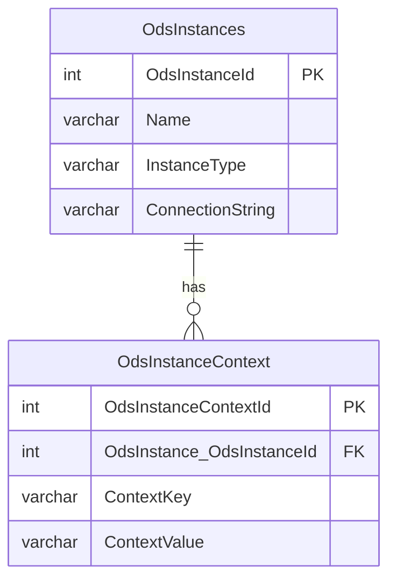

# Context-Based Routing for Year-Specific ODS

The Ed-Fi ODS API routing has been redesigned to provide a simple, predictable
base path for all API requests by default. The out-of-the-box configuration
allows for the implementation of any _implicit_ data segmentation strategy
through the configuration of ODS instances, API clients, and their associations
with each API client configured with access to a single ODS instance. In this
configuration, API clients all use the same base path with their requests and
are not aware how the data is segmented by the host.

However, some implementations may find it useful to add an explicit school year
(or some other contextual value such as a district and/or instance identifier)
to the API requests base path as part of an _explicit_ data segmentation
strategy or to distinguish data associated with previous years from data for the
current year, or both. The primary reason for pursuing an explicit data
segmentation strategy is to allow the same API clients to be used to access
several different ODS instances.

To enable context-based routing for the Ed-Fi ODS / API, provide an ASP.NET
route template in the "OdsContextRouteTemplate" setting of the "ApiSettings"
section of the configuration. This route template can contain multiple segments
(e.g. `{instanceId}/{schoolYearFromRoute}`) if multiple context values are
required and can include ASP.NET [route
constraints](https://learn.microsoft.com/en-us/aspnet/core/fundamentals/routing?view=aspnetcore-7.0#route-constraints).

```json
{
  "ApiSettings": {
    ...
    "OdsContextRouteTemplate": "{schoolYearFromRoute:range(2000,2099)}",
    ...
  }
}
```

:::info
The term "schoolYearFromRoute" has been used historically for school
year in the route template to avoid any potential naming conflicts in the
ASP.NET model binding context caused by the presence of a query string filter
parameter named "schoolYear" because of a corresponding resource property.
:::

Once the OdsContextRouteTemplate is defined, _all_ API requests must include the
segment in the base path (in multi-tenant mode this context segment will be
added after the tenant identifier segment). Also, all ODS instance definitions
managed in the `EdFi_Admin` database must have corresponding contextual
name/value pairs defined in the OdsInstanceContext table. The API will use the
context from the request path with the contextual values defined for the ODS
instance to identify which database should be used to service the request. A
failure to match all the context values defined will result in a 404 Not Found
response.



:::note
The `InstanceType` property has no restrictions - this column is for
human readers.
:::

Examples below outline steps to configure explicit Year-Specific routes and District-Specific routes.

## Configuring Year-Specific Routes

To route requests to two year-specific ODS databases, for school years 2026 and
2027 with explicit school year segment in the route:

- **Step 1:** Set `"OdsContextRouteTemplate": "{schoolYearFromRoute:range(2000,2099)}"` in the
  appsettings file or`ApiSettings__OdsContextRouteTemplate` environment
  variable.

- **Step 2:** Create the following records in `dbo.OdsInstances`:

  OdsInstanceId | Name          | InstanceType | ConnectionString                                         |
  ------------- | --------------| -------------| ---------------------------------------------------------|
  1             | EdFi_Ods_2026 | YearSpecific | Server=??;Database=EdFi_Ods_2026;User ID=??;Password=??; |
  2             | EdFi_Ods_2027 | YearSpecific | Server=??;Database=EdFi_Ods_2027;User ID=??;Password=??; |

- **Step 3:** Create the following records in the `dbo.OdsInstanceContext`:

  OdsInstance_OdsInstanceId | ContextKey          | ContextValue |
  ------------------------- | --------------------| ------------ |
  1                         | schoolYearFromRoute | 2026         |
  2                         | schoolYearFromRoute | 2027         |

SQL statements:

```sql
INSERT INTO dbo.odsinstances ("name", instancetype, connectionstring)
VALUES
 ('EdFi_Ods_2026', '2026 ODS', 'Server=localhost;Database=EdFi_Ods_2026;Integrated Security=True;Encrypt=False'),
 ('EdFi_Ods_2027', '2027 ODS', 'Server=localhost;Database=EdFi_Ods_2027;Integrated Security=True;Encrypt=False');

INSERT INTO dbo.odsinstancecontexts (odsinstance_odsinstanceid, contextkey, contextvalue)
SELECT odsinstanceid, 'schoolYearFromRoute', '2026' FROM dbo.odsinstances WHERE "name" = 'EdFi_Ods_2026'
UNION
SELECT odsinstanceid, 'schoolYearFromRoute', '2027' FROM dbo.odsinstances WHERE "name" = 'EdFi_Ods_2027';
```

## Configuring District-Specific Routes

To route requests to two district-specific ODS databases, for Local Education
Agency ID values 255901 and 255902 with explicit district id segment in the route:

- **Step 1:** Set `"OdsContextRouteTemplate": "{instanceId}"` in the appsettings file
  or `ApiSettings__OdsContextRouteTemplate` environment variable.
- **Step 2:** Create the following records in `dbo.OdsInstances`:

  OdsInstanceId | Name            | InstanceType     | ConnectionString                                           |
  --------------| ----------------| -----------------| -----------------------------------------------------------|
  1             | EdFi_Ods_255901 | DistrictSpecific | Server=??;Database=EdFi_Ods_255901;User ID=??;Password=??; |
  2             | EdFi_Ods_255902 | DistrictSpecific | Server=??;Database=EdFi_Ods_255902;User ID=??;Password=??; |

- **Step 3:** Create the following records in the `dbo.OdsInstanceContext`:

  OdsInstance_OdsInstanceId | ContextKey | ContextValue |
  --------------------------| -----------| ------------ |
  1                         | instanceId | 255901       |
  2                         | instanceId | 255902       |

SQL statements:

```sql
INSERT INTO dbo.odsinstances ("name", instancetype, connectionstring)
VALUES
 ('EdFi_Ods_255901', 'DistrictSpecific', 'Server=localhost;Database=EdFi_Ods_255901;Integrated Security=True;Encrypt=False;'),
 ('EdFi_Ods_255902', 'DistrictSpecific', 'Server=localhost;Database=EdFi_Ods_255902;Integrated Security=True;Encrypt=False;');

INSERT INTO dbo.odsinstancecontexts (odsinstance_odsinstanceid, contextkey, contextvalue)
SELECT odsinstanceid, 'instanceid', '255901' FROM dbo.odsinstances WHERE "name" = 'EdFi_Ods_255901'
UNION
SELECT odsinstanceid, 'instanceid', '255902' FROM dbo.odsinstances WHERE "name" = 'EdFi_Ods_255902';
```
