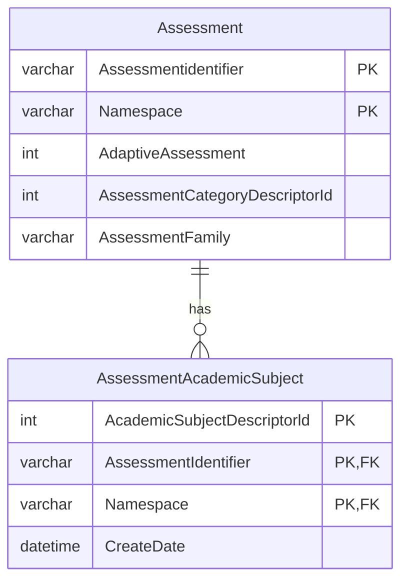

# Authorizing Requests Using Custom Database Views

The relationship-based authorization strategies used in the API are implemented
via authorization views have been oriented around an API client's Education
Organization Id claims, and their relationship with other education
organizations (through the education organization hierarchy in the model), and
with Students/Staff/Parents/Contacts through "primary associations" (such as
staff employment/assignment, or student registration). Essentially, when
applied, these strategies allow access to all students enrolled to an education
organization in the API client's claims, the parents of those students and the
staff employed or assigned to those education organizations.

However, with the growing need to integrate various vendors, new use cases have
arisen that require expanding these assumptions. For instance, authorization
restrictions may now need to limit student access based on enrollment in
specific courses or grade levels etc. As a result, ODS / API provides a
non-intrusive mechanism to add custom view based authorization strategies. The
custom view-based authorization strategy only requires the creation of an ODS
database view and the definition of some additional security metadata. No C#
code changes, recompilation or even API restarts are required.

Using this capability, one could create database views that support new
authorization strategies that limit an API client’s access to the following
groups of Students:

* Students enrolled in CTE courses
* Students in the Gifted and Talented program
* Students in preschool or early childhood education

The view-based support is not limited to Students however and can use any Ed-Fi
or extension entity as the basis for authorization. As additional contrived
examples, one could implement authorization strategies as follows:

* AssessmentWithReadingInTheIdentifier - Limit access to Assessment-related data
  (including Assessment metadata and/or Student Assessment results) for items
  where the associated Assessment has an AssessmentIdentifier containing the
  text “Reading”.
* TransportationTypeDescriptorWithABus - Limit access to Student Transporation
  resource items with a TransportationTypeDescriptor code value that contains
  the word “Bus”.

The approach provides tremendous flexibility but requires that implementers
adhere to strict conventions when creating the authorization strategy names and
the corresponding database views. The process and required conventions are
described below.

## Step 1: Identify the Authorization Strategy

A custom view-based authorization strategy starts with the selection of a basis
entity. This is the entity whose primary key values must be present on the root
entity of the resources being authorized. In the existing relationship-based
authorization strategies, the basis entities are limited to types of people
(Student/Staff/Parent/Contact) and/or education organizations. With custom
view-based authorization strategies, any entity in the model (including
extensions) can be used.

For the sake of an example, let’s build an authorization strategy based on
Assessment that can be used to authorize access to dependent resources,
filtering items to those referencing Assessments that contain an academic
subject of “Mathematics” (see database diagram below for reference).

## Step 2: Create the ODS Database View

### Identify the Basis Entity/Table

The database view built for the authorization strategy must contain the basis
table’s primary key values because these will be used by the authorization
strategy implementation to join to the subject tables being authorized.

### Plan the Query

In the case of Assessment table, the primary key consists of the
AssessmentIdentifier and Namespace columns. While these two columns determine
the query results that must be produced by the custom authorization view
definition, they don’t necessarily need to come directly from the basis table.

In this example, we are actually interested in filtering Assessments based on
the presence of the Academic Subject of “Mathematics”. This value is stored in
the AcademicSubjectDescriptorId column of the AssessmentAcademicSubject child
table:



Since the Assessment’s primary key columns are present on this child table, the
Assessment table won’t need to be included in the query, however, a join to the
edfi.Descriptor table will be needed to filter the results to the specific
AcademicSubjectDescriptorId.

### Name the View

The authorization view’s name must adhere to the following naming convention:

`{BasisEntityName}With{HintPhrase}`

:::info
Since the authorization strategy name and view must match (due to design
limitations), the maximum length for an authorization strategy name is 128
characters when using SQL Server, and 63 characters when using PostgreSQL. Also,
while PostgreSQL does not retain casing on identifier names unless quotes are
used, the custom view-based authorization strategy implementation does not
require a case-sensitive match. Do not use quotes when defining the view name in
PostgreSQL.
:::

The first part of the view name consists of the basis entity’s name (i.e.
“Assessment” in this case).

The second part is the literal text “With”. This is case-sensitive and is used
to separate the entity name from the hint phrase to follow.

The final part is a title-cased “hint phrase”. When view-based authorization
fails, the API returns a “problem details” message in the response that includes
a “hint” for the consumer indicating ways to remedy the situation. For example,
a hint of “You may need to create a corresponding 'StudentSchoolAssociation'
item." is provided when a request using relationship-based authorization fails
on a resource with a Student reference. However, on a custom view-based
authorization which has no additional C# or security metadata defined, the only
means to communicate this hint phrase is by including it in the authorization
strategy name (which must match the view name, as described earlier).

The hint phrase is generated from the authorization strategy name’s “postfix” by
separating the words using title-casing. Acronyms are detected and retained, and
words matching a common list of prepositions are converted to lower-case. The
result of this processing is that an authorization strategy (and view) name of
“StudentWithCTECourseEnrollments” will result in a hint phrase of “You may need
a Student with CTE Course Enrollments”.

:::info
It is worth noting an edge case where the use of the word “a” after the “With”
portion of the name, followed by an acronym creates an ambiguity that will have
undesirable results when processed into a hint phrase. For example, if the
authorization strategy name was “StudentWithACTECourseEnrollment”, the resulting
hint phrase would be “You may need a Student with ACTE Course Enrollment” when
what you probably wanted was “You may need a Student with a CTE Course
Enrollment”. In cases such as this, you may need to consider an alternate
approach for the hint phrase (i.e. use a plural noun to eliminate the need for
the word “a” after the “With” and before the acronym).
:::

### Create the View

With view name and query determined, create the view definition (shown below for
SQL Server):

```SQL
CREATE VIEW [auth].[AssessmentWithAnAcademicSubjectOfMathematics]
AS
    SELECT DISTINCT AssessmentIdentifier, Namespace
    FROM edfi.AssessmentAcademicSubject asubj
        INNER JOIN edfi.Descriptor d
        ON asubj.AcademicSubjectDescriptorId = d.DescriptorId
    WHERE d.Uri = 'uri://ed-fi.org/AcademicSubjectDescriptor#Mathematics'
GO
```

## Step 3: Define the Security Metadata

There are no special considerations when defining the security metadata for the
new authorization strategy beyond ensuring that the name of the authorization
strategy and the name of the database view are the same.

Once the authorization strategy is created in the EdFi_Security database, the
authorization strategy can be used like any other. One thing to keep in mind is
that while when multiple relationship-based authorization strategies are used on
a resource they are combined using “OR” semantics, while the custom view-based
authorization strategies are combined using “AND” semantics – essentially, they
are treated as additional criteria filters.

Thus, custom view-based authorization strategies can be used alone or in
conjunction with relationship-based authorization strategies to further restrict
access based on criteria embedded in the view definition.

:::info By default, the Ed-Fi ODS API refreshes the security metadata
periodically so it follows then that you could define new custom views on the
ODS database(s) at runtime, add the necessary security metadata (including use
by a claim set), and the next time a request is authorized with the refreshed
security metadata, the custom view will be used (without the need to restart the
API).
:::
