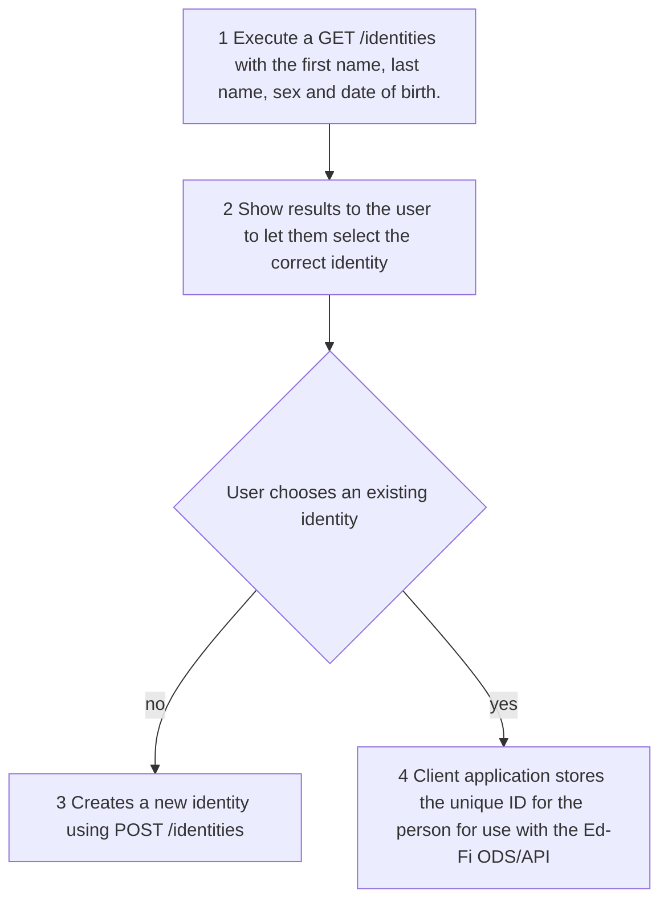

# Unique ID System Integration

Generally speaking, a unique ID system ensures that a person has only one unique
ID for an organization even if the person is represented in multiple roles, such
as an individual who is both a staff member and parent at a school.

Many organizations have an existing implementation of a unique ID system. The
Ed-Fi ODS / API does not replace an organization’s unique ID system. Instead, it
provides clear extension points for platform developers to integrate with their
existing system, while also providing clients with a standardized API for
integrating identity management into their applications.

The Ed-Fi ODS / API provides two points of integration with unique ID systems.
The first integration point provides a means for the API to validate the unique
ID values being supplied by clients, and the second is an optional set of
endpoints for clients to create and retrieve unique IDs for person records
including students, staff, and parents.

The Ed-Fi ODS / API ships without unique ID validation. In the as-shipped
distribution, its identity management endpoints are configured to return a `501

* Not Implemented` response. Integration development work is required to connect
to an enterprise unique ID system. This documentation contains conceptual and
how-to material about connecting to an existing unique ID system.

## Unique ID System Integration Models

When planning an API implementation, platform hosts must select an approach that
best serves their enterprise's needs: an [integrated unique ID system
model](https://edfi.atlassian.net/wiki/pages/resumedraft.action?draftId=23301628#UniqueIDSystemIntegration-Integrated)
(shortened to "integrated model," below), or a [non-integrated unique ID system
model](https://edfi.atlassian.net/wiki/pages/resumedraft.action?draftId=23301628#UniqueIDSystemIntegration-NonIntegrated)
("non-integrated," below).

Within the integrated model, there are two facets: [unique ID
validation](https://edfi.atlassian.net/wiki/pages/resumedraft.action?draftId=23301628#UniqueIDSystemIntegration-validation)
and [identity
management](https://edfi.atlassian.net/wiki/pages/resumedraft.action?draftId=23301628#UniqueIDSystemIntegration-management).
Minimally, support for validation is expected. Optionally, the platform host may
also choose to support the identity management endpoints.

### Model 1. Integrated Unique ID System Model

This model is suitable when an external system, often a commercial product, is
the authoritative source for unique IDs and can be wired into the ODS / API. In
this model, an external unique ID system always defines the unique ID for
students, staff, and parent entities and clients are expected to pass valid
unique IDs to the ODS / API.

Distinguishing characteristics of this model include:

* Unique IDs are established outside the context of the ODS / API by the
    external unique ID system.
* Client applications are expected to supply valid unique IDs to the ODS /
    API. To accomplish this they may either:
  * Use the Ed-Fi `/identities` endpoint to search identities and create new
        unique IDs as necessary.
  * Follow a process defined outside the scope of the ODS / API to obtain
        appropriate unique ID values.
* When new person-entities are created in the ODS / API, the existence of the
    unique ID is validated against the external system automatically. Client
    applications do not define the unique ID values.

This model can support fully integrated unique ID management, but it does make
some assumptions about the system flow. An outline of an expected system flow
follows.

#### Client-Side ID Lookup in the Integrated Model

When the ODS / API platform supports an integrated model with identity
management for establishing a unique ID, client applications will need some
process for looking up that unique ID value. This section provides a system flow
that most clients will follow to look up a unique ID through the Ed-Fi ODS /
API.

The unique ID for a person can be obtained from the `/identities` endpoints in
the Ed-Fi ODS / API. The workflow for clients to create and obtain IDs are
described below. For the purposes of this example, the workflow will focus on
the use case of creating a new student record, but the same general flow applies
to staff and parent records.

It is assumed that once a unique ID is obtained by a client, it will be stored
in client applications as a way to easily sync data between the client and
platform from that point forward.



A description of each step follows.

* **Step 1.** Execute a GET `/identities` with the first name, last name, sex,
    and date of birth.
* **Step 2.** Show the scored results to the user to let them select the
    correct identity.
* **Step 3.** Create a new identity using POST `/identities` if the user
    indicates an appropriate match does not already exist.
* **Step 4.** Save the resulting unique ID value in the client application for
    use when sending the person's data to the Ed-Fi ODS / API.

Now that a unique ID has been obtained, it can be used by clients when referring
to that student.

:::info

When a client application creates a student record, the client won't be able to
retrieve or update that student until it has established a relationship with
that student. That relationship is created by adding an entry to
the studentSchoolAssociations resource under an LEA to which the client
application has access. Similarly, when a client application creates a staff
record, the client won't be able to retrieve or update that staff record until
it adds an entry to the staffEducationOrganizationAssignmentAssociations or
staffEducationOrganizationEmploymentAssociations resources under an LEA to which
the client application has access.

:::

### Model 2. Non-Integrated Unique ID System Model

This model is suitable when platform hosts choose not to wire in or link to an
external unique ID system. In this model, platform hosts provide guidance to
clients on how to acquire or assign a unique ID out of band. A common approach
is to instruct clients to acquire a unique ID from an enterprise system and
subsequently pass that value to the ODS / API when creating new person entities.

Distinguishing characteristics of this model include:

* Client applications are responsible for populating the unique ID for person
    entities.
* The API performs no validation on the incoming unique IDs during person
    entity creation — unique ID values are treated as just another data element
    for the purposes of creation (though uniqueness is enforced by the API).

This model requires no system integration work from a platform host, but it
relies on specific guidance being provided to client application developers.

### Integration Model Comparison

The above models are fundamentally different for the platform host. But, from a
client system perspective, the change is limited to whether or not the values
that the client application supplies for the unique IDs are validated against an
external system. In some scenarios, the client could conceivably be responsible
for assigning the unique ID value, but exactly how that value should be derived
should be agreed upon with the host.

## Key Integration Steps for Unique ID Validation

### Implement the Unique ID to Id Value Mapper

The `IUniqueIdToIdValueMapper` interface enables the API to use the supplied
unique ID value to resolve and assign the resource identifier (`Id`) property of
the person entity appropriately. Implicit in that interaction with the external
system is a validation that the supplied unique ID already exists.

```csharp
public interface IUniqueIdToIdValueMapper
{
    PersonIdentifiersValueMap GetId(string personType, string uniqueId);
    PersonIdentifiersValueMap GetUniqueId(string personType, Guid id);
}

public class PersonIdentifiersValueMap
{
    public int Usi { get; set; }
    public Guid Id { get; set; }
    public string UniqueId { get; set; }
}

```

The personType argument in the two methods defined by the interface will contain
one of the following values upon invocation: Student, Staff, or Parent. In some
integrations, this distinction may not be relevant and the argument can be
ignored.

Upon return, the `PersonIdentifiersValueMap`'s `Usi` property is not used and
can be left as the default value (0).

### Enabling the Unique Id Integration for Validation

The unique ID system integration feature is enabled using the
ApiSettings:Features:UniqueIdValidation configuration setting in
the appsettings.json file of the EdFi.Ods.WebApi project. While this registers
and configures all the supporting components for performing unique ID
validation, the custom implementation of the `IUniqueIdToIdValueMapper` will
still need to be registered with the container. To register custom
implementation, add registration to ApplyConfigurationSpecificRegistrations
method in the `UniqueIdIntegrationModule` class as shown below:

```csharp
namespace EdFi.Ods.Features.Container.Modules
{
    public class UniqueIdIntegrationModule : ConditionalModule
    {
        ...
        public override void ApplyConfigurationSpecificRegistrations(ContainerBuilder builder)
        {
            ...
            //Add registration of custom implementation
            builder.RegisterType<My.Custom.UniqueIdToIdValueMapper>()
                .As<IUniqueIdToIdValueMapper>()
                .SingleInstance()
        }
    }
}
```

Sample custom implementation could be:

**My.Custom.UniqueIdToIdValueMapper** Expand source

```csharp
    public class My.Custom.UniqueIdToIdValueMapper : IUniqueIdToIdValueMapper
    {
        public PersonIdentifiersValueMap GetId(string personType, string uniqueId)
        {
            return Get(personType, uniqueId);
        }

        public PersonIdentifiersValueMap GetUniqueId(string personType, Guid id)
        {
            return Get(personType, id);
        }

        private PersonIdentifiersValueMap Get(string personTypeName, string uniqueId)
        {
            var results = new PersonIdentifiersValueMap { UniqueId = uniqueId };

            ValidatePersonType(personTypeName);

            using (var db = new UniqueIdIntegrationContext())
            {
                var uniqueIdMapping = db.UniqueIdPersonMappings.FirstOrDefault(mapping => mapping.UniqueId == uniqueId);

                if (uniqueIdMapping == null)
                    return results;

                results.Id = uniqueIdMapping.Id;
            }

            return results;
        }

        private PersonIdentifiersValueMap Get(string personTypeName, Guid id)
        {
            var results = new PersonIdentifiersValueMap { Id = id };

            ValidatePersonType(personTypeName);

            using (var db = new UniqueIdIntegrationContext())
            {
                var uniqueIdMapping = db.UniqueIdPersonMappings.FirstOrDefault(mapping => mapping.Id == id);

                if (uniqueIdMapping == null)
                    return results;

                results.UniqueId = uniqueIdMapping.UniqueId;
            }

            return results;
        }

        private static void ValidatePersonType(string personTypeName)
        {
            if (!PersonEntitySpecification.IsPersonEntity(personTypeName))
                throw new ArgumentException(
                    string.Format("Invalid person type '{0}'. Valid person types are: {1}", personTypeName,
                                  "'" + String.Join("','", PersonEntitySpecification.ValidPersonTypes) + "'"));
        }
    }
    public class UniqueIdIntegrationContext : System.Data.Entity.DbContext
    {
        public UniqueIdIntegrationContext(string connectionString)
            : base(connectionString)
        {
        }

        public UniqueIdIntegrationContext()
            : base()
        {
        }

        public DbSet<UniqueIdPersonMapping> UniqueIdPersonMappings { get; set; }
    }


    public class UniqueIdPersonMapping
    {
        [Key]
        public Guid Id { get; set; }

        [StringLength(32)]
        public string UniqueId { get; set; }
    }
```

This approach resolves supplied unique ID values to resource identifier (`Id`)
records in the ODS using UniqueIdPersonMapping table:

**UniqueIdPersonMapping Table** Expand source

```sql
--
IF (NOT EXISTS (SELECT * FROM sys.schemas WHERE name = 'uid'))
BEGIN
    EXEC ('CREATE SCHEMA [uid] AUTHORIZATION [dbo]')
END
GO

CREATE TABLE [uid].UniqueIdPersonMapping
(
       Id uniqueidentifier NOT NULL,
       UniqueId nvarchar(32) NOT NULL,
);
GO

ALTER TABLE [uid].UniqueIdPersonMapping ADD CONSTRAINT PK_UniqueIdMapping PRIMARY KEY CLUSTERED (Id);
ALTER TABLE [uid].UniqueIdPersonMapping ADD CONSTRAINT UI_UniqueIdPersonMapping_UniqueId UNIQUE NONCLUSTERED (UniqueId);
GO

```

### Technical Details of How Unique ID Integration Works

The `UniqueIdIntegrationModule` class makes the necessary modifications to
adjust the API to operate in an integrated fashion with the external Unique ID
system. Specifically, that installer performs the following tasks:

* Registers the `IUniqueIdToIdValueMapper` so that IDs and Unique IDs can be
    retrieved from the external system.
* Registers the `IPersonUniqueIdToIdCache` with an implementation that caches
    the `UniqueId`\-to-`Id` mappings and calls the value mapper only when needed
    (for performance reasons).
* Registers a decorator for the `IUpsertPipelineStepsProvider` which inserts a
    `PopulateIdFromUniqueIdOnPeople` step in the processing of all PUT/POST
    requests just prior to persisting the entity model. This step only engages
    on person-type entities, but then it looks for an uninitialized
    `Id` property on the entity and calls the aforementioned
    `IPersonUniqueIdCache` to obtain the corresponding `Id` for the supplied
    `UniqueId` value. It then marks this `Id` as server-assigned to allow the
    API to create the resource if needed. (This is because v3.x of the Ed-Fi ODS
    / API no longer allows clients to assign IDs — they are now either assigned
    via UniqueId integration or they are initialized automatically during
    NHibernate persistence).
* Registers two entity validators (which are executed just prior to NHibernate
    persistence):
  * `EnsureUniqueIdAlreadyExistsEntityValidator`. This validator relies on
        the presence of the PopulateIdFromUniqueIdOnPeople step (which ensures
        the `Id` property is properly initialized even if the entity hasn't been
        persisted yet). When UniqueId integration is configured, if the `Id`
        hasn't been assigned by the time the entity is being validated (just
        prior to NHibernate persistence), then it is an indication that the
        UniqueId could not be resolved in the
        PopulateIdFromUniqueIdOnPeople step and a validation error is raised.
  * `UniqueIdNotChangedEntityValidator`. This validator also relies on the
        presence of the `PopulateIdFromUniqueIdOnPeople` step (which ensures the
        `Id` property has a relevant value before the entity is persisted the
        first time), and looks up the `UniqueId` using the
        `IPersonUniqueIdCache`. The `UniqueId` value returned from the cache
        should match the value actually assigned on the incoming entity. If it
        doesn't match, it indicates that the client is effectively trying to
        change the `UniqueId` value (through a PUT request), and a validation
        error is raised.

## Key Integration Steps for Identity Management

### Implement IIdentityService

Integrating your unique ID system with the Ed-Fi ODS / API requires a custom
implementation of the `IIdentityService` interface. When properly registered,
this code is called for each of the `/identities` API calls received by the
Ed-Fi ODS / API.

The EdFi.Ods.Features.IdentityManagement project contains the definitions for
all artifacts (e.g., interfaces, requests, responses) related to identity
management integration. The placeholder implementation of the `IIdentityService`
interface is located in the EdFi.Ods.Features project in the
EdFi.Ods.Features.IdentityManagement namespace.

#### Unique Identity Interfaces

```csharp
public interface IIdentityService<in TCreateRequest, in TSearchRequest, TSearchResponse, TIdentityResponse>
    where TCreateRequest : IdentityCreateRequest
    where TSearchRequest : IdentitySearchRequest
    where TSearchResponse : IdentitySearchResponse<TIdentityResponse>
    where TIdentityResponse : IdentityResponse
{
    IdentityServiceCapabilities IdentityServiceCapabilities { get; }

    Task<IdentityResponseStatus<string>> Create(TCreateRequest createRequest);

    Task<IdentityResponseStatus<TSearchResponse>> Find(params string[] findRequest);

    Task<IdentityResponseStatus<TSearchResponse>> Search(params TSearchRequest[] searchRequest);
}
```

The identities are represented by a generic type argument that is based on the
`IdentityResponse` class, which is defined as follows:

```csharp
public class IdentityResponse
{
 public string UniqueId { get; set; }
 public decimal Score { get; set; }
 public string LastSurname { get; set; }
 public string FirstName { get; set; }
 public string MiddleName { get; set; }
 public string GenerationCodeSuffix { get; set; }
 public string SexType { get; set; }
 public DateTime? BirthDate { get; set; }
 public int? BirthOrder { get; set; }
 public Location BirthLocation { get; set; }
}
```

| Member | Description |
| --- | --- |
| UniqueId | The human-readable unique identifier for the person. While the UniqueId is represented as a string in the interface, the Ed-Fi ODS Database limits the length of the UniqueId to 32 characters. |
| Score | A number indicating the level of confidence with the provided match. Higher numbers are more confident. Some systems use the number of standard deviations from normal (sigma) and others use a 0 to 100 scale. In other systems, the number is relative to the result set provided and has no relevance outside of one query. This is an implementation-specific detail that would be relayed to a human user of the system for resolution. |
| LastSurname | A space-delimited list of all the family names associated with a person. In some Hispanic and other traditions this may be both parents' surnames (e.g., Hermanez Gonzalez). In some Asian and other traditions, the surname may be provided first for each child. |
| FirstName | The person's given first name. |
| MiddleName | The person's given middle name, if available. |
| GenerationCodeSuffix | The suffix applied to the person's name (e.g., Jr., III, Esquire). |
| SexType | The natural sex of the person at the time of their birth. |
| BirthDate | The date on which the person was born. |
| BirthOrder | The birth order, if known, among the person's sibling group. |
| BirthLocation | The details on the location where the person was born (city, state / province, and country). |

:::info

In previous versions of the identity service, the `IdentityResponse`
model was derived from `ExpandoObject` for extensibility. However, due to the
potential security concerns of this approach with a 3rd party integration, the
extensibility model has been changed to use generic types with explicit
statically defined properties for model binding. This change enables additional
data defined by the external unique ID system to be made available through
the Ed-Fi identities API using this new extensibility mechanism. This could
include a list of third-party identifiers (e.g., local education organization
identifiers, driver's license, teaching certificate number) that could be used
to further distinguish a person. For more information, see [How To: Extend the
Ed-Fi Identities
API](../how-to-guides/how-to-extend-the-ed-fi-identities-api.md).

:::

### Enabling the Identity Management API Endpoints

The identity management feature is enabled using the
"ApiSettings:Features:IdentityManagement" configuration setting in the
appsettings.json file of the EdFi.Ods.WebApi project. While this registers and
configures all the supporting components for the API endpoints, the custom
implementation of the `IIdentityService` will need to be registered with the
container separately.

#### IUniqueIdentity Registration Code

```csharp
using Autofac;
using EdFi.Common.Configuration;
using EdFi.Ods.Common.Configuration;
using EdFi.Ods.Common.Container;
using My.Custom.IdentityService

namespace EdFi.Ods.Features.Container.Modules
{
    public class IdentityModule : ConditionalModule
    {
        public IdentityModule(ApiSettings apiSettings) : base(apiSettings, nameof(IdentityModule)) { }

        public override bool IsSelected() => IsFeatureEnabled(ApiFeature.UniqueIdValidation);

        public override void ApplyConfigurationSpecificRegistrations(ContainerBuilder builder)
        {
            builder.RegisterType<IdentitiesControllerOverrideConvention>()
                .As<IApplicationModelConvention>()
                .SingleInstance();

            // Register your implementation using the default models here
            //     (or see the article How To: Extend the Ed-Fi Identities API).
            builder.RegisterType<UnimplementedIdentityService>()
                .AsImplementedInterfaces()
                .SingleInstance();
        }
    }
}
```

:::note

The following link contains the documentation for the `identities`
endpoints: [Identities
API](https://api.ed-fi.org/v7.3/docs/swagger/index.html?urls.primaryName=Other:%20Identity)

:::
