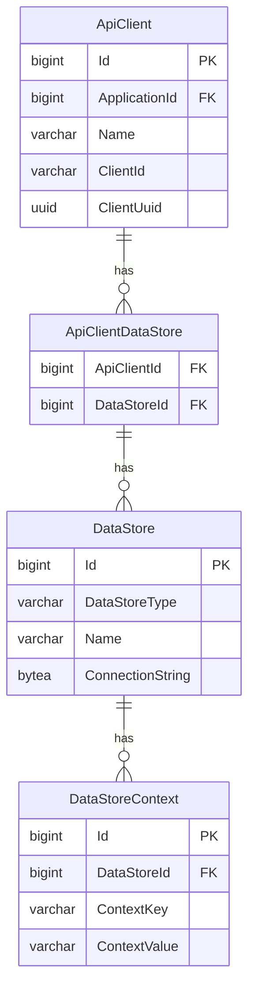
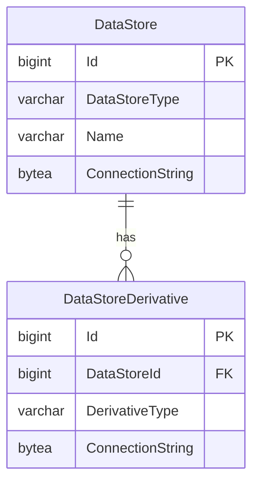

# API Client and Data Store Configuration

## Data Stores

Database connection strings for Ed-Fi API v8 are stored in the Configuration
Service, not in application configuration files. Each _data store_ entry holds
the connection string and type for one tenant database. Connection strings stored
in the Configuration Service are encrypted at rest using AES. This measure
guards against the possibility that someone who gains unauthorized access to the
database can retrieve connection strings from the system.

Data stores are managed through the Configuration Service API. See the
[Configuration Details](./configuration-details#configuration-service-settings)
page for encryption key configuration.

## Data Store Derivatives

Ed-Fi API v8 supports derivative data stores — secondary databases associated
with a primary data store — configured in the `DataStoreDerivative` table.

The `DerivativeType` column accepts the following values:

| Value | Description |
| --- | --- |
| `ReadReplica` | A read-only replica of the primary data store, used to offload GET request workloads |
| `Snapshot` | A point-in-time copy of the primary data store, used for consistent change processing by API clients |

:::info

Snapshot support is planned for a future release. See [Current
Limitations](../features/changed-record-queries.md#current-limitations)
for details.

:::

## API Client and Data Store Association

To provide a simple experience for API clients with a fixed API base URL (no
route segments for school year, district, etc.), each API client can be
associated with a single data store. This association provides the required
context to identify the specific database for each API request.

API clients belong to applications, which in turn belong to vendors. The full
hierarchy is: Vendor → Application → ApiClient → DataStore. Vendors, applications,
API clients, and their data store associations are all managed through the
Configuration Service API.

## Route-Based Data Store Selection

If school year or district segments in the API routes are desired, a
route-qualifier setting can be used. With this setting, the same API key and
secret can be used to connect to more than one data store by using entries in
the `DataStoreContext` table. The combination of the API client's data store
association and the context provided in the request route is used to identify
the appropriate data store for each API request.

Route qualifiers are configured via the `RouteQualifierSegments` setting (or the
`ROUTE_QUALIFIER_SEGMENTS` environment variable). See
[Context-Based Routing for Year-Specific Data Store](./context-based-routing-for-year-specific-datastore.md)
for configuration details.
