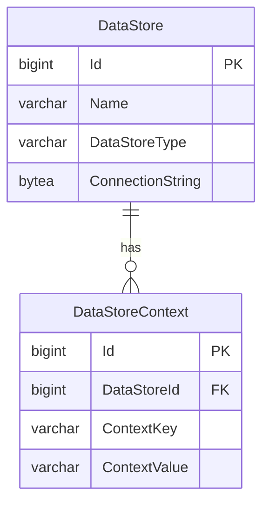

# Context-Based Routing for Year-Specific Data Store

The Ed-Fi API v8 routing provides a simple, predictable base path for all API
requests by default. The out-of-the-box configuration allows for the
implementation of any _implicit_ data segmentation strategy through the
configuration of data stores, API clients, and their associations — with each
API client configured with access to a single data store. In this
configuration, API clients all use the same base path with their requests and
are not aware how the data is segmented by the host.

However, some implementations may find it useful to add an explicit school year
(or some other contextual value such as a district and/or instance identifier)
to the API request base path as part of an _explicit_ data segmentation
strategy or to distinguish data associated with previous years from data for
the current year, or both. The primary reason for pursuing an explicit data
segmentation strategy is to allow the same API client credentials to be used to
access several different data stores.

To enable context-based routing, set `AppSettings:RouteQualifierSegments` to a
comma-separated list of segment names. These names appear as path segments
between the path base and the `/data/ed-fi/...` portion of the URL and can
include multiple segments if multiple context values are required (e.g.,
`districtId,schoolYear`).

```json
{
  "AppSettings": {
    "RouteQualifierSegments": "schoolYear"
  }
}
```

Or via environment variable:

```ini
ROUTE_QUALIFIER_SEGMENTS=schoolYear
```

Once `RouteQualifierSegments` is defined, _all_ API requests must include the
segment(s) in the base path (in multi-tenant mode this context segment will be
added after the tenant identifier segment). Also, all data store definitions in
the Configuration Service must have corresponding contextual name/value pairs
defined in the `DataStoreContext` table. The API uses the context from the
request path with the contextual values defined for the data store to identify
which database should service the request. A failure to match all context
values will result in a 404 Not Found response.



Examples below outline steps to configure explicit year-specific and
district-specific routes.

## Configuring Year-Specific Routes

To route requests to two year-specific databases, for school years 2026 and
2027 with an explicit school year segment in the route:

- **Step 1:** Set `RouteQualifierSegments` to `schoolYear` in the appsettings
  file or via the `ROUTE_QUALIFIER_SEGMENTS` environment variable.

- **Step 2:** Create two data stores in the Configuration Service — one named
  `EdFi_2026` and one named `EdFi_2027` — each with the appropriate database
  connection string.

- **Step 3:** Add a `DataStoreContext` entry to each data store in the
  Configuration Service with `contextKey: "schoolYear"` and the corresponding
  year as `contextValue` (`"2026"` and `"2027"` respectively).

After this configuration, API requests use the school year in the path:

```text
GET http://localhost:8080/api/2026/data/ed-fi/schools
GET http://localhost:8080/api/2027/data/ed-fi/schools
```

## Configuring District-Specific Routes

To route requests to two district-specific databases for LEA IDs 255901 and
255902 with an explicit district segment in the route:

- **Step 1:** Set `RouteQualifierSegments` to `districtId` in the appsettings
  file or via the `ROUTE_QUALIFIER_SEGMENTS` environment variable.

- **Step 2:** Create two data stores in the Configuration Service — one per
  district — each with the appropriate database connection string.

- **Step 3:** Add a `DataStoreContext` entry to each data store in the
  Configuration Service with `contextKey: "districtId"` and the LEA ID as
  `contextValue` (`"255901"` and `"255902"` respectively).

After this configuration, API requests use the district ID in the path:

```text
GET http://localhost:8080/api/255901/data/ed-fi/schools
GET http://localhost:8080/api/255902/data/ed-fi/schools
```

## Multi-Tenant Deployments with Route Qualifiers

When multi-tenancy is enabled alongside route qualifiers, the tenant identifier
appears _before_ the route qualifier segment(s):

```text
GET http://localhost:8080/api/{tenantId}/{qualifier}/data/ed-fi/schools
```

For example, with `MultiTenancy=true` and `RouteQualifierSegments=schoolYear`:

```text
GET http://localhost:8080/api/tenant1/2026/data/ed-fi/schools
GET http://localhost:8080/api/tenant2/2027/data/ed-fi/schools
```

See [Single and Multi-Tenant
Configuration](./single-and-multi-tenant-configuration.md) for details on
enabling multi-tenancy.
