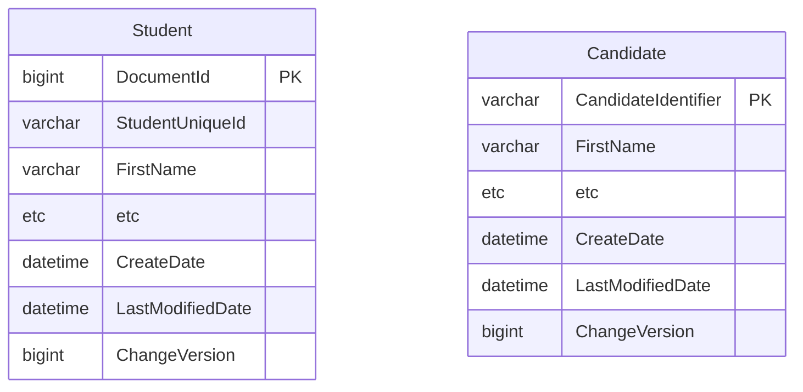
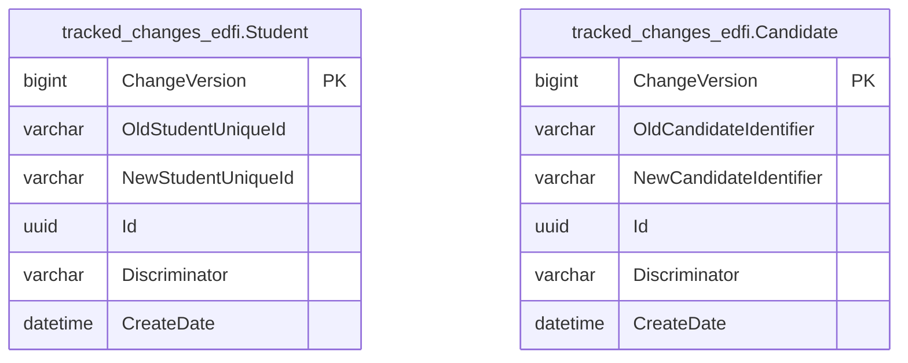

# Changed Record Queries

The Ed-Fi API platform tracks inserts, updates, and deletes, and surfaces those
changes to client systems through a feature called changed record queries, or
"change queries." Change queries allow client systems to narrow requests for
data to only data that has changed since a specified point in time. This allows
client systems to stay in sync with the Ed-Fi API without having to pull a
complete data set.

Client system interaction is documented in the [Using the Changed Record
Queries](../../client-developers-guide/using-the-changed-record-queries.md)
section of the API Client Developers' Guide.

Change queries are always enabled in Ed-Fi API v8. The change query database
schema is provisioned as part of the standard database setup via
`dms-schema ddl provision`. No additional configuration is required to enable
the feature.

This feature also provides an [option](#changed-record-queries-with-snapshot-isolation)
that enables platform hosts to provide API clients with an isolated snapshot
context for processing changes.

## Technical Details

The change queries feature uses basic versioning concepts. A global version
counter is introduced using a sequence object, and each table representing the
top-level entities of a data domain is given a `ChangeVersion` column to
represent the current version of the entity instance. These columns are set up
with triggers to ensure they are automatically updated based on the latest value
of the sequence on all inserts and updates. Queries done against the API to find
changed records function by adding an additional where clause based on this
`ChangeVersion` column.

Supporting delete tracking requires a "tombstone" table. This concept involves
tracking all deletes and storing a record of what was deleted, to allow future
querying against deleted records. The pattern is implemented using a delete
trigger on the main table, and the resource id and primary key of the deleted
record are stored in the tracking table. API requests to retrieve information on
deletes query against these tables to retrieve the resource ids of deleted entity
instances.

:::note

There is a concern in use cases with very high volume of deletes or for very
long-running database instances where the size of these delete tracking tables
can get very large. In that case, these tables can be truncated periodically.
The only risk is losing visibility into any deletes that are removed by the
truncation.

:::

The patterns described above are used for both the standard, as-shipped Ed-Fi
database tables, as well as tables generated to serve Ed-Fi Extensions. By using
[MetaEd](/reference/metaed) (the recommended method for extending the Ed-Fi
API), scripts are generated to support the `ChangeVersion` column,
insert/update/delete triggers, and delete tracking tables. This allows hosts to
have consistent support for the feature across their entire API, even for new
top-level entities introduced by Extension projects.

## Changed Record Queries with Snapshot Isolation

In order to provide an environment for API clients that can guarantee data
consistency for downstream processing of Ed-Fi data, it is _highly recommended_
that API hosts set up snapshots and provide isolated snapshots to use with the
Change Queries workflow.

This feature provides a mechanism for API clients to make API requests that are
served from a static copy of the database isolated from ongoing changes in the
underlying operational database. This isolation avoids data consistency
problems, processing failures, and, significantly, undetected missing data (or
data changes) in the target system.

The following artifacts are relevant for snapshot isolation:

- A `DataStoreDerivative` record in the Configuration Service with
  `DerivativeType = 'Snapshot'` to capture the connection string for the static
  copy of the database.
- API support for processing the `Use-Snapshot` HTTP header to service API
  requests using the corresponding static data source rather than the live
  operational database.

:::info

Snapshot support is planned for a future release. See [Current
Limitations](#current-limitations) for details.

:::

## Creating and Managing Snapshots

In order to provide an isolated context for API clients' processing, platform
hosts must implement DevOps processes to maintain a periodically refreshed
static copy of the API's main database and the corresponding `DataStoreDerivative`
record in the Configuration Service.

This would typically be implemented as a basic scheduled database
backup-and-restore operation. For PostgreSQL or SQL Server users, it could also
be implemented using the respective database's lightweight snapshot features
where available.

The host's process must perform the following steps:

- Back up the current operational database.
- Restore the database as a snapshot copy.
- Create or update a `DataStoreDerivative` record in the Configuration Service
  with `DerivativeType = 'Snapshot'` and the snapshot database connection
  string, associated with the appropriate `DataStore`.

## Current Limitations

Changed record queries (`/availableChangeVersions`, `/deletes`, `/keyChanges`)
are supported in Ed-Fi API v8.0 with the following limitations compared to the
ODS/API:

- **No snapshot support** — the ODS/API allowed clients to create and query
  against a consistent point-in-time snapshot. Snapshot support is planned for a
  future release.
- **Always enabled** — the feature cannot be disabled through configuration.
- **No custom view-based authorization** — the ODS/API supported custom database
  view-based authorization strategies on change query endpoints. This is not
  available in v8.0.
