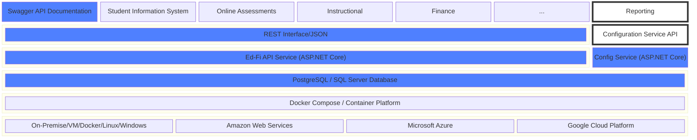

# Overview

This section provides important conceptual material related to the Ed-Fi API v8
platform.

## Solution Overview

The Ed-Fi Alliance publishes the [Ed-Fi Data
Standard](/reference/data-exchange/data-standard), which models a broad spectrum
of commonly exchanged and shared K–12 education data. Ed-Fi API v8 is a concrete
implementation of a relational database and a companion API harmonized with the
Ed-Fi Data Standard. Ed-Fi API v8 is tuned to the security and performance needs
of K–12 organizations and the education technology vendors who serve them.

Ed-Fi API v8 consists of two services: the **Ed-Fi API**, which implements the
Ed-Fi Resources, Descriptors, and Discovery API specifications, and the
**Configuration Service**, which implements the Ed-Fi Management API
specification v3. Both services are implemented in C# and ASP.NET Core.
PostgreSQL and SQL Server are supported as database platforms.

The platform is vendor neutral — client applications may be written in any
language.

## Conceptual Overview

Education enterprises like schools, districts, and states often have
student-centric information spanning several systems. Even though there is a
wealth of data, the information is essentially siloed, which makes it difficult
to get a holistic picture of a student or the performance of the enterprise as a
whole.

Having data in silos causes other issues like duplicate and conflicting
information. In the case of standardized test results that arrive on
disconnected media, enterprises struggle with finding a place to store that
information in a way that it can be connected with students.

Ed-Fi API v8 addresses these problems by centralizing data in a relational
database, and providing secure access back to the siloed systems and to
reporting tools like dashboards or BI analysis platforms. Additionally, some
implementers use the platform as the primary data store for a custom student
information system or as the data store solely for a centralized BI report
source. The key point is that Ed-Fi API v8 covers a broad swath of educational
data and provides an interface that can be configured for a variety of
scenarios.

## What Does the Ed-Fi API Do?

The Ed-Fi API v8 can be useful in the following common technology tasks:

- Integration of data from siloed source systems.
- Quality checking and cleansing data, and de-duplicating records.
- Operational reporting on data from a single source.
- Providing authoritative information to client applications.

A discussion of the components follows.

## The Data Store

What draws implementers to Ed-Fi API v8 is that it provides a rich and detailed
data model out of the box, which means that it can handle the real-world
complexities of student attendance, grades, discipline events, and so forth. The
data model is extensible, which means that it also allows for the inevitable
customizations that are necessary to suit a particular enterprise's needs.

Specifically, the Ed-Fi API provides detailed resources and storage structures for the
following domains:

- Assessment
- Bell Schedule
- Discipline
- Education Organization
- Enrollment
- Finance
- Graduation
- Intervention
- School Calendar
- Staff
- Student Academic Record
- Student Attendance
- Student Cohort
- Student Identification and Demographics
- Teaching and Learning
- Alternative/Supplemental Services, including:
  - Career and Technical Education
  - Migrant Education
  - Special Education
  - Title I Part A Services
- Survey

If you're new to the Ed-Fi Data Standard, the [Unifying Data Model - Model
Reference](https://edfi.atlassian.net/wiki/spaces/EFDS5/pages/26707002/Unifying+Data+Model+-+v5+Model+Reference)
documentation is useful in exploring the domain models.

Ed-Fi API v8 stores each resource in its own set of dedicated relational tables
using a tables-per-resource model. Tables are organized into a schema per
project — for example, the `ed-fi` project maps to the `edfi` schema, giving
tables such as `edfi.School` and `edfi.Student`.
The `dms-schema` CLI tool manages database provisioning — creating tables,
indexes, and authorization structures for a given API schema version. The
RESTful interface makes it easy for client systems to keep the data up to date
in real time.

## The Application Programming Interface Component

The Ed-Fi API is a secure, modern, RESTful interface to your data that can be
accessed by any client application on any platform.

Like the data model, the API is harmonized with the Ed-Fi Data Standard. The
resources accessible from the API share the same naming conventions,
definitions, and organization as the underlying tables. This makes it easy to
understand where data is coming from and what it means.

The API is secure. It uses HTTPS for communication, the OAuth 2 specification
for authentication, and comes with a rich and customizable claim-set model so
platform hosts have fine-grained control over which applications and users can
see particular pieces of data. Ed-Fi API v8 includes a built-in
[OpenIddict](https://openiddict.com/)-based identity provider hosted inside the
Configuration Service — no external identity server is required for a standard
deployment. See the [Security](./security/readme.md) section in this
documentation for complete details.

## Technology Stack

Ed-Fi API v8 is built on C# and ASP.NET Core. It is deployed using Docker
Compose, which brings up both services and a database (PostgreSQL or SQL Server)
with a single command. Being a containerized application, it can be hosted on
Linux or Windows hosts, as well as cloud-based platforms.

A high-level view looks something like this:

A few things to note:

- Ed-Fi API v8 is cross-platform and clients can be written in practically any
  language for any modern operating system. See the [API Client Developers'
  Guide](../client-developers-guide/readme.md) for details.
- Ed-Fi API v8 can run in a variety of server environments, including
  on-premises hardware, Docker, or cloud-based platforms like AWS and Azure. See
  the [Deployment](./deployment/readme.md) section in this documentation for
  details.
