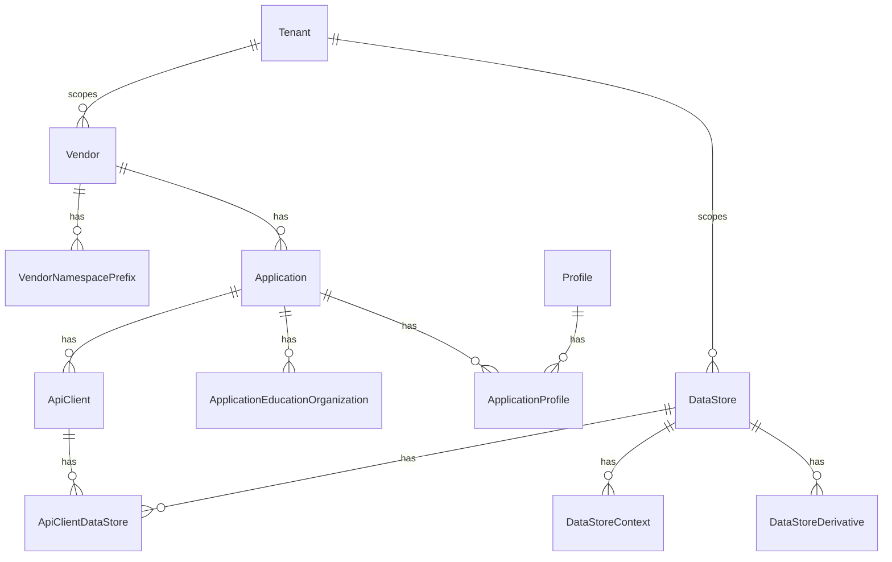
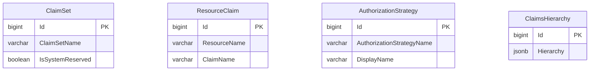

# Security Configuration Data Stores

Security and client configuration for the Ed-Fi API is stored in the
Configuration Service database (`dmscs` schema). This single database replaces
the separate `EdFi_Admin` and `EdFi_Security` databases used in prior versions.
The schema is divided into two logical groups: client configuration entities
(authentication and data access) and authorization entities (claim sets, resource
claims, and authorization strategies).

## Client Configuration

The client configuration entities manage vendors, applications, API clients, and
the data stores they can access.

- **Vendors.** Each education software vendor is represented in the database and
  serves as a container for applications and namespace prefixes.
- **Vendor Namespace Prefixes.** Vendors are assigned one or more namespace
  prefixes (URI format). For resources secured by namespace, the client can only
  perform actions on objects matching an assigned prefix.
- **Applications.** A list of applications belonging to vendors. Each
  application is assigned a claim set name and may be associated with one or
  more education organizations. Applications are also linked to profiles that
  constrain API responses.
- **Application Education Organizations.** Associates applications with the
  education organization IDs they are authorized to access.
- **API Clients.** Each API client belongs to an application and carries a
  `ClientId` and `ClientUuid` used for OAuth token issuance. API clients are
  linked to one or more data stores.
- **Data Stores.** Database connections used to serve Ed-Fi resource data.
  Connection strings are stored encrypted at rest (AES). Each data store may
  have contextual name/value pairs (`DataStoreContext`) for route-based
  selection, and derivative connections (`DataStoreDerivative`) for read
  replicas or snapshots.
- **Profiles.** Data policies (expressed as XML definitions) that constrain
  which resource properties are readable or writable for assigned applications.
  See [API Profiles](./api-profiles.md) for details.
- **Tenants.** In multi-tenant deployments, each tenant record scopes vendors,
  data stores, and claim sets to a specific tenant identifier. See [Single and
  Multi-Tenant
  Configuration](../configuration/single-and-multi-tenant-configuration.md).

The following ERD shows the structure of the client configuration entities:

## Authorization Configuration

The authorization entities define what resources API clients can access and
under what conditions.

- **Claim Sets.** A named collection of resource claims and authorization rules
  for a type of API client (e.g., a SIS vendor). Each application references a
  claim set by name. System-reserved claim sets (`IsSystemReserved = true`)
  cannot be modified through the Configuration Service API.
- **Resource Claims.** Each API resource exposed by the Ed-Fi API has a
  corresponding resource claim entry (`ResourceName`, `ClaimName`). Resource
  claims are organized into a hierarchy to allow high-level grouping (e.g., all
  descriptors under a single parent claim).
- **Authorization Strategies.** Named strategies (e.g.,
  `RelationshipsWithEdOrgsAndPeople`, `NamespaceBased`) that define the logic
  applied after the basic resource/action check. See [API Claim Sets &
  Resources](./api-claim-sets-resources.md#authorization-strategies) for
  descriptions of each strategy.
- **Claims Hierarchy.** The complete resource claim hierarchy — including
  resource-to-claim-set assignments, action permissions (Create, Read, Update,
  Delete), and authorization strategy overrides — is stored as a single JSONB
  document in the `ClaimsHierarchy` table. This replaces the normalized
  per-row approach used in prior versions and allows the full security metadata
  to be read and applied in a single query.

The following ERD shows the structure of the authorization configuration
entities:

:::info

The `ClaimsHierarchy.Hierarchy` JSONB document encodes the full claims taxonomy:
resource claim parentage, claim set assignments, action permissions, and
authorization strategy overrides. This claims taxonomy is managed through the
Configuration Service API and is cached by the Ed-Fi API for the duration
configured in `CacheSettings:ClaimSetsCacheExpirationSeconds` (in seconds),
which defaults to 600 seconds (10 minutes).

:::
