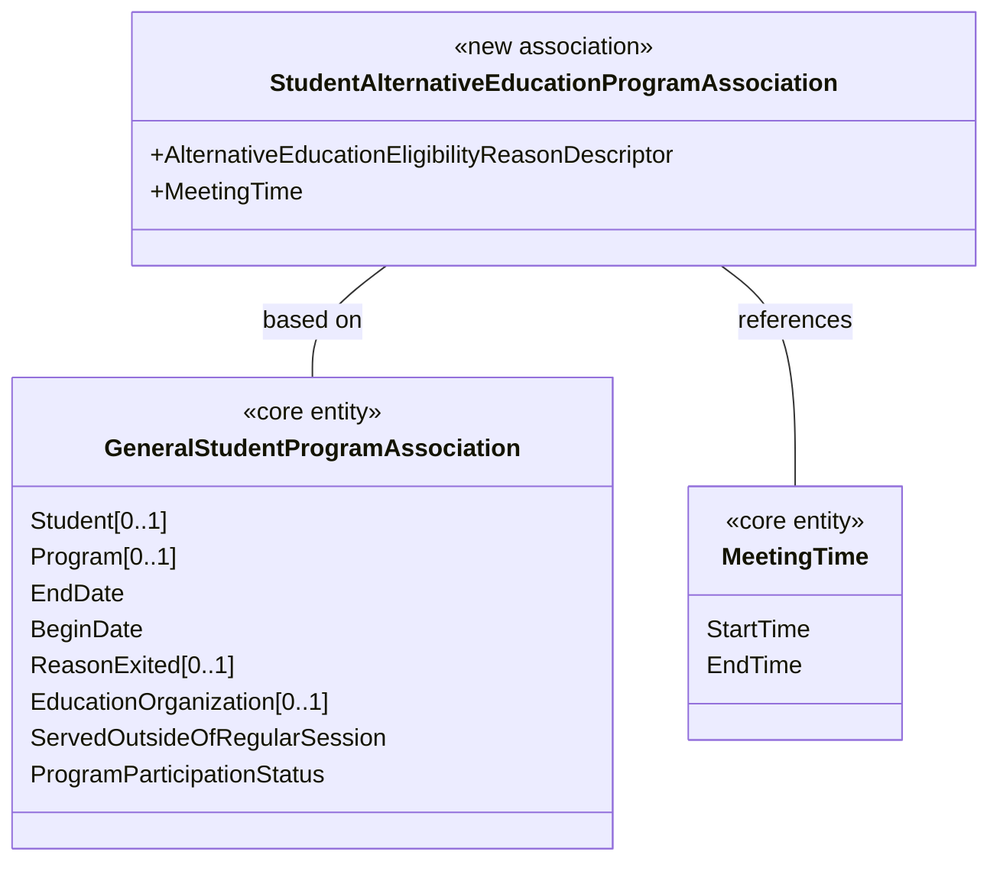

# How To: Extend the Ed-Fi API - Alternative Education Program Example

In this example, we create a new program called Alternative Education Program
and expose it through a new API resource called
**studentAlternativeEducationProgramAssociations**.

Before you begin:

- This example uses MetaEd to generate the extension schema. MetaEd is a free
  tool developed by the Ed-Fi Alliance and is the recommended way to add new
  fields to the Ed-Fi API. [Download and install
  MetaEd](/reference/metaed/getting-started-with-metaed-ide/installation/)
  before beginning. MetaEd **4.8 or later** is required for Ed-Fi API v8.0.
- This example assumes the Ed-Fi API is already running locally per the
  instructions in [Getting Started](../getting-started/readme.md).
- The `api-schema-tools` CLI must be available. See [Database
  Provisioning](../platform-dev-guide/utilities/database-provisioning.md) for
  installation instructions.
- Step 8 verifies the extension with an authenticated API request, which
  requires API client credentials. If you don't already have a client, see
  [Getting Started - Configure a Data
  Store](../getting-started/configure-data-store.md) to create one with
  `Get-SmokeTestCredential` before you reach that step.

## Step 1. Design Your Extension

In a real project, you would design your extension as a preliminary step. We'll
propose a design here.

This example creates a new Alternative Education Program. The data model has
several programs where students can be enrolled, but there is no Alternative
Education Program where a specific Meeting Time can be added. We'll add and
relate our new program to existing parts of the data model.

The following diagram shows the new Alternative Education Program and its
properties. Our new program is based on the
`GeneralStudentProgramAssociation` and references the common `MeetingTime`
entity already in the data model.



The `AlternativeEducationEligibilityReason` is modeled as a descriptor, an
Ed-Fi-specific pattern that allows enumeration-like definition and validation
that can vary between operational contexts.

## Step 2. Author Your Extension Using MetaEd

In this step, we'll create a new project in MetaEd and author our new entity.
It's easy, but you need to [download and install
MetaEd](/reference/metaed/getting-started-with-metaed-ide/installation/) to do
this step. Do that now if you haven't already.

### Step 2a. Set or Confirm MetaEd Target Version

MetaEd supports multiple Ed-Fi technology stack and data model versions. Confirm
that your MetaEd IDE is targeting desired data model e.g. **ed-fi-model-5.2** by
following the instructions in [Version
Targeting](/reference/metaed/ide-user-guide/creating-and-maintaining-your-extension#step-4-add-the-correct-data-model-project).

MetaEd **4.8 or later** is required for Ed-Fi API v8.0 support.

### Step 2b. Create a New Extension Project

Create a new extension by following the steps in [MetaEd IDE - Creating and
Maintaining Your
Extension](/reference/metaed/ide-user-guide/creating-and-maintaining-your-extension).
For this example, place your extension in a folder called
`AlternativeEducationProgram`.

<details>
<summary>Listing of files</summary>

```text
ed-fi-model-5.2/
├─ Association/
├─ Choice/
├─ Common/
├─ Descriptor/
├─ Domain/
├─ DomainEntity/
├─ Enumeration/
├─ Interchange/
├─ Shared/
├─ package.json
├─ README.md

AlternativeEducationProgram/
├─ Association/
├─ Descriptor/
├─ package.json
```

</details>

### Step 2c. Update the package.json File

Open the `package.json` file in your extension project and provide an
appropriate name:

```json
{
  "metaEdProject": {
    "projectName": "SampleAlternativeEducationProgram",
    "projectVersion": "1.0.0"
  }
}
```

Click **File** > **Save** (**Ctrl+S**) to save.

### Step 2d. Add an Association File to Your Project

We're going to add an Association source file to the project we just created.
Note that MetaEd files are required to be organized into subfolders. Folders are
generally named after their entity type. When you followed the steps in [MetaEd
IDE - Creating and Maintaining Your
Extension](/reference/metaed/ide-user-guide/creating-and-maintaining-your-extension)
one of the folders you created was called "Association". We will now add a
MetaEd source file to that folder.

**Right-click** on the folder **Association**, and select **New File**.

Name the new file `StudentAlternativeEducationProgramAssociation.metaed` to
match the name of the new entity to be created.

Note the new file appears in the tree view to the left. **Double-click** on the
file in the tree view to open it.

<details>
<summary>Listing of files</summary>

```text
AlternativeEducationProgram/
├─ Association/
│  └─ StudentAlternativeEducationProgramAssociation.metaed
├─ Descriptor/
├─ package.json
```

</details>

### Step 2e. Author and Save Your Extension

Type or copy and paste the code listing below into your MetaEd file. Note that
an error will be listed in the linter panel until the referenced Descriptor is
created in a future step.

<details>
<summary>MetaEd source: StudentAlternativeEducationProgramAssociation</summary>

```none
Association StudentAlternativeEducationProgramAssociation based on EdFi.GeneralStudentProgramAssociation
    documentation "This association represents Students in an Alternative Education Program."
    descriptor AlternativeEducationEligibilityReason
        documentation "The reason the student is eligible for the program."
        is required
    common EdFi.MeetingTime
        documentation "The times at which this Alternative Education Program is scheduled to meet."
        is optional collection
```

</details>

If you're new to Ed-Fi technology, it's worth understanding the Ed-Fi Descriptor
pattern because it occurs throughout the model. In essence, Descriptors provide
states, districts, vendors, and other platform hosts with the flexibility to use
their own enumerations and code sets. A Descriptor is consistent within an
operational context such as a single district, but may be different in another
operational context.

**Right-click** on the **Descriptor** folder, select **New File**. Name the file
`AlternativeEducationEligibilityReason.metaed`.

Replace the template text in your new Descriptor source file with the following
code.

<details>
<summary>MetaEd source: AlternativeEducationEligibilityReason Descriptor</summary>

```none
Descriptor AlternativeEducationEligibilityReason
    documentation "This descriptor describes the reason a student is eligible for an Alternative Education Program"
```

</details>

Click **File** > **Save All** (**Ctrl+K S**) to save your changes.

## Step 3. Generate Extended Technical Artifacts Using MetaEd

In this step, we'll build our new MetaEd project. This is fairly
straightforward.

### Step 3a. Build Your Project

**Click Build** in the VS Code editor to generate artifacts. Note that you must
have a file open for the Build button to be displayed.

### Step 3b. View MetaEd Output

You can expand the project in the tree view and click **MetaEdOutput** to
explore generated artifacts. The artifacts include the API schema and XSD files
used by the Ed-Fi API, along with SQL scripts and interchange schemas used by
the legacy ODS / API.

<details>
<summary>Listing of files after build</summary>

```text
AlternativeEducationProgram/
├─ Association/
│  └─ StudentAlternativeEducationProgramAssociation.metaed
├─ Descriptor/
│  └─ AlternativeEducationEligibilityReason.metaed
├─ MetaEdOutput/                                        <── generated
│  ├─ EdFi/
│  └─ SampleAlternativeEducationProgram/
│     ├─ ApiMetadata/
│     ├─ ApiSchema/
│     │  └─ ApiSchema-EXTENSION.json                 <── used by the Ed-Fi API
│     ├─ Database/
│     ├─ Interchange/
│     └─ XSD/
│        └─ EXTENSION-Ed-Fi-Extended-Core.xsd        <── used by the XML Bulk Load Client
└─ package.json
```

</details>

We'll look at how to use the MetaEd output for the Ed-Fi API below.

:::info

For Ed-Fi API v8.0, only `ApiSchema-EXTENSION.json` and (optionally) the XSD
file are needed. The SQL scripts under `Database/` and the interchange schemas
are used by the legacy ODS / API and are not required for the new Ed-Fi API. The
XSD file is required only if you load data via the [XML Bulk Load Client
Utility](../platform-dev-guide/utilities/bulk-load-client-utility.md).

:::

## Step 4. Gather the Schema Files

Create a directory (e.g. `my-schemas/`) to hold the core and extension
schemas. The `prepare-dms-schema.ps1` staging script discovers every file
matching `ApiSchema*.json` recursively in this directory, so subdirectory
organization is up to you.

```text
my-schemas/
├─ ApiSchema.json                   <── core schema
└─ ApiSchema-EXTENSION.json         <── extension (Step 3b output, copied as-is)
```

**Core schema**: after running `bootstrap-local-dms.ps1` at least once, the core
schema is available at
`eng/docker-compose/.bootstrap/ApiSchema/schemas/Ed-Fi/ApiSchema.json`. Copy it
into your directory. Alternatively, download it from the
`EdFi.DataStandard52.ApiSchema` NuGet package on the Ed-Fi package feed.

**Extension schema**: copy `ApiSchema-EXTENSION.json` from
`MetaEdOutput/SampleAlternativeEducationProgram/ApiSchema/` (your Step 3b
output) into the same directory. The filename already follows the
`ApiSchema-*.json` pattern that `prepare-dms-schema.ps1` discovers, so no
rename is necessary.

## Step 5. Stage the Extension Schema

Staging copies your schema and claims into a `.bootstrap/` workspace that
`bootstrap-local-dms.ps1` reads when it starts the stack and provisions the
database. Run every command below from the `eng/docker-compose/` directory, and
run the sub-steps **in order**: staging writes into the same workspace the
reset in Step 5a clears, so resetting _after_ staging would discard your
extension.

### Step 5a. Reset the Local Stack

The Ed-Fi API loads the schema **once at startup** into a fresh database, so
adding an extension means provisioning a new database rather than mutating the
running one. Stop the stack, delete its database volumes, and clear any existing
`.bootstrap/` workspace:

```powershell
./bootstrap-local-dms.ps1 -d -v
```

:::caution

This reset is required, not optional. Following [Getting
Started](../getting-started/readme.md) (a prerequisite for this guide) leaves a
core-only `.bootstrap/` workspace staged; staging your extension on top of it
makes `prepare-dms-schema.ps1` fail with an error like "Existing staged
bootstrap workspace differs from requested inputs... effective schema hash
mismatch." The `-d -v` teardown removes that workspace and the populated
database volumes so you stage from a clean state.

:::

### Step 5b. Build the Schema Tool

`prepare-dms-schema.ps1` uses `api-schema-tools` to hash the combined schema.
Build it once, the same way the [Getting
Started](../getting-started/readme.md) flow does:

```powershell
dotnet build ..\..\src\dms\clis\EdFi.DataManagementService.SchemaTools
```

`prepare-dms-schema.ps1` auto-discovers the build output under the project's
`bin/` directory, so no `-SchemaToolPath` is needed. That output lives outside
`.bootstrap/`, so it survives the Step 5a reset; you only need to build it once.

### Step 5c. Stage the Schema

```powershell
./prepare-dms-schema.ps1 -ApiSchemaPath "C:\path\to\my-schemas"
```

`prepare-dms-schema.ps1` discovers both `ApiSchema*.json` files in your
directory, identifies the core (via `isExtensionProject: false`) and your
extension, computes the combined schema hash, and writes the staged workspace to
`.bootstrap/ApiSchema/`.

:::info

No `appsettings.json` edit is needed for this local flow. The script **copies**
your files from `-ApiSchemaPath` into `.bootstrap/ApiSchema/` inside the repo
checkout; after this step, your original directory isn't referenced again.
Writing the staged workspace also creates `.bootstrap/bootstrap-manifest.json`,
which puts the stack into "bootstrap mode": the next start automatically adds a
compose override that mounts `.bootstrap/ApiSchema` read-only into the DMS
container at `/app/ApiSchema`, matching the `AppSettings:ApiSchemaPath` and
`AppSettings:UseApiSchemaPath` values already defaulted in `.env`. The stack you
stopped in Step 5a picks up the staged schema when you start it again in Step 6.

:::

### Step 5d. Author and Stage the Claims Fragment

New extension resources are not accessible until they're added to the claims
hierarchy and granted to a claim set. Do this by authoring a small claim
fragment file and staging it; no runtime API call is needed.

Create a directory (e.g. `my-claims/`) containing a file named
`001-sample-alternative-education-program-claimset.json`:

```json title="001-sample-alternative-education-program-claimset.json"
{
  "name": "SampleAlternativeEducationProgramClaims",
  "resourceClaims": [
    {
      "isParent": true,
      "name": "domains/systemDescriptors",
      "children": [
        {
          "name": "http://ed-fi.org/identity/claims/sample-alternative-education-program/AlternativeEducationEligibilityReasonDescriptor"
        }
      ]
    },
    {
      "isParent": true,
      "name": "domains/relationshipBasedData",
      "children": [
        {
          "name": "http://ed-fi.org/identity/claims/sample-alternative-education-program/StudentAlternativeEducationProgramAssociation"
        }
      ]
    }
  ]
}
```

:::note

Claim URIs in Ed-Fi API v8 use the pattern
`http://ed-fi.org/identity/claims/{projectEndpointName}/{resourceName}`, without
the `/ods/` segment used in previous ODS/API versions. Both values come
straight from your generated `ApiSchema-EXTENSION.json` (`projectEndpointName`,
and each resource's `resourceName`, which matches the entity name you authored
in MetaEd). Matching is case-insensitive, so exact casing isn't critical, but
using the schema's own casing keeps the fragment self-documenting. See
[Extending API
DataModel](../platform-dev-guide/extensibility-customization/extending-api-datamodel.md#naming-conventions-for-extensions)
for the full convention.

:::

Attaching the new claims as children of the existing `systemDescriptors` and
`relationshipBasedData` domains means they automatically inherit whatever claim
sets are already granted at those domains: for example, `SISVendor` already
has `Read` on `systemDescriptors` and full CRUD on `relationshipBasedData`, so
no explicit `claimSets` entry is needed here. To grant a different claim set,
or restrict access to just the new resources, add an explicit `claimSets`
array, but the fragment validator requires any resource claim with its own
`claimSets` entry to also be marked `isParent: true`.

Now stage the claims configuration, including your new fragment:

```powershell
./prepare-dms-claims.ps1 -ClaimsDirectoryPath "C:\path\to\my-claims"
```

Because `SampleAlternativeEducationProgram` isn't a recognized built-in
extension, `-ClaimsDirectoryPath` is required; omitting it fails staging with
`ClaimsDirectoryPath is required for unmapped extension project(s):
SampleAlternativeEducationProgram.` `prepare-dms-claims.ps1` validates your
fragment, then stages it alongside the built-in claims into
`.bootstrap/claims/` and records the staging mode (`Hybrid`, since a fragment
is present) in the bootstrap manifest.

## Step 6. Start the Stack

Start the stack. Because you already stopped it and cleared its database volumes
in Step 5a, no teardown is needed here: starting from the staged workspace
provisions the extension into a clean database. `bootstrap-local-dms.ps1` reads
the staged workspace and provisions the database automatically with both the
core and extension schemas, and seeds the Configuration Service with the
built-in claims plus your fragment:

```powershell
./bootstrap-local-dms.ps1
```

:::note

Both the schema and the claims are loaded **once at startup**, and only when
their respective databases are empty; there is no hot-reload for either. To
apply a later change to the extension schema or the claims fragment, repeat the
cycle **in order**: tear down with `./bootstrap-local-dms.ps1 -d -v` (which wipes
the databases **and** clears the staged workspace), re-run
`prepare-dms-schema.ps1` / `prepare-dms-claims.ps1` to stage the updated files,
then start again with `./bootstrap-local-dms.ps1`.

:::

## Step 7. Configure Security

The Ed-Fi API is secure by default, but you already granted access when you
authored the claims fragment in Step 5. Attaching the new descriptor and
association claims as children of the existing `systemDescriptors` and
`relationshipBasedData` domains means they inherit whichever claim sets are
already assigned at those parent domains, so no separate grant step is needed.
The built-in `SISVendor` claim set, for example, already has `Read` on
`systemDescriptors` and full CRUD on `relationshipBasedData`, so it can access
both new resources as soon as the stack restarts with the staged claims.

If you want to grant a different claim set, or restrict access to only the new
resources, add an explicit `claimSets` array to the resource claim in your
fragment. The fragment validator requires any resource claim with its own
`claimSets` entry to also be marked `isParent: true`; CMS derives a non-parent
claim's grant from the fragment's top-level `name` instead.

See [How To: Create and Manage API Security
Metadata](./how-to-create-and-manage-api-security-metadata.mdx) for the full
explanation of the claims hierarchy and loading modes. Step 8 verifies that
access actually works, by making an authenticated request to the new resource
endpoint.

## Step 8. Verify the Extension

Confirm the Ed-Fi API is running with the extended schema by calling the
Discovery endpoint:

```powershell
Invoke-RestMethod http://localhost:8080/api
```

The response should list your extension's data model under the `dataModels`
array. Then make an authenticated request to one of the new endpoints, using
the `<api-client-key>`/`<api-client-secret>` from [Configure a Data
Store](../getting-started/configure-data-store.md) (for example, from
`Get-SmokeTestCredential`):

```powershell
$apiToken = Invoke-RestMethod -Method Post -Uri "http://localhost:8081/connect/token" `
  -ContentType "application/x-www-form-urlencoded" `
  -Body @{
    "grant_type"    = "client_credentials"
    "client_id"     = "<api-client-key>"
    "client_secret" = "<api-client-secret>"
  }

Invoke-RestMethod `
  -Uri "http://localhost:8080/api/data/sample-alternative-education-program/studentAlternativeEducationProgramAssociations" `
  -Headers @{ Authorization = "Bearer $($apiToken.access_token)" }
```

A `200 OK` with an empty array confirms that the extension resource is active
and the API client's claim set has access.

## Next Steps & Further Information

Congratulations! You have successfully extended the Ed-Fi API with a custom
resource.

- [How To: Extend the Ed-Fi API - Student Transcript
  Example](./how-to-extend-the-ed-fi-ods-api-student-transcript-example.md):
  a more advanced scenario, including extending an existing resource
  rather than only adding new ones
- [How To: Create and Manage API Security
  Metadata](./how-to-create-and-manage-api-security-metadata.mdx): full
  reference for the claims hierarchy and all loading modes
- [Database
  Provisioning](../platform-dev-guide/utilities/database-provisioning.md):
  `api-schema-tools` CLI reference
- [The MetaEd Cookbook](/reference/metaed/cookbook): examples of common and
  complex extension scenarios
