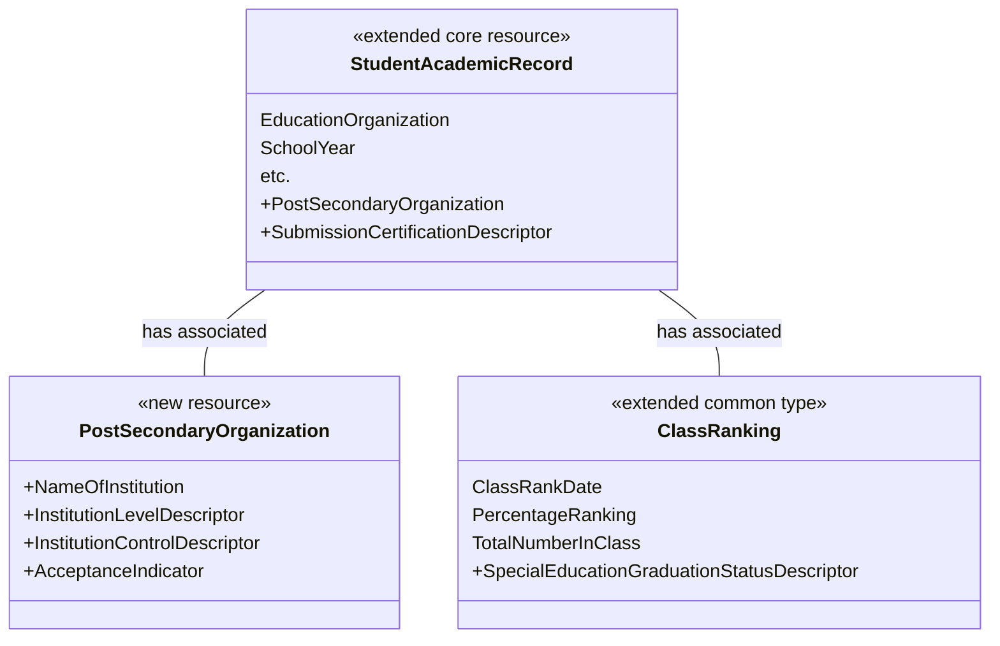

# How To: Extend the Ed-Fi API - Student Transcript Example

In this example, we add Student Transcript capability to the Ed-Fi API: a new
**postSecondaryOrganizations** resource, four new descriptors, and an
extension of the existing **studentAcademicRecords** resource (and its
**classRanking** common type) with additional properties.

Before you begin:

- This example uses MetaEd to generate the extension schema. MetaEd is a free
  tool developed by the Ed-Fi Alliance and is the recommended way to add new
  fields to the Ed-Fi API. [Download and install
  MetaEd](/reference/metaed/getting-started-with-metaed-ide/installation/)
  before beginning. MetaEd **4.8 or later** is required for Ed-Fi API v8.0.
- This example assumes knowledge of the basic concepts described in [How To:
  Extend the Ed-Fi API - Alternative Education Program
  Example](./how-to-extend-the-ed-fi-ods-api-alternative-education-program-example.md).
  If you're new to the Ed-Fi technology stack, or haven't used MetaEd before,
  run through that example first.
- This example assumes the Ed-Fi API is already running locally per the
  instructions in [Getting Started](../getting-started/readme.md).
- The `api-schema-tools` CLI must be available. See [Database
  Provisioning](../platform-dev-guide/utilities/database-provisioning.md) for
  installation instructions.
- Step 8 verifies the extension with an authenticated API request, which
  requires API client credentials. If you don't already have a client, see
  [Getting Started - Configure a Data
  Store](../getting-started/configure-data-store.md) to create one with
  `Get-SmokeTestCredential` before you reach that step.

## Step 1. Design Your Extension

In a real project, you would design your extension as a preliminary step, and
analyze how your needs map to the Ed-Fi API data model. We'll propose a
design.

This example adds information about where students enroll in college after
graduation, an element indicating whether graduates were part of a special
education program, and information about whether a transmitted record is an
official or unofficial submission.

Based on those needs, we require a new entity (to hold information about
postsecondary institutions) and we need to add elements to two existing
entities. Unlike the Alternative Education Program example, where every new
resource was wholly new, this example also **extends** existing resources: the
new properties on `StudentAcademicRecord` and `ClassRanking` are additions to
resources that already exist in the core Ed-Fi Data Standard.



The `InstitutionLevel`, `InstitutionControl`, `SubmissionCertification`, and
`SpecialEducationGraduationStatus` elements are modeled as descriptors, the
same enumeration-like pattern used in the Alternative Education Program
example.

## Step 2. Author Your Extension Using MetaEd

In this step, we'll create a new project in MetaEd and author our new and
extended entities. You need to [download and install
MetaEd](/reference/metaed/getting-started-with-metaed-ide/installation/) to do
this step. Do that now if you haven't already.

### Step 2a. Set or Confirm MetaEd Target Version

MetaEd supports multiple Ed-Fi technology stack and data model versions.
Confirm that your MetaEd IDE is targeting the desired data model, e.g.
**ed-fi-model-5.2**, by following the instructions in [Version
Targeting](/reference/metaed/ide-user-guide/creating-and-maintaining-your-extension#step-4-add-the-correct-data-model-project).

MetaEd **4.8 or later** is required for Ed-Fi API v8.0 support.

### Step 2b. Create a New Extension Project

Create a new extension by following the steps in [MetaEd IDE - Creating and
Maintaining Your
Extension](/reference/metaed/ide-user-guide/creating-and-maintaining-your-extension).
For this example, place your extension in a folder called `StudentTranscript`.

<details>
<summary>Listing of files</summary>

```text
ed-fi-model-5.2/
├─ Association/
├─ Choice/
├─ Common/
├─ Descriptor/
├─ Domain/
├─ DomainEntity/
├─ Enumeration/
├─ Interchange/
├─ Shared/
├─ package.json
├─ README.md

StudentTranscript/
├─ Common/
├─ Descriptor/
├─ DomainEntity/
├─ package.json
```

</details>

### Step 2c. Update the package.json File

Open the `package.json` file in your extension project and provide an
appropriate name:

```json
{
  "metaEdProject": {
    "projectName": "SampleStudentTranscript",
    "projectVersion": "1.0.0"
  }
}
```

Click **File** > **Save** (**Ctrl+S**) to save.

### Step 2d. Add the PostSecondaryOrganization Domain Entity

**Right-click** on the folder **DomainEntity**, and select **New File**. Name
the new file `PostSecondaryOrganization.metaed`.

Type or copy and paste the code listing below into your MetaEd file. Note that
errors will be listed in the linter panel until the referenced Descriptors are
created in a later step.

<details>
<summary>MetaEd source: PostSecondaryOrganization</summary>

```none
Domain Entity PostSecondaryOrganization
    documentation "PostSecondaryOrganization"
    shared string EdFi.NameOfInstitution
        documentation "The name of the institution."
        is part of identity
    descriptor InstitutionLevel
        documentation "The level of the institution."
        is required
    descriptor InstitutionControl
        documentation "The type of control of the institution (i.e., public or private)."
        is required
    bool AcceptanceIndicator
        documentation "An indication of acceptance."
        is required
```

</details>

### Step 2e. Extend the Student Academic Record Entity

Next, extend the existing `StudentAcademicRecord` resource to reference the
new entity. Use the `additions` keyword to add properties to a resource that
already exists in the core Data Standard, rather than declaring a new one.

**Right-click** on the folder **DomainEntity**, select **New File**. Name the
file `StudentAcademicRecordExtension.metaed`.

<details>
<summary>MetaEd source: StudentAcademicRecord additions</summary>

```none
Domain Entity EdFi.StudentAcademicRecord additions
    domain entity PostSecondaryOrganization
        documentation "A reference to the postsecondary organization."
        is optional
    descriptor SubmissionCertification
        documentation "The type of submission certification."
        is optional
    common extension EdFi.ClassRanking
        documentation "Class Ranking Extension"
        is optional
```

</details>

### Step 2f. Extend the Class Ranking Common Type

Similarly, extend the existing `ClassRanking` common type to add the special
education graduation status element.

**Right-click** on the **Common** folder, select **New File**. Name the file
`ClassRankingExtension.metaed`.

<details>
<summary>MetaEd source: ClassRanking additions</summary>

```none
Common EdFi.ClassRanking additions
    descriptor SpecialEducationGraduationStatus
        documentation "The graduation status for special education."
        is required
```

</details>

### Step 2g. Add the Descriptor Entities

If you're new to Ed-Fi technology, it's worth understanding the Ed-Fi
Descriptor pattern because it occurs throughout the model. In essence,
Descriptors provide states, districts, vendors, and other platform hosts with
the flexibility to use their own enumerations and code sets. A Descriptor is
consistent within an operational context such as a single district, but may be
different in another operational context.

**Right-click** on the **Descriptor** folder, select **New File**, and add the
following four files.

<details>
<summary>MetaEd source: InstitutionControl Descriptor</summary>

```none
Descriptor InstitutionControl
    documentation "The type of control for an institution (e.g., public or private)."
```

</details>

<details>
<summary>MetaEd source: InstitutionLevel Descriptor</summary>

```none
Descriptor InstitutionLevel
    documentation "The typical level of postsecondary degree offered by the institute."
```

</details>

<details>
<summary>MetaEd source: SpecialEducationGraduationStatus Descriptor</summary>

```none
Descriptor SpecialEducationGraduationStatus
    documentation "The graduation status for special education."
```

</details>

<details>
<summary>MetaEd source: SubmissionCertification Descriptor</summary>

```none
Descriptor SubmissionCertification
    documentation "The type of submission certification."
```

</details>

Click **File** > **Save All** (**Ctrl+K S**) to save your changes.

<details>
<summary>Listing of files</summary>

```text
StudentTranscript/
├─ Common/
│  └─ ClassRankingExtension.metaed
├─ Descriptor/
│  ├─ InstitutionControl.metaed
│  ├─ InstitutionLevel.metaed
│  ├─ SpecialEducationGraduationStatus.metaed
│  └─ SubmissionCertification.metaed
├─ DomainEntity/
│  ├─ PostSecondaryOrganization.metaed
│  └─ StudentAcademicRecordExtension.metaed
└─ package.json
```

</details>

## Step 3. Generate Extended Technical Artifacts Using MetaEd

In this step, we'll build our new MetaEd project. This is fairly
straightforward.

### Step 3a. Build Your Project

**Click Build** in the VS Code editor to generate artifacts. Note that you
must have a file open for the Build button to be displayed.

### Step 3b. View MetaEd Output

You can expand the project in the tree view and click **MetaEdOutput** to
explore generated artifacts. The artifacts include the API schema and XSD
files used by the Ed-Fi API, along with SQL scripts and interchange schemas
used by the legacy ODS / API.

<details>
<summary>Listing of files after build</summary>

```text
StudentTranscript/
├─ Common/
│  └─ ClassRankingExtension.metaed
├─ Descriptor/
│  ├─ InstitutionControl.metaed
│  ├─ InstitutionLevel.metaed
│  ├─ SpecialEducationGraduationStatus.metaed
│  └─ SubmissionCertification.metaed
├─ DomainEntity/
│  ├─ PostSecondaryOrganization.metaed
│  └─ StudentAcademicRecordExtension.metaed
├─ MetaEdOutput/                                        <── generated
│  ├─ EdFi/
│  └─ SampleStudentTranscript/
│     ├─ ApiMetadata/
│     ├─ ApiSchema/
│     │  └─ ApiSchema-EXTENSION.json                 <── used by the Ed-Fi API
│     ├─ Database/
│     ├─ Interchange/
│     └─ XSD/
│        └─ EXTENSION-Ed-Fi-Extended-Core.xsd        <── used by the XML Bulk Load Client
└─ package.json
```

</details>

We'll look at how to use the MetaEd output for the Ed-Fi API below.

:::info

For Ed-Fi API v8.0, only `ApiSchema-EXTENSION.json` and (optionally) the XSD
file are needed. The SQL scripts under `Database/` and the interchange schemas
are used by the legacy ODS / API and are not required for the new Ed-Fi API.
The XSD file is required only if you load data via the [XML Bulk Load Client
Utility](../platform-dev-guide/utilities/bulk-load-client-utility.md).

:::

## Step 4. Gather the Schema Files

Create a directory (e.g. `my-schemas/`) to hold the core and extension
schemas. The `prepare-dms-schema.ps1` staging script discovers every file
matching `ApiSchema*.json` recursively in this directory, so subdirectory
organization is up to you.

```text
my-schemas/
├─ ApiSchema.json                   <── core schema
└─ ApiSchema-EXTENSION.json         <── extension (Step 3b output, copied as-is)
```

**Core schema**: after running `bootstrap-local-dms.ps1` at least once, the
core schema is available at
`eng/docker-compose/.bootstrap/ApiSchema/schemas/Ed-Fi/ApiSchema.json`. Copy it
into your directory. Alternatively, download it from the
`EdFi.DataStandard52.ApiSchema` NuGet package on the Ed-Fi package feed.

**Extension schema**: copy `ApiSchema-EXTENSION.json` from
`MetaEdOutput/SampleStudentTranscript/ApiSchema/` (your Step 3b output) into
the same directory. The filename already follows the `ApiSchema-*.json`
pattern that `prepare-dms-schema.ps1` discovers, so no rename is necessary.

## Step 5. Stage the Extension Schema

Staging copies your schema and claims into a `.bootstrap/` workspace that
`bootstrap-local-dms.ps1` reads when it starts the stack and provisions the
database. Run every command below from the `eng/docker-compose/` directory, and
run the sub-steps **in order**: staging writes into the same workspace the
reset in Step 5a clears, so resetting _after_ staging would discard your
extension.

### Step 5a. Reset the Local Stack

The Ed-Fi API loads the schema **once at startup** into a fresh database, so
adding an extension means provisioning a new database rather than mutating the
running one. Stop the stack, delete its database volumes, and clear any existing
`.bootstrap/` workspace:

```powershell
./bootstrap-local-dms.ps1 -d -v
```

:::caution

This reset is required, not optional. Following [Getting
Started](../getting-started/readme.md) (a prerequisite for this guide) leaves a
core-only `.bootstrap/` workspace staged; staging your extension on top of it
makes `prepare-dms-schema.ps1` fail with an error like "Existing staged
bootstrap workspace differs from requested inputs... effective schema hash
mismatch." The `-d -v` teardown removes that workspace and the populated
database volumes so you stage from a clean state.

:::

### Step 5b. Build the Schema Tool

`prepare-dms-schema.ps1` uses `api-schema-tools` to hash the combined schema.
Build it once, the same way the [Getting
Started](../getting-started/readme.md) flow does:

```powershell
dotnet build ..\..\src\dms\clis\EdFi.DataManagementService.SchemaTools
```

`prepare-dms-schema.ps1` auto-discovers the build output under the project's
`bin/` directory, so no `-SchemaToolPath` is needed. That output lives outside
`.bootstrap/`, so it survives the Step 5a reset; you only need to build it once.

### Step 5c. Stage the Schema

```powershell
./prepare-dms-schema.ps1 -ApiSchemaPath "C:\path\to\my-schemas"
```

`prepare-dms-schema.ps1` discovers both `ApiSchema*.json` files in your
directory, identifies the core (via `isExtensionProject: false`) and your
extension, computes the combined schema hash, and writes the staged workspace
to `.bootstrap/ApiSchema/`.

:::info

No `appsettings.json` edit is needed for this local flow. The script **copies**
your files from `-ApiSchemaPath` into `.bootstrap/ApiSchema/` inside the repo
checkout; after this step, your original directory isn't referenced again.
Writing the staged workspace also creates `.bootstrap/bootstrap-manifest.json`,
which puts the stack into "bootstrap mode": the next start automatically adds a
compose override that mounts `.bootstrap/ApiSchema` read-only into the DMS
container at `/app/ApiSchema`, matching the `AppSettings:ApiSchemaPath` and
`AppSettings:UseApiSchemaPath` values already defaulted in `.env`. The stack you
stopped in Step 5a picks up the staged schema when you start it again in Step 6.

:::

### Step 5d. Author and Stage the Claims Fragment

New extension resources are not accessible until they're added to the claims
hierarchy and granted to a claim set. This example demonstrates two different
situations:

- The four descriptors and `postSecondaryOrganizations` are **new** resource
  claims and need to be added to the hierarchy.
- `studentAcademicRecords` is **not** a new resource claim. Its extra
  properties ride along under the resource's existing `_ext` node; the
  existing `studentAcademicRecord` claim (already granted to claim sets like
  `SISVendor`) already covers them. No claims work is needed for it at all.

Create a directory (e.g. `my-claims/`) containing a file named
`001-sample-student-transcript-claimset.json`:

```json title="001-sample-student-transcript-claimset.json"
{
  "name": "SampleStudentTranscriptClaims",
  "resourceClaims": [
    {
      "isParent": true,
      "name": "domains/systemDescriptors",
      "children": [
        {
          "name": "http://ed-fi.org/identity/claims/sample-student-transcript/InstitutionControlDescriptor"
        },
        {
          "name": "http://ed-fi.org/identity/claims/sample-student-transcript/InstitutionLevelDescriptor"
        },
        {
          "name": "http://ed-fi.org/identity/claims/sample-student-transcript/SpecialEducationGraduationStatusDescriptor"
        },
        {
          "name": "http://ed-fi.org/identity/claims/sample-student-transcript/SubmissionCertificationDescriptor"
        }
      ]
    },
    {
      "isParent": true,
      "name": "http://ed-fi.org/identity/claims/domains/sample-student-transcript",
      "_defaultAuthorizationStrategiesForCrud": [
        {
          "actionName": "Create",
          "authorizationStrategies": [{ "name": "NoFurtherAuthorizationRequired" }]
        },
        {
          "actionName": "Read",
          "authorizationStrategies": [{ "name": "NoFurtherAuthorizationRequired" }]
        },
        {
          "actionName": "Update",
          "authorizationStrategies": [{ "name": "NoFurtherAuthorizationRequired" }]
        },
        {
          "actionName": "Delete",
          "authorizationStrategies": [{ "name": "NoFurtherAuthorizationRequired" }]
        },
        {
          "actionName": "ReadChanges",
          "authorizationStrategies": [{ "name": "NoFurtherAuthorizationRequired" }]
        }
      ],
      "children": [
        {
          "name": "http://ed-fi.org/identity/claims/sample-student-transcript/PostSecondaryOrganization"
        }
      ],
      "claimSets": [
        {
          "name": "SISVendor",
          "actions": [
            { "name": "Create" },
            { "name": "Read" },
            { "name": "Update" },
            { "name": "Delete" },
            { "name": "ReadChanges" }
          ]
        },
        {
          "name": "EdFiSandbox",
          "actions": [
            { "name": "Create" },
            { "name": "Read" },
            { "name": "Update" },
            { "name": "Delete" },
            { "name": "ReadChanges" }
          ]
        }
      ]
    }
  ]
}
```

:::note

`postSecondaryOrganizations` has no relationship to education organizations,
students, or staff, so unlike the descriptors above, there's no existing
domain claim for it to inherit access from. It needs its **own** domain claim
(`domains/sample-student-transcript`) with an explicit
`_defaultAuthorizationStrategiesForCrud` of `NoFurtherAuthorizationRequired`,
plus explicit `claimSets` grants, since there's nothing to inherit from.
Compare this to the descriptors and to the Alternative Education Program
example, where every new claim attached under an existing domain and inherited
that domain's grants automatically.

:::

Now stage the claims configuration, including your new fragment:

```powershell
./prepare-dms-claims.ps1 -ClaimsDirectoryPath "C:\path\to\my-claims"
```

Because `SampleStudentTranscript` isn't a recognized built-in extension,
`-ClaimsDirectoryPath` is required; omitting it fails staging with
`ClaimsDirectoryPath is required for unmapped extension project(s):
SampleStudentTranscript.` `prepare-dms-claims.ps1` validates your fragment,
then stages it alongside the built-in claims into `.bootstrap/claims/` and
records the staging mode (`Hybrid`, since a fragment is present) in the
bootstrap manifest.

## Step 6. Start the Stack

Start the stack. Because you already stopped it and cleared its database volumes
in Step 5a, no teardown is needed here: starting from the staged workspace
provisions the extension into a clean database. `bootstrap-local-dms.ps1` reads
the staged workspace and provisions the database automatically with both the
core and extension schemas, and seeds the Configuration Service with the
built-in claims plus your fragment:

```powershell
./bootstrap-local-dms.ps1
```

:::note

Both the schema and the claims are loaded **once at startup**, and only when
their respective databases are empty; there is no hot-reload for either. To
apply a later change to the extension schema or the claims fragment, repeat the
cycle **in order**: tear down with `./bootstrap-local-dms.ps1 -d -v` (which wipes
the databases **and** clears the staged workspace), re-run
`prepare-dms-schema.ps1` / `prepare-dms-claims.ps1` to stage the updated files,
then start again with `./bootstrap-local-dms.ps1`.

:::

## Step 7. Configure Security

The Ed-Fi API is secure by default, but this example needed two different
approaches to make everything accessible, both handled when you authored the
claims fragment in Step 5:

- The four descriptors inherit access automatically, the same way the
  Alternative Education Program example's descriptor did: attaching them as
  children of the existing `systemDescriptors` domain means they inherit
  whatever claim sets are already granted there (`SISVendor` already has
  `Read`, for example).
- `postSecondaryOrganizations` needed a **new** domain claim with its own
  `NoFurtherAuthorizationRequired` default and explicit `claimSets` grants,
  because it has no natural parent domain to inherit from.
- `studentAcademicRecords` needed **no claims change at all**. Its extension
  properties are exposed under the resource's existing `_ext` node, and
  authorization is enforced at the resource level, not per-property. Any
  claim set already granted access to `studentAcademicRecords` (for example,
  `SISVendor`, which already has full CRUD on the `relationshipBasedData`
  domain it belongs to) can read and write the extended fields as soon as the
  stack restarts with the staged schema.

See [How To: Create and Manage API Security
Metadata](./how-to-create-and-manage-api-security-metadata.mdx) for the full
explanation of the claims hierarchy and loading modes. Step 8 verifies that
access actually works, by making authenticated requests to the new and
extended resources.

## Step 8. Verify the Extension

Confirm the Ed-Fi API is running with the extended schema by calling the
Discovery endpoint:

```powershell
Invoke-RestMethod http://localhost:8080/api
```

The response should list your extension's data model under the `dataModels`
array. Then make an authenticated request to the new resource, using the
`<api-client-key>`/`<api-client-secret>` from [Configure a Data
Store](../getting-started/configure-data-store.md) (for example, from
`Get-SmokeTestCredential`):

```powershell
$apiToken = Invoke-RestMethod -Method Post -Uri "http://localhost:8081/connect/token" `
  -ContentType "application/x-www-form-urlencoded" `
  -Body @{
    "grant_type"    = "client_credentials"
    "client_id"     = "<api-client-key>"
    "client_secret" = "<api-client-secret>"
  }

Invoke-RestMethod `
  -Uri "http://localhost:8080/api/data/sample-student-transcript/postSecondaryOrganizations" `
  -Headers @{ Authorization = "Bearer $($apiToken.access_token)" }
```

A `200 OK` with an empty array confirms that the new resource is active and
the API client's claim set has access.

:::note

To confirm the `studentAcademicRecords` extension specifically, check the
Discovery/OpenAPI document for the resource: its schema now includes an
`_ext.samplestudenttranscript` node (and, nested under `classRanking`, a
second `_ext.samplestudenttranscript` node for
`specialEducationGraduationStatusDescriptor`). Since the resource itself
already existed, a `200 OK` on `GET
/api/data/ed-fi/studentAcademicRecords` alone doesn't confirm the extension is
active; the `_ext` node in the schema is the reliable check.

:::

## Next Steps & Further Information

Congratulations! You have successfully extended the Ed-Fi API with both a new
resource and an extended existing resource.

- [How To: Create and Manage API Security
  Metadata](./how-to-create-and-manage-api-security-metadata.mdx): full
  reference for the claims hierarchy and all loading modes
- [Database
  Provisioning](../platform-dev-guide/utilities/database-provisioning.md):
  `api-schema-tools` CLI reference
- [The MetaEd Cookbook](/reference/metaed/cookbook): examples of common and
  complex extension scenarios
